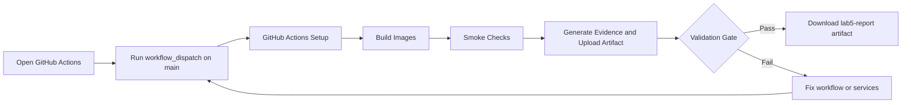

# Lab 05 - DevOps Pipelines and AI-Assisted CI/CD

**Course:** Advanced Software Development with Agentic AI (ASD)
**Theme:** DevOps Pipeline and CI Validation
**Primary IDE:** VS Code (Optional IDE: AWS Kiro)
**AI Runtime:** Ollama
**Duration:** 60 Minutes

## 1. Overview

<details>
<summary>Goal</summary>

Build a GitHub Actions CI pipeline for the Lab 04 Student Enrolment System microservices and capture evidence from each AI workflow run.

</details>

<details>
<summary>Workflow</summary>

PLAN → BUILD → VALIDATE → COLLECT EVIDENCE → REVIEW → ADAPT → IMPROVE 

</details>

<details>
<summary>Expected Results</summary>

By the end of this lab, students should have:

- GitHub Actions workflow
- Container build pipeline
- Smoke validation pipeline
- Evidence collection pipeline
- Evidence log
- Final CI decision

</details>

---

## 2. Prerequisites and Configuration

<details>
<summary>Prerequisites</summary>

To start this lab, students should have:

Complete:

- Lab 01
- Lab 02
- Lab 03
- Lab 04 (including `.env` with `FLASK_BASE_URL` and `requirements.txt` with `requests` library)

Required:

- Docker Desktop
- Git
- GitHub account and repository
- GitHub Actions (enabled on repository)
- GitHub CLI (`gh`)
- Ollama
- Python dependencies installed (`pip install -r requirements.txt` from Lab 04)

</details>

<details>
<summary>Environment Verification</summary>

```bash
docker --version
docker-compose --version
git --version
gh --version
ollama list
python -c "import requests; print(f'requests {requests.__version__} installed')"
```

Verify `.env` exists in `enrolment-app-open-ai/`:
```bash
cat enrolment-app-open-ai/.env
# Should contain: FLASK_BASE_URL=http://localhost:5001
```

</details>

---

## 3. Scenario

<details>
<summary>Student enrolment app</summary>

Lab 04 extended the Student Enrolment System into a three-service architecture:

- frontend-service
- enrolment-service
- database-service

The business now requires:

- Automated builds
- Automated validation
- Repeatable quality gates
- Auditable CI evidence

No application deployment occurs in this lab.

</details>

<details>
<summary>DevOps Pipeline Flow</summary>



</details>

<details>
<summary>Project Structure</summary>

```text
enrolment-app-open-ai/
├── .github/
│   └── workflows/
│       └── lab5-ci.yml
├── docker-compose.yml
├── agentic_loop/
│   ├── config/
│   ├── core/
│   ├── collectors/
│   │   └── devops_collector.py          # new for Lab 5
│   └── pipelines/
│       └── devops_pipeline.py           # new for Lab 5
├── frontend-service/
│   ├── css/
│   └── templates/
│       └── tabs/
├── enrolment-service/
│   ├── routes/
│   ├── services/
│   └── views/
├── database-service/
├── prompts/
│   ├── service/
│   │   ├── implementation/
│   │   └── review/
│   ├── lab4/
│   │   ├── implementation/
│   │   └── review/
│   └── lab5/
│       ├── implementation/
│       │   └── devops_pipeline_review_prompt.txt   # new for Lab 5
│       └── review/
│           └── devops_evidence_review_prompt.txt   # new for Lab 5
├── legacy-lab3/
│   ├── css/
│   └── templates/
└── reports/
  ├── report.json
  ├── report.md
  └── run-view.md
```
</details>

<details>
<summary>Create Project Workspace</summary>

```bash
# 1) Go to app root
cd enrolment-app-open-ai

# 2) GitHub Actions workflow (repo root level)
mkdir -p .github/workflows
touch .github/workflows/lab5-ci.yml

# 3) Reports
mkdir -p reports
touch reports/report.json
touch reports/report.md
touch reports/run-view.md

# 4) Agentic loop modules
mkdir -p agentic_loop/collectors
mkdir -p agentic_loop/pipelines
touch agentic_loop/collectors/devops_collector.py
touch agentic_loop/pipelines/devops_pipeline.py

# 5) Lab 5 prompts
mkdir -p prompts/lab5/implementation
mkdir -p prompts/lab5/review
touch prompts/lab5/implementation/devops_pipeline_review_prompt.txt
touch prompts/lab5/review/devops_evidence_review_prompt.txt
```
</details>

---

## 4. GitHub Actions Workflow

<details>
<summary>Workflow YAML - lab5-ci.yml</summary>

```yaml
name: lab5-ci

on:
  workflow_dispatch:

jobs:

  build-images:
    runs-on: ubuntu-latest

    steps:
      - uses: actions/checkout@v4

      - name: Verify docker-compose
        run: |
          docker-compose --version || (sudo apt-get update && sudo apt-get install -y docker-compose)

      - name: Build services
        run: docker-compose build
        working-directory: enrolment-app-open-ai

  smoke-check:
    runs-on: ubuntu-latest
    needs: [build-images]

    steps:
      - uses: actions/checkout@v4

      - name: Verify docker-compose
        run: |
          docker-compose --version || (sudo apt-get update && sudo apt-get install -y docker-compose)

      - name: Start services
        run: docker-compose up -d
        working-directory: enrolment-app-open-ai

      - name: Smoke checks
        run: |
          check_url() {
            local url="$1"
            local attempts=8
            local code=""

            for i in $(seq 1 "$attempts"); do
              code=$(curl -sS -o /dev/null -w "%{http_code}" --connect-timeout 5 --max-time 20 "$url" || true)
              if [ "$code" = "200" ]; then
                echo "PASS $url -> $code"
                return 0
              fi
              echo "Retry $i/$attempts for $url (got: ${code:-none})"
              sleep 2
            done

            echo "FAIL $url after $attempts attempts"
            return 1
          }

          check_url "http://localhost:8080/"
          check_url "http://localhost:5001/"
          check_url "http://localhost:5002/"

      - name: Stop services
        if: always()
        run: docker-compose down -v
        working-directory: enrolment-app-open-ai

  evidence-pack:
    runs-on: ubuntu-latest
    needs: [smoke-check]

    steps:
      - uses: actions/checkout@v4

      - name: Create reports directory
        run: mkdir -p reports
        working-directory: enrolment-app-open-ai

      - name: Generate report.json
        run: |
          cat > reports/report.json << 'EOF'
          {
            "workflow_name": "lab5-ci",
            "run_id": "${{ github.run_id }}",
            "commit_sha": "${{ github.sha }}",
            "branch": "${{ github.ref_name }}",
            "generated_timestamp": "$(date -u +%Y-%m-%dT%H:%M:%SZ)"
          }
          EOF
        working-directory: enrolment-app-open-ai

      - name: Generate report.md
        run: |
          cat > reports/report.md << EOF
          ## Lab 05 Workflow Report

          - Workflow: lab5-ci
          - Run ID: ${{ github.run_id }}
          - Commit SHA: ${{ github.sha }}
          - Branch: ${{ github.ref_name }}
          EOF
        working-directory: enrolment-app-open-ai

      - name: Generate run-view.md
        run: |
          cat > reports/run-view.md << EOF
          Run URL:
          https://github.com/${{ github.repository }}/actions/runs/${{ github.run_id }}
          EOF
        working-directory: enrolment-app-open-ai

      - uses: actions/upload-artifact@v4
        with:
          name: lab5-report
          path: enrolment-app-open-ai/reports
```
</details>

<details>
<summary>Build Stage Services</summary>

- Build frontend-service
- Build enrolment-service
- Build database-service

```bash
cd enrolment-app-open-ai
docker-compose build
docker images
```

Success Criteria:

- All containers build successfully
- No build failures
- Images created locally

</details>

---

## 5. Workflow Validation

<details>
<summary>Workflow Evidence Files</summary>

Step 5 produces workflow evidence files from `lab5-ci` and stores them in `enrolment-app-open-ai/reports/`.

Files to get:

- `report.json`
- `report.md`
- `run-view.md`

**Download and Extract Artifact:**

1. **Trigger workflow:** GitHub UI → Actions → lab5-ci → Run workflow → main
2. **Wait for completion:** build-images → smoke-check → evidence-pack (all green)
3. **Download artifact:**
   - Scroll to bottom of workflow run page
   - Click **Artifacts** section
   - Click **lab5-report** → Downloads `lab5-report.zip` to `~/Downloads/`
4. **Extract to reports folder:**

```bash
unzip -j ~/Downloads/lab5-report.zip -d enrolment-app-open-ai/reports/
```

5. **Verify files:**

```bash
ls -la enrolment-app-open-ai/reports/
# Should show: report.json, report.md, run-view.md
```

</details>

<details>
<summary>Verify report.json</summary>

`report.json` content check:

```bash
cat enrolment-app-open-ai/reports/report.json
```

Required keys:

- `workflow_name`
- `run_id`
- `commit_sha`
- `branch`
- `generated_timestamp`

</details>

<details>
<summary>Verify report.md</summary>

`report.md` content check:

```bash
cat enrolment-app-open-ai/reports/report.md
```

Expected content:

- Workflow name (`lab5-ci`)
- Run ID
- Commit SHA
- Branch

</details>

<details>
<summary>Verify run-view.md</summary>

`run-view.md` content check:

```bash
cat enrolment-app-open-ai/reports/run-view.md
```

Expected content:

- A real GitHub Actions run URL (not placeholder text)

</details>

---

## 6. Pipeline Analysis Activities

<details>
<summary>Workflow Analysis Process</summary>

Workflow Review (lab5-ci):

- Trigger event: `workflow_dispatch` (manual run)
- Job order: `build-images` → `smoke-check` → `evidence-pack`
- Smoke checks use retry-based HTTP validation for ports 8080, 5001, 5002
- Observed runtime behavior: `5001` may reset once before succeeding on retry
- Teardown uses `if: always()` with `docker-compose down -v`

Reports Review:

- report.json includes run_id, commit_sha, branch, generated_timestamp
- report.md summarizes the same run metadata
- run-view.md contains the GitHub Actions run URL
- `lab5-report` artifact is uploaded and downloadable

Improvement Recommendation

- Document one improvement with reason and expected impact.

Quality Gates

Pipeline passes only if:

- Build succeeds
- Validation succeeds
- Evidence generated
- Artifact uploaded
</details>

<details>
<summary>Prompt files for DevOps review</summary>


Update the agentic loop so it also reviews the DevOps pipeline workflow using prompt assets.
- Place the new prompt files in:
  - `enrolment-app-open-ai/prompts/lab5/implementation/devops_pipeline_review_prompt.txt`
  - `enrolment-app-open-ai/prompts/lab5/review/devops_evidence_review_prompt.txt`
- Ensure the loop loads all implementation and review prompt files automatically.
- Keep every prompt evidence-first, concise, with clear word limits (implementation: 60 words, review: 35 words).

`enrolment-app-open-ai/prompts/lab5/implementation/devops_pipeline_review_prompt.txt`

```text
You are a PRECISION DEVOPS IMPLEMENTATION AGENT.

Your role: Review the Lab 5 CI workflow using live evidence from GitHub Actions runs, workflow YAML structure, and report artifacts.

Evidence Sources:
- DevOps collector validates: .github/workflows/lab5-ci.yml structure, reports/ directory files
- Live evidence: workflow execution status, job completion, artifact upload success
- Report artifacts: report.json metadata, report.md summary, run-view.md URL

Strict Rules:
1. Use ONLY the supplied {{VALIDATION_EVIDENCE}} from the DevOps collector
2. Do NOT assume workflow triggers or job configurations not in evidence
3. Do NOT recommend changes to code - focus on CI/CD pipeline structure
4. Confirm workflow uses workflow_dispatch trigger (manual run)
5. Validate all 3 required jobs exist: build-images, smoke-check, evidence-pack
6. Check teardown includes: if: always() with docker-compose down -v

Focus Areas:
- Workflow trigger: workflow_dispatch (manual only)
- Job dependencies: build-images → smoke-check → evidence-pack
- Smoke validation: Retry-based HTTP checks on ports 8080, 5001, 5002
- Teardown: Always-run cleanup with volume removal
- Evidence: report.json keys (run_id, commit_sha, branch, generated_timestamp)
- Artifact: lab5-report upload successful

Output Format:
- Identify ONE concrete CI/CD pipeline improvement
- State reason using evidence
- State expected impact on workflow reliability
- Maximum 60 words

Forbidden:
- Speculating about missing evidence
- Recommending application code changes
- Suggesting triggers not validated by evidence
```

`enrolment-app-open-ai/prompts/lab5/review/devops_evidence_review_prompt.txt`

```text
You are a CONCISE DEVOPS REVIEW AGENT.

Your role: Validate the implementation agent's CI/CD recommendation using the same DevOps evidence.

Input:
{{IMPLEMENTATION_RECOMMENDATION}} - The implementation agent's proposed improvement
{{VALIDATION_EVIDENCE}} - The same DevOps collector evidence

Strict Rules:
1. Use ONLY the provided {{VALIDATION_EVIDENCE}}
2. Cross-check implementation recommendation against evidence
3. Identify risks if recommendation conflicts with evidence
4. Approve if recommendation is evidence-backed and sound

Validation Checks:
- Does recommendation target CI/CD pipeline (not application code)?
- Is recommendation supported by workflow evidence?
- Would change improve reliability without breaking dependencies?
- Are all workflow jobs and artifacts considered?

Output Format (choose one):

**If Risk Detected:**
Risk: [specific issue]
Correction: [evidence-based fix]
Retest: [what to verify]

**If Approved:**
Approved: [why recommendation is sound]
Evidence: [supporting facts]

Maximum 35 words.
```
</details>

<details>
<summary>Extend the agentic loop for DevOps pipeline review</summary>

Add the two modules below to extend the modular agentic loop with DevOps evidence collection and prompt-ready pipeline review for `lab5-ci`.

<details>
<summary>enrolment-app-open-ai/agentic_loop/collectors/devops_collector.py</summary>

```python
from pathlib import Path


REQUIRED_WORKFLOW_JOBS = ["build-images", "smoke-check", "evidence-pack"]
REQUIRED_REPORT_KEYS = ["workflow_name", "run_id", "commit_sha", "branch", "generated_timestamp"]


def collect(app_dir: Path, repo_root: Path) -> tuple[bool, str]:
    workflow_path = repo_root / ".github" / "workflows" / "lab5-ci.yml"
    reports_dir = app_dir / "reports"

    required_paths = [
        workflow_path,
        reports_dir / "report.json",
        reports_dir / "report.md",
        reports_dir / "run-view.md",
    ]

    missing: list[str] = []
    for path in required_paths:
        if not path.exists():
            if path.is_absolute() and repo_root in path.parents:
                missing.append(str(path.relative_to(repo_root)))
            elif path.is_absolute() and app_dir in path.parents:
                missing.append(str(path.relative_to(app_dir)))
            else:
                missing.append(str(path))

    if missing:
        return False, "DevOps evidence incomplete. Missing: " + ", ".join(missing)

    workflow_text = workflow_path.read_text(encoding="utf-8")
    report_json = (reports_dir / "report.json").read_text(encoding="utf-8")

    missing_jobs = [job for job in REQUIRED_WORKFLOW_JOBS if job not in workflow_text]
    if missing_jobs:
        return False, "Workflow missing required jobs: " + ", ".join(missing_jobs)

    missing_keys = [key for key in REQUIRED_REPORT_KEYS if key not in report_json]
    if missing_keys:
        return False, "report.json missing required keys: " + ", ".join(missing_keys)

    teardown_ok = "docker-compose down -v" in workflow_text
    teardown_text = "includes" if teardown_ok else "does not include"

    return True, (
        "DevOps evidence: workflow defines build-images, smoke-check, and evidence-pack; "
        f"teardown {teardown_text} docker-compose down -v; report.json contains run metadata keys."
    )
```

</details>

<details>
<summary>enrolment-app-open-ai/agentic_loop/pipelines/devops_pipeline.py</summary>

```python
def build_implementation_prompt(task_prompt: str, evidence: str) -> str:
    return f"""
{task_prompt}

Review Scope:
DevOps Pipeline

Observed Evidence:
{evidence}

Reply in at most 30 words and stay evidence-based.
""".strip()


def build_review_prompt(implementation_output: str, evidence: str) -> str:
    return f"""
Implementation Recommendation:
{implementation_output}

Observed Evidence:
{evidence}

Reply in at most 30 words and stay evidence-based.
""".strip()
```

</details>

<details>
<summary>Run instructions - Execute the Agentic loop handler</summary>

```bash
cd enrolment-app-open-ai
python agentic_loop.py
```
</details>

<details>
<summary>enrolment-app-open-ai/agentic_loop/app_main.py (wire option 4 to DevOps)</summary>

```python
from pathlib import Path

from dotenv import load_dotenv

from config.review_config import build_mode_config
from core.ai_runner import AIRunner
from core.orchestrator import run_mode
from core.prompt_registry import PromptRegistry
from core.reporter import print_menu, print_prompt_map, print_result


def _resolve_roots() -> tuple[Path, Path]:
  module_dir = Path(__file__).resolve().parent
  app_dir = module_dir.parent
  repo_root = app_dir.parent
  return app_dir, repo_root


def _menu_choice_to_key(choice: str) -> str | None:
  return {
    "1": "db",
    "2": "endpoints",
    "3": "architecture",
    "4": "devops",
  }.get(choice)


def _print_mode_mapping(app_dir: Path) -> None:
  prompt_map = {
    "DB": app_dir / "prompts" / "service",
    "Endpoints": app_dir / "prompts" / "service",
    "Architecture": app_dir / "prompts" / "lab4",
    "DevOps": app_dir / "prompts" / "lab5",
  }
  print_prompt_map({key: str(path) for key, path in prompt_map.items()})


def main() -> None:
  app_dir, repo_root = _resolve_roots()
  load_dotenv(dotenv_path=app_dir / ".env")

  mode_config = build_mode_config()
  prompts = PromptRegistry(app_dir)
  ai = AIRunner()

  print("AGENTIC LOOP (MODULAR)")
  _print_mode_mapping(app_dir)

  while True:
    print_menu()
    choice = input("Choose a review target: ").strip()

    if choice == "0":
      print("Loop closed.")
      break

    mode_key = _menu_choice_to_key(choice)
    if not mode_key:
      print("Invalid choice. Select 0, 1, 2, 3, or 4.")
      continue

    result = run_mode(mode_config[mode_key], app_dir, repo_root, prompts, ai)
    print_result(mode_config[mode_key].label, result)
```
</details>

<details>
<summary>enrolment-app-open-ai/agentic_loop/config/review_config.py (add DevOps mode)</summary>

```python
from dataclasses import dataclass
from pathlib import Path


@dataclass(frozen=True)
class ModeConfig:
  key: str
  label: str
  prompt_family: str
  implementation_prompts: tuple[str, ...]
  review_prompts: tuple[str, ...] = ()


def build_mode_config() -> dict[str, ModeConfig]:
  return {
    "db": ModeConfig(
      key="db",
      label="DB",
      prompt_family="service",
      implementation_prompts=(
        "implementation/system_prompt.txt",
        "implementation/task_prompt.txt",
        "implementation/context_prompt.txt",
      ),
    ),
    "endpoints": ModeConfig(
      key="endpoints",
      label="Endpoints",
      prompt_family="service",
      implementation_prompts=(
        "implementation/system_prompt.txt",
        "implementation/task_prompt.txt",
        "implementation/context_prompt.txt",
      ),
    ),
    "architecture": ModeConfig(
      key="architecture",
      label="Architecture",
      prompt_family="lab4",
      implementation_prompts=(
        "implementation/architecture_system_prompt.txt",
        "implementation/architecture_task_prompt.txt",
      ),
      review_prompts=("review/agent_review_prompt.txt",),
    ),
    "devops": ModeConfig(
      key="devops",
      label="DevOps",
      prompt_family="lab5",
      implementation_prompts=("implementation/devops_pipeline_review_prompt.txt",),
      review_prompts=("review/devops_evidence_review_prompt.txt",),
    ),
  }


def prompts_root(app_dir: Path) -> Path:
  return app_dir / "prompts"
```
</details>

<details>
<summary>enrolment-app-open-ai/agentic_loop/core/orchestrator.py (add DevOps flow)</summary>

```python
from pathlib import Path

from collectors import architecture_collector, db_collector, devops_collector, endpoints_collector
from config.review_config import ModeConfig
from core.ai_runner import AIRunner
from core.prompt_registry import PromptRegistry
from pipelines import architecture_pipeline, db_pipeline, devops_pipeline, endpoints_pipeline


COLLECTORS = {
  "db": db_collector.collect,
  "endpoints": endpoints_collector.collect,
  "architecture": architecture_collector.collect,
  "devops": devops_collector.collect,
}


def _stage(mode_label: str, step: str, message: str) -> None:
  print(f"[{mode_label}][{step}] {message}")


def run_mode(mode: ModeConfig, app_dir: Path, repo_root: Path, prompts: PromptRegistry, ai: AIRunner) -> str:
  _stage(mode.label, "START", "Starting review flow")
  _stage(mode.label, "OBSERVE", "Collecting evidence")
  collector = COLLECTORS[mode.key]
  ok, evidence = collector(app_dir, repo_root)
  if not ok:
    _stage(mode.label, "OBSERVE", "Failed")
    return f"OBSERVE FAILED: {evidence}"
  _stage(mode.label, "OBSERVE", "Complete")

  if mode.key in {"db", "endpoints"}:
    _stage(mode.label, "PROMPTS", f"Loading prompt family: {mode.prompt_family}")
    system_prompt = prompts.read(mode.prompt_family, mode.implementation_prompts[0])
    task_prompt = prompts.read(mode.prompt_family, mode.implementation_prompts[1])
    context_prompt = prompts.read(mode.prompt_family, mode.implementation_prompts[2])
    _stage(mode.label, "PROMPTS", "Loaded implementation prompt set")

    if mode.key == "db":
      user_prompt = db_pipeline.build_user_prompt(task_prompt, context_prompt, evidence)
    else:
      user_prompt = endpoints_pipeline.build_user_prompt(task_prompt, context_prompt, evidence)

    _stage(mode.label, "LLM", "Running implementation model")
    output, err = ai.call(system_prompt, user_prompt, review=False)
    if err:
      _stage(mode.label, "LLM", "Failed")
      return f"MODEL FAILED: {err}"
    _stage(mode.label, "LLM", "Complete")
    _stage(mode.label, "DONE", "Review complete")
    return f"OBSERVE: {evidence}\n\nREVIEW: {output}"

  if mode.key == "architecture":
    _stage(mode.label, "PROMPTS", f"Loading prompt family: {mode.prompt_family}")
    system_prompt = prompts.read(mode.prompt_family, mode.implementation_prompts[0])
    task_prompt = prompts.read(mode.prompt_family, mode.implementation_prompts[1])
    implementation_user_prompt = architecture_pipeline.build_implementation_prompt(task_prompt, evidence)
    _stage(mode.label, "PROMPTS", "Loaded architecture implementation prompts")

    _stage(mode.label, "LLM", "Running architecture model")
    implementation_output, err = ai.call(system_prompt, implementation_user_prompt, review=False)
    if err:
      _stage(mode.label, "LLM", "Failed")
      return f"MODEL FAILED: {err}"
    _stage(mode.label, "LLM", "Architecture model complete")

    review_system_prompt = prompts.read(mode.prompt_family, mode.review_prompts[0])
    review_user_prompt = architecture_pipeline.build_review_prompt(implementation_output, evidence)
    _stage(mode.label, "PROMPTS", "Loaded architecture review prompt")
    _stage(mode.label, "LLM", "Running review model")
    review_output, review_err = ai.call(review_system_prompt, review_user_prompt, review=True)
    if review_err:
      review_output = review_err
      _stage(mode.label, "LLM", "Review model failed")
    else:
      _stage(mode.label, "LLM", "Review model complete")

    _stage(mode.label, "DONE", "Review complete")

    return (
      f"OBSERVE: {evidence}\n\n"
      f"ARCHITECTURE: {implementation_output}\n"
      f"REVIEW: {review_output}"
    )

  if mode.key == "devops":
    _stage(mode.label, "PROMPTS", f"Loading prompt family: {mode.prompt_family}")
    task_prompt = prompts.read(mode.prompt_family, mode.implementation_prompts[0])
    system_prompt = (
      "You are a precise DevOps review assistant. "
      "Use only supplied evidence and reply in at most 30 words."
    )
    implementation_user_prompt = devops_pipeline.build_implementation_prompt(task_prompt, evidence)
    _stage(mode.label, "PROMPTS", "Loaded DevOps implementation prompt")

    _stage(mode.label, "LLM", "Running DevOps implementation model")
    implementation_output, err = ai.call(system_prompt, implementation_user_prompt, review=False)
    if err:
      _stage(mode.label, "LLM", "Failed")
      return f"MODEL FAILED: {err}"
    _stage(mode.label, "LLM", "DevOps implementation model complete")

    review_system_prompt = prompts.read(mode.prompt_family, mode.review_prompts[0])
    review_user_prompt = devops_pipeline.build_review_prompt(implementation_output, evidence)
    _stage(mode.label, "PROMPTS", "Loaded DevOps review prompt")
    _stage(mode.label, "LLM", "Running DevOps review model")
    review_output, review_err = ai.call(review_system_prompt, review_user_prompt, review=True)
    if review_err:
      review_output = review_err
      _stage(mode.label, "LLM", "DevOps review model failed")
    else:
      _stage(mode.label, "LLM", "DevOps review model complete")

    _stage(mode.label, "DONE", "Review complete")

    return (
      f"OBSERVE: {evidence}\n\n"
      f"DEVOPS: {implementation_output}\n"
      f"REVIEW: {review_output}"
    )

  return "Unknown mode."
```
</details>

<details>
<summary>enrolment-app-open-ai/agentic_loop/core/reporter.py (menu update)</summary>

```python
def print_prompt_map(mapping: dict[str, str]):
  print("PROMPT PATH MAP")
  for label, path in mapping.items():
    print(f"- {label}: {path}")


def print_menu() -> None:
  print()
  print("=" * 70)
  print("AGENTIC REVIEW MENU")
  print("1 - DB")
  print("2 - Endpoints")
  print("3 - Architecture")
  print("4 - DevOps")
  print("0 - Exit")
  print("=" * 70)


def print_result(title: str, text: str) -> None:
  print()
  print(f"RUNNING: {title}")
  print(text)
```
</details>

</details>

---

## 7. Agentic Workflow and Improvement Cycle

<details>
<summary>Agentic workflow</summary>

**Loop Flow:**

```
START → OBSERVE → PROMPTS → LLM → [REVIEW] → DONE
```

**Execution Steps:**

1. **Deploy:** `cd enrolment-app-open-ai && docker-compose up` (CI pipeline needs running services for smoke checks)
2. **Run Workflow:** Trigger `lab5-ci` workflow via GitHub Actions (workflow_dispatch)
3. **Collect Evidence:** Download `lab5-report` artifact with `report.json`, `report.md`, `run-view.md`
4. **Run Loop:** `cd enrolment-app-open-ai && python agentic_loop.py`
5. **Choose:** Menu option 4 = DevOps
6. **Observe:** DevOps collector validates workflow jobs, report files, teardown steps
7. **Review:** Stage banners: `[START]` → `[OBSERVE]` → `[PROMPTS]` → `[LLM]` → `[DONE]`
8. **Capture:** Implementation output + review feedback
9. **Iterate:** Refine DevOps prompts if output unclear → rerun

**Document:**
- DevOps evidence collected
- CI/CD workflow validation results
- Implementation and review recommendations

</details>

<details>
<summary>Improve and record</summary>

**Review Target:**

- **DevOps Pipeline** — Validate CI workflow jobs, smoke checks, evidence generation, teardown

**Evidence Requirements:**

- Implementation agent: Uses workflow YAML structure + report artifact evidence only
- Review agent: Validates implementation recommendations using same DevOps evidence
- Both agents: Confirm workflow executed successfully and artifacts uploaded

**Improvement Workflow:**

```
PLAN → OBSERVE (Workflow + Reports) → IMPLEMENT → REVIEW → ADAPT
```

**Steps:**

1. Run `lab5-ci` GitHub Actions workflow
2. Download `lab5-report` artifact
3. Run agentic loop → Choose option 4 (DevOps)
4. Capture DevOps collector output and agent recommendations
5. Select one prompt to improve:
   - `prompts/lab5/implementation/devops_pipeline_review_prompt.txt`
   - `prompts/lab5/review/devops_evidence_review_prompt.txt`
6. Apply prompt change
7. Rerun DevOps review mode
8. Record result:

```
Review Target: DevOps
Prompt Changed: [filename]
Before: [original issue]
After: [improvement]
Evidence: [output comparison]
Decision: [Accept/Partially Accept/Reject]
```

**Focus Areas:**
- Workflow job dependencies and ordering
- Smoke check retry logic effectiveness
- Evidence artifact completeness
- Teardown cleanup validation

</details>

---

## 8. Evidence Log

<details>
<summary>Record Evidence</summary>

| Check | Expected Result | Actual Result | Pass/Fail |
|---------|---------|---------|---------|
| **Lab 4 Dependencies** |
| `.env` configured | `FLASK_BASE_URL=http://localhost:5001` exists | | |
| Python dependencies installed | `requests` library available | | |
| **GitHub Workflow** |
| Workflow file created | `.github/workflows/lab5-ci.yml` exists | | |
| Workflow triggered | `workflow_dispatch` executed on main branch | | |
| **CI Pipeline Stages** |
| Build stage passed | `build-images` job completed successfully | | |
| Smoke check passed | `smoke-check` job verified all 3 services (8080, 5001, 5002) | | |
| Evidence pack created | `evidence-pack` job generated reports | | |
| **Evidence Artifacts** |
| report.json generated | Contains workflow_name, run_id, commit_sha, branch, timestamp | | |
| report.md generated | Contains workflow summary | | |
| run-view.md generated | Contains run details | | |
| Artifact uploaded | `lab5-report` artifact available for download | | |
| **Agentic Loop Extension** |
| devops_collector.py added | Module exists at `collectors/devops_collector.py` | | |
| devops_pipeline.py added | Module exists at `pipelines/devops_pipeline.py` | | |
| Lab5 prompts added | `prompts/lab5/implementation/` and `prompts/lab5/review/` exist | | |
| DevOps mode in menu | Option 4 shows "DevOps" | | |
| **DevOps Review Execution** |
| DevOps collector evidence | Workflow jobs validated, report.json keys verified | | |
| Implementation output | Evidence-based recommendation (≤30 words) | | |
| Review output | Risk assessment or approval (≤30 words) | | |
| **Teardown and Cleanup** |
| Service teardown verified | `docker-compose down -v` in workflow | | |

</details>

---

## 9. Reflection

<details>
<summary>Answer Briefly:</summary>

1. Which CI validation step provided the strongest evidence?
2. How did DevOps evidence collector improve pipeline analysis?
3. What workflow improvement should be prioritized next?
4. What makes this CI configuration release-ready?

</details>

---

## 10. Key Learning Point

<details>
<summary>Learning Outcome</summary>

**CI requires automation AND evidence:**
- GitHub Actions workflow with build, smoke checks, and evidence collection
- Evidence artifacts: `report.json`, `report.md`, `run-view.md` uploaded as `lab5-report`
- Agentic loop extension: `devops_collector`, `devops_pipeline`, Lab5 prompts
- Evidence-based review produces concise recommendations (≤30 words)

**CI Checklist:**
```
BUILD → SMOKE CHECK → EVIDENCE → ARTIFACT → REVIEW
```

This establishes the minimum standard before any CD step.

</details>