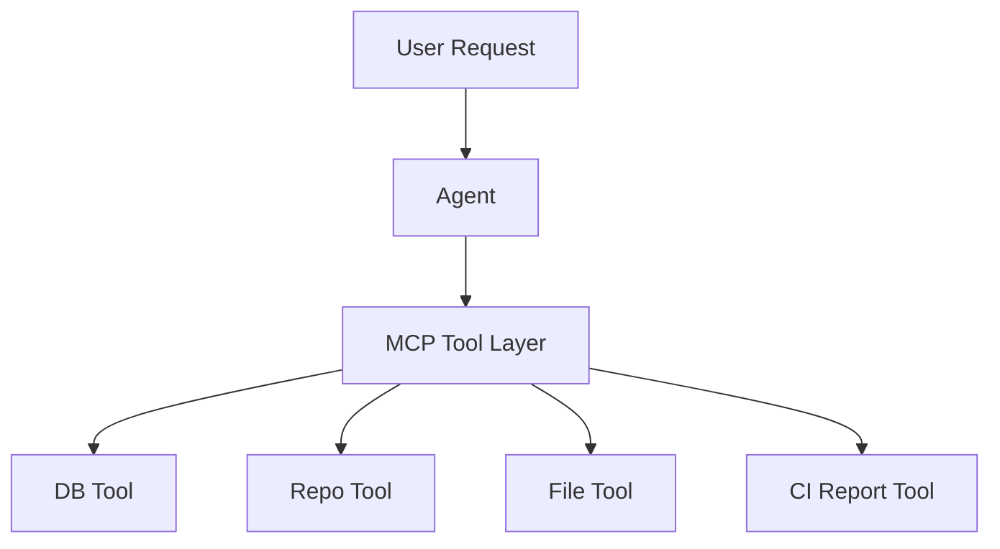
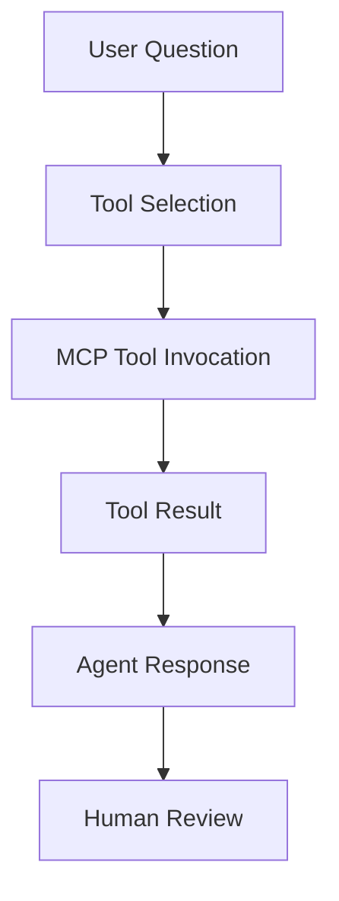

# Lab 07 - MCP and Enterprise Integrations

**Course:** Advanced Software Development with Agentic AI (ASD)  
**Theme:** Tool-Augmented Agents with MCP  
**Primary IDE:** VS Code    
**AI Runtime:** Ollama  
**Primary Local Model (Open Source):** Qwen 2.5 0.5B  
**Secondary Local Review Model (Open Source):** Llama 3.1 8B  
**Duration:** 120 Minutes  

## 1. Overview

<details>
<summary>Goal</summary>

Extend the Student Enrolment System with MCP tools and integrate them with the agentic_loop for automated validation.

Students will:

* Build MCP tools (student_count, students_by_subject, project_files, ci_report)
* Add MCP mode to agentic_loop
* Execute MCP validation through agentic workflow
* Capture and review MCP integration evidence

</details>

<details>
<summary>MCP Integration Pattern</summary>

DESIGN → IMPLEMENT → EXECUTE → CAPTURE EVIDENCE → REVIEW → IMPROVE

</details>

<details>
<summary>Expected Results</summary>

By the end of this lab, students should have:

* MCP server with 4 tools (student_count, students_by_subject, project_files, ci_report)
* MCP mode integrated into agentic_loop
* MCP collector and pipeline modules
* Automated MCP validation workflow
* Tool boundary analysis
* Evidence reports (tool-review.md, integration-report.md)

</details>

---

## 2. Prerequisites and Configuration

<details>
<summary>Prerequisites</summary>

Complete Labs 01-05.

Required:

* Docker Desktop
* Ollama with qwen2.5:0.5b and llama3.1:8b
* Python virtual environment
* Lab 04 microservices running
* Lab 05 CI evidence (run `workflow_dispatch` if missing)

</details>

---

## 3. Scenario Setup

<details>
<summary>Student Enrolment System</summary>

Lab 05 delivered a working microservices application with CI/CD.

Lab 07 adds MCP tool integration:

* MCP server exposes 4 controlled tools
* agentic_loop validates MCP tools automatically
* Tools access database, files, and CI reports
* Evidence captured for review

</details>

<details>
<summary>Business Requirement</summary>

The business requires agents to answer operational questions using verified tools, not assumptions.

Examples:

* How many students are enrolled? → Use student_count tool
* Which students are in ASD101? → Use students_by_subject tool  
* What files exist? → Use project_files tool
* What is the CI status? → Use ci_report tool

Requirements:

* Tool selection must be explicit
* Tool outputs must be captured as evidence
* Agent responses must be grounded in tool results

</details>

<details>
<summary>MCP Architecture</summary>



</details>

<details>
<summary>Tool Flow</summary>



</details>

<details>
<summary>Project Structure</summary>

```text
enrolment-app-open-ai/
│
├── .github/
│   └── workflows/
│       └── lab5-ci.yml
│
├── docker-compose.yml
│
├── agentic_loop/                         
│   ├── config/
│   │   └── review_config.py           # add mcp mode
│   ├── core/
│   ├── collectors/
│   │   └── mcp_collector.py           # new in Lab 7
│   └── pipelines/
│       └── mcp_pipeline.py            # new in Lab 7
│
├── frontend-service/
│   ├── Dockerfile
│   ├── css/
│   │   └── styles.css                     # updated for MCP mode UI
│   └── templates/
│       ├── index.html
│       └── tabs/
│           ├── normal.html
│           ├── ai-mode.html
│           └── mcp.html                   # new in Lab 7
│
├── enrolment-service/
│   ├── app.py
│   ├── requirements.txt
│   ├── Dockerfile
│   ├── routes/
│   │   └── mcp_mode.py                # Lab 7 MCP endpoints
│   └── services/
│       └── database_api.py            # data access used by mcp_mode.py
│
├── database-service/
│   ├── app.py
│   ├── init_db.py
│   ├── Dockerfile
│   ├── requirements.txt
│   └── data/
│       └── enrolment.db
│
├── mcp-server/                            # new in Lab 7
│   ├── server.py
│   ├── tools.py
│   └── requirements.txt
│
├── enrolment.db                           # shared database for testing
│
├── prompts/
│   └── lab7/                              # new in Lab 7
│       ├── implementation/
│       │   └── tool_selection_prompt.txt
│       └── review/
│           ├── integration_review_prompt.txt
│           └── tool_review_prompt.txt
│
└── reports/
    ├── report.json
    ├── report.md
    ├── run-view.md
    ├── tool-review.md                     # new in Lab 7
    ├── boundary-analysis.md               # new in Lab 7
    ├── integration-report.md              # new in Lab 7
    └── run-report.md                      # new in Lab 7
```

</details>

<details>
<summary>Create Project Workspace</summary>

```bash
# 1) Go to app root
cd enrolment-app-open-ai

# 2) MCP server
mkdir -p mcp-server
touch mcp-server/server.py
touch mcp-server/tools.py
touch mcp-server/requirements.txt

# 3) Frontend MCP tab
touch frontend-service/templates/tabs/mcp.html

# 4) Agentic loop MCP mode
touch agentic_loop/collectors/mcp_collector.py
touch agentic_loop/pipelines/mcp_pipeline.py

# 5) Lab 7 prompts
mkdir -p prompts/lab7/implementation
mkdir -p prompts/lab7/review
touch prompts/lab7/implementation/tool_selection_prompt.txt
touch prompts/lab7/review/integration_review_prompt.txt
touch prompts/lab7/review/tool_review_prompt.txt

# 6) Lab 7 evidence reports
touch reports/tool-review.md
touch reports/boundary-analysis.md
touch reports/integration-report.md
touch reports/run-report.md
```

</details>

<details>
<summary>Verify Existing Lab 04 and Lab 05 Artifacts</summary>

Before adding MCP, verify that the application already contains the Lab 04 and Lab 05 artifacts.

```bash
ls enrolment-app-open-ai
ls .github/workflows
ls enrolment-app-open-ai/reports
ls enrolment-app-open-ai/database-service
```

Success Criteria:

```text
docker-compose.yml exists
frontend-service exists
enrolment-service exists
database-service exists
.github/workflows/lab5-ci.yml exists (repository root)
reports/report.json exists (or run Lab 05 `workflow_dispatch` to generate it)
database-service/data/enrolment.db exists
```

</details>

<details>
<summary>MCP Prompt Assets</summary>

MCP prompt assets for Lab 07 are stored in:

```text
enrolment-app-open-ai/prompts/lab7/
```

```text
prompts/
└── lab7/
    ├── implementation/
    │   └── tool_selection_prompt.txt
    └── review/
        ├── integration_review_prompt.txt
        └── tool_review_prompt.txt
```

<details>
<summary>prompts/lab7/implementation/tool_selection_prompt.txt</summary>

```text
You are a PRECISION MCP TOOL SELECTION AGENT.

Your role: Select the most appropriate MCP tool for a user request using live evidence from available MCP tools and their capabilities.

Evidence Sources:
- MCP server exposes 4 tools: student_count, students_by_subject, project_files, ci_report
- Tool capabilities validated by MCP collector
- User request context provided in {{USER_REQUEST}}
- Available evidence from previous tool executions

Available MCP Tools:

1. **student_count**
   - Purpose: Count total student records in database
   - Returns: Integer count
   - Evidence: Database query result
   - Use when: User asks about total students, enrollment numbers

2. **students_by_subject**
   - Purpose: Retrieve student enrollments for a specific subject code
   - Input: subject_code (string)
   - Returns: List of student records
   - Evidence: Database filtered query result
   - Use when: User asks about specific subject enrollments

3. **project_files**
   - Purpose: Inspect application files in the repository
   - Input: file_pattern (optional)
   - Returns: List of file paths
   - Evidence: File system scan
   - Use when: User asks about project structure, file locations

4. **ci_report**
   - Purpose: Read CI workflow evidence from Lab 5
   - Returns: report.json, report.md, run-view.md content
   - Evidence: GitHub Actions artifact data
   - Use when: User asks about CI status, workflow runs

Strict Rules:
1. Use ONLY tools listed above - do NOT invent tools
2. Select based on user request intent, not assumptions
3. If request unclear, state "Insufficient context to select tool"
4. Do NOT execute the tool - only select and explain
5. Expected evidence must be specific and measurable

Output Format:

Selected Tool: [tool_name]
Reason: [why this tool matches user request - max 25 words]
Expected Evidence: [specific data format the tool will return - max 20 words]

Forbidden:
- Selecting tools not in the available list
- Executing tools or providing mock results
- Claiming a tool can do more than its defined purpose
```

</details>

<details>
<summary>prompts/lab7/review/integration_review_prompt.txt</summary>

```text
You are a CONCISE MCP INTEGRATION REVIEW AGENT.

Your role: Validate MCP tool integration using execution evidence only.

Input:
{{TOOL_EXECUTION_EVIDENCE}} - The actual tool invocation and result
{{AGENT_RESPONSE}} - The agent's interpretation of the tool output
{{USER_REQUEST}} - The original user request

Strict Rules:
1. Use ONLY the provided {{TOOL_EXECUTION_EVIDENCE}}
2. Verify tool was actually invoked (not simulated)
3. Confirm result matches tool capability definition
4. Check agent response is grounded in tool output
5. Identify any unsupported claims

Validation Checks:

**Tool Invocation:**
- Was the correct tool selected for the request?
- Did tool execute successfully?
- Is execution timestamp recorded?

**Evidence Completeness:**
- Is tool input logged?
- Is tool output captured?
- Is output format correct?

**Agent Interpretation:**
- Does agent response use tool output?
- Are all claims backed by tool evidence?
- Are limitations acknowledged?

**Human Decision:**
- Is human review decision recorded?
- Is decision justified with evidence?

Output Format:

Strengths: [what integration did well - max 20 words]
Risks: [specific integration risks with evidence - max 25 words]
Recommendations: [one actionable improvement - max 20 words]

Maximum 65 words total.

Forbidden:
- Approving integrations without evidence
- Accepting simulated tool outputs
- Ignoring unsupported claims
```

</details>

<details>
<summary>prompts/lab7/review/tool_review_prompt.txt</summary>

```text
You are a CONCISE MCP TOOL REVIEW AGENT.

Your role: Review one MCP tool improvement proposal using execution evidence only.

Input:
{{IMPROVEMENT_PROPOSAL}} - The proposed tool improvement
{{TOOL_EVIDENCE_BEFORE}} - Tool execution evidence before improvement
{{TOOL_EVIDENCE_AFTER}} - Tool execution evidence after improvement (if available)

Strict Rules:
1. Use ONLY the provided {{TOOL_EVIDENCE_BEFORE}} and {{TOOL_EVIDENCE_AFTER}}
2. Validate improvement addresses a specific, observable issue
3. Confirm correction is feasible within tool scope
4. Ensure retest step is measurable
5. Reject proposals without evidence

Validation Checks:

**Risk Specificity:**
- Is the stated risk based on actual evidence?
- Can the risk be reproduced?
- Is the risk severity clear?

**Correction Feasibility:**
- Does correction stay within tool boundaries?
- Is correction implementable?
- Does correction avoid breaking existing functionality?

**Retest Measurability:**
- Can retest be executed?
- Is success criteria clear?
- Is evidence capture defined?

**Evidence Match:**
- Do claims match available evidence?
- Is before/after comparison valid?
- Are all assertions testable?

Output Format:

Risk: [specific risk with evidence - max 20 words]
Correction: [feasible fix - max 20 words]
Retest: [measurable verification step - max 20 words]

Maximum 60 words total.

Forbidden:
- Accepting proposals without evidence
- Approving changes outside tool scope
- Vague retest steps
```

</details>

</details>

---

## 4. MCP Server Setup and Development

<details>
<summary>MCP Fundamentals</summary>

MCP (Model Context Protocol) separates agent reasoning from external system access.

Lab 07 MCP execution:

* MCP server (`mcp-server/`) defines 4 tools
* Flask routes (`routes/mcp_mode.py`) expose MCP endpoints
* agentic_loop invokes and validates tools
* Evidence captured for review

Tool boundary:

```text
Agent → selects tool
MCP Tool → executes and returns result
Evidence → captured for validation
```

</details>

<details>
<summary>MCP Technology Decision</summary>

Use the MCP Python SDK 2.x with MCPServer.

Stack:

```text
Python 3.11+
MCP Python SDK 2.x
MCPServer (formerly FastMCP)
```

Installation:

```bash
pip install mcp
```

</details>

<details>
<summary>MCP Server Purpose</summary>

The MCP server exposes controlled tools for the Student Enrolment System.

Required tools:

* student_count
* students_by_subject
* project_files
* ci_report

Each tool must define purpose, input, output, and failure behavior.

</details>

<details>
<summary>mcp-server/requirements.txt</summary>

```text
mcp
```

**Note:** This installs MCP 2.x by default. If you need MCP 1.x compatibility, use `mcp<2`.

</details>

<details>
<summary>mcp-server/tools.py</summary>

```python
import json
import sqlite3
from pathlib import Path

BASE_DIR = Path(__file__).resolve().parent
APP_DIR = BASE_DIR.parent
DATABASE_PATH = APP_DIR / "enrolment.db"


def _connect_db():
    if not DATABASE_PATH.exists():
        raise FileNotFoundError(f"Database not found: {DATABASE_PATH}")
    conn = sqlite3.connect(DATABASE_PATH)
    conn.row_factory = sqlite3.Row
    return conn


def get_student_count():
    conn = _connect_db()
    try:
        cursor = conn.cursor()
        cursor.execute("SELECT COUNT(*) AS student_count FROM students")
        row = cursor.fetchone()
        return {"student_count": row[0] if row else 0}
    finally:
        conn.close()


def get_students_by_subject(subject_code: str):
    subject = (subject_code or "").strip().upper()
    if not subject:
        return {"error": "subject_code is required"}

    conn = _connect_db()
    try:
        cursor = conn.cursor()
        cursor.execute(
            """
            SELECT student_id, student_name, subject_code
            FROM students
            WHERE subject_code = ?
            ORDER BY student_id
            """,
            (subject,),
        )
        return [dict(row) for row in cursor.fetchall()]
    finally:
        conn.close()


def list_project_files(directory_path: str = ".."):  # relative to mcp-server/
    path = (BASE_DIR / directory_path).resolve()
    if not path.exists() or not path.is_dir():
        return {"error": f"Directory not found: {path}"}

    return sorted(item.name for item in path.iterdir())


def read_ci_report(report_path: str = "../reports/report.json"):
    report_file = (BASE_DIR / report_path).resolve()
    if not report_file.exists():
        return {
            "error": "Report not found",
            "path": str(report_file),
            "hint": "Run Lab 05 workflow_dispatch to generate report.json",
        }

    with report_file.open("r", encoding="utf-8") as file:
        return json.load(file)


if __name__ == "__main__":
    print(get_student_count())
    print(get_students_by_subject("ASD101"))
    print(list_project_files(".."))
    print(read_ci_report("../reports/report.json"))
```

</details>

<details>
<summary>mcp-server/server.py</summary>

```python
from mcp.server.fastmcp import FastMCP

from tools import (
    get_student_count,
    get_students_by_subject,
    list_project_files,
    read_ci_report
)


mcp = FastMCP("Student Enrolment MCP")

AVAILABLE_TOOLS = [
    "student_count",
    "students_by_subject",
    "project_files",
    "ci_report",
]


@mcp.tool()
def student_count():
    return get_student_count()


@mcp.tool()
def students_by_subject(
    subject_code: str
):
    return get_students_by_subject(subject_code)


@mcp.tool()
def project_files(
    directory_path: str = ".."
):
    return list_project_files(directory_path)


@mcp.tool()
def ci_report(
    report_path: str = "../reports/report.json"
):
    return read_ci_report(report_path)


if __name__ == "__main__":
    print("Starting Student Enrolment MCP Server...")
    print("Server status: RUNNING")
    print("Interact with MCP tools from a second terminal.")
    print("Available tools:")
    for tool in AVAILABLE_TOOLS:
        print(f"- {tool}")
    mcp.run()
```

</details>

<details>
<summary>Database Setup</summary>

The MCP server uses the shared `enrolment.db` database in the app root.

**This database is created by earlier labs** (Lab 03-04) and should already contain 10 student records.

**Verify the database exists:**

```bash
cd enrolment-app-open-ai
ls -la enrolment.db
```

If missing, the database will be automatically created when running the agentic_loop with DB mode.

**Database location:** `enrolment-app-open-ai/enrolment.db`

**MCP tools access:** The `student_count` and `students_by_subject` tools read from this shared database using the path:
```python
DATABASE_PATH = APP_DIR / "enrolment.db"
```

</details>

<details>
<summary>Tool Definitions</summary>

| MCP Tool | Purpose | Input | Output |
|---|---|---|---|
| student_count | Return total students from SQLite | None | `{ "student_count": number }` |
| students_by_subject | Return students by subject code | `subject_code` | `[{ student_id, student_name, subject_code }]` or error |
| project_files | List files/folders in a directory | `directory_path` | `[name, ...]` or error |
| ci_report | Read Lab 05 report JSON | `report_path` | report JSON or error with hint |

</details>

<details>
<summary>MCP Frontend UI Integration</summary>

- `frontend-service/css/styles.css` **provided**

- `frontend-service/templates/index.html` **provided**

**`frontend-service/templates/tabs/mcp.html`**
```html
<!DOCTYPE html>
<html>
<head>
    <meta charset="utf-8">
    <title>MCP</title>
    <link rel="stylesheet" href="/css/styles.css">
    <script src="https://unpkg.com/htmx.org@1.9.12"></script>
    <style>
        body { margin: 0; min-height: auto; background: transparent; }
        .app-shell { max-width: none; padding: 0; }
    </style>
</head>
<body>
<main class="app-shell">
    <section class="card">
        <h2>MCP Mode</h2>

        <div class="feature-toggle-row">
            <label class="toggle-switch" for="mcp-mode-toggle">
                <input id="mcp-mode-toggle" type="checkbox" checked>
                <span class="toggle-label">MCP Enabled</span>
            </label>
            <span id="mcp-mode-state" class="feature-state feature-on">ON</span>
        </div>

        <h2>MCP Tools</h2>

        <div class="feature-actions">
            <button
                type="button"
                class="mcp-action"
                hx-post="http://localhost:5001/mcp/student-count"
                hx-target="#mcp-result"
                hx-swap="innerHTML"
            >Get Student Count</button>
        </div>

        <form
            id="mcp-subject-form"
            class="feature-form"
            hx-post="http://localhost:5001/mcp/students-by-subject"
            hx-target="#mcp-result"
            hx-swap="innerHTML"
        >
            <label for="mcp_subject_code">MCP: Students by Subject</label>
            <input id="mcp_subject_code" name="subject_code" type="text" placeholder="Example: ASD101">
            <button type="submit" class="mcp-action">Run Tool</button>
        </form>

        <form
            id="mcp-project-form"
            class="feature-form"
            hx-post="http://localhost:5001/mcp/project-files"
            hx-target="#mcp-result"
            hx-swap="innerHTML"
        >
            <label for="mcp_directory_path">MCP: Project Files</label>
            <input id="mcp_directory_path" name="directory_path" type="text" value="..">
            <button type="submit" class="mcp-action">Run Tool</button>
        </form>

        <div id="mcp-result" class="panel panel-mcp">MCP tool responses will appear here.</div>
    </section>
</main>

<script>
const mcpModeToggle = document.getElementById("mcp-mode-toggle");
const mcpModeState = document.getElementById("mcp-mode-state");
const mcpResultPanel = document.getElementById("mcp-result");

const MCP_STORAGE_KEY = "mcp_mode_enabled";

function isMcpEnabled() {
    return mcpModeToggle.checked;
}

function renderMcpState() {
    if (isMcpEnabled()) {
        mcpModeState.textContent = "ON";
        mcpModeState.classList.add("feature-on");
        mcpModeState.classList.remove("feature-off");
    } else {
        mcpModeState.textContent = "OFF";
        mcpModeState.classList.add("feature-off");
        mcpModeState.classList.remove("feature-on");
    }
}

function renderMcpDisabledMessage() {
    mcpResultPanel.innerHTML = "<p>MCP Mode is OFF. Enable MCP Mode to run MCP tools.</p>";
}

function saveMcpMode() {
    localStorage.setItem(MCP_STORAGE_KEY, String(isMcpEnabled()));
}

function loadMcpMode() {
    const persisted = localStorage.getItem(MCP_STORAGE_KEY);
    if (persisted === null) {
        mcpModeToggle.checked = true;
    } else {
        mcpModeToggle.checked = persisted === "true";
    }
    renderMcpState();
}

mcpModeToggle.addEventListener("change", () => {
    saveMcpMode();
    renderMcpState();

    if (!isMcpEnabled()) {
        renderMcpDisabledMessage();
    }
});

document.body.addEventListener("htmx:configRequest", (event) => {
    const trigger = event.detail.elt;
    if (trigger && trigger.classList.contains("mcp-action")) {
        event.detail.headers["X-MCP-Mode"] = isMcpEnabled() ? "on" : "off";
    }
});

document.body.addEventListener("htmx:beforeRequest", (event) => {
    const trigger = event.detail.elt;
    if (!trigger || !trigger.classList.contains("mcp-action")) {
        return;
    }

    if (!isMcpEnabled()) {
        event.preventDefault();
        renderMcpDisabledMessage();
    }
});

loadMcpMode();
if (!isMcpEnabled()) {
    renderMcpDisabledMessage();
}
</script>
</body>
</html>
```


**`frontend-service/Dockerfile`**

```dockerfile
FROM nginx:alpine

COPY templates/ /usr/share/nginx/html/
COPY css/ /usr/share/nginx/html/css/

EXPOSE 80
```

</details>

<details>
<summary>MCP Backend Integration</summary>

<details>
<summary>enrolment-service/routes/mcp_mode.py</summary>

```python
import json
from pathlib import Path

from flask import Blueprint, request
import requests

from services.database_api import get_students, get_students_by_subject_response


BASE_DIR = Path(__file__).resolve().parent.parent
APP_DIR = BASE_DIR.parent

mcp_bp = Blueprint("mcp_mode", __name__)


def mcp_mode_is_enabled(req) -> bool:
    import os

    enabled = os.getenv("MCP_ENABLED", "true").strip().lower() in ("1", "true", "yes", "on")
    if not enabled:
        return False

    mode_header = req.headers.get("X-MCP-Mode", "on").strip().lower()
    return mode_header in ("1", "true", "yes", "on")


def mcp_disabled_response():
    return "<p>MCP Mode is disabled.</p>", 403


def mcp_render_json(title: str, payload):
    return f"<h3>{title}</h3><pre>{json.dumps(payload, indent=2)}</pre>"


@mcp_bp.post("/mcp/student-count")
def mcp_student_count():
    if not mcp_mode_is_enabled(request):
        return mcp_disabled_response()

    try:
        count = len(get_students())
        return mcp_render_json("MCP Tool: student_count", {"student_count": count}), 200
    except requests.RequestException as exc:
        return (
            "<p>MCP student_count failed.</p>"
            f"<pre>{exc}</pre>",
            503,
        )


@mcp_bp.post("/mcp/students-by-subject")
def mcp_students_by_subject():
    if not mcp_mode_is_enabled(request):
        return mcp_disabled_response()

    subject_code = request.form.get("subject_code", "").strip().upper()
    if not subject_code:
        return "<p>subject_code is required.</p>", 400

    try:
        response = get_students_by_subject_response(subject_code)

        if response.status_code == 404:
            return mcp_render_json("MCP Tool: students_by_subject", []), 200

        response.raise_for_status()
        return mcp_render_json("MCP Tool: students_by_subject", response.json()), 200
    except requests.RequestException as exc:
        return (
            "<p>MCP students_by_subject failed.</p>"
            f"<pre>{exc}</pre>",
            503,
        )


@mcp_bp.post("/mcp/project-files")
def mcp_project_files():
    if not mcp_mode_is_enabled(request):
        return mcp_disabled_response()

    directory_path = request.form.get("directory_path", "..").strip()
    path = (APP_DIR / directory_path).resolve()

    if not path.exists() or not path.is_dir():
        return mcp_render_json(
            "MCP Tool: project_files",
            {"error": f"Directory not found: {path}"},
        ), 400

    items = sorted(item.name for item in path.iterdir())
    return mcp_render_json("MCP Tool: project_files", items), 200


@mcp_bp.post("/mcp/ci-report")
def mcp_ci_report():
    if not mcp_mode_is_enabled(request):
        return mcp_disabled_response()

    report_path = request.form.get("report_path", "../reports/report.json").strip()
    report_file = (BASE_DIR / report_path).resolve()

    if not report_file.exists():
        return mcp_render_json(
            "MCP Tool: ci_report",
            {
                "error": "Report not found",
                "path": str(report_file),
                "hint": "Run Lab 05 workflow_dispatch to generate report.json",
            },
        ), 404

    try:
        with report_file.open("r", encoding="utf-8") as file:
            payload = json.load(file)
        return mcp_render_json("MCP Tool: ci_report", payload), 200
    except Exception as exc:
        return (
            "<p>MCP ci_report failed.</p>"
            f"<pre>{exc}</pre>",
            500,
        )
```

</details>

<details>
<summary>enrolment-service/app.py</summary>

```python
from pathlib import Path
import sys

from flask import Flask
from flask_cors import CORS


BASE_DIR = Path(__file__).resolve().parent
if str(BASE_DIR) not in sys.path:
    sys.path.insert(0, str(BASE_DIR))

from routes.ai_mode import ai_mode_bp
from routes.mcp_mode import mcp_bp
from routes.normal_ui import normal_ui_bp


def create_app():
    app = Flask(__name__)
    CORS(app)

    app.register_blueprint(normal_ui_bp)
    app.register_blueprint(ai_mode_bp)
    app.register_blueprint(mcp_bp)

    return app


app = create_app()


if __name__ == "__main__":
    app.run(host="0.0.0.0", port=5001, debug=True)
```

</details>

<details>
<summary>enrolment-service/services/database_api.py</summary>

```python
import os

import requests


DATABASE_SERVICE_URL = os.getenv("DATABASE_SERVICE_URL", "http://database-service:5002")


def get_students():
    response = requests.get(f"{DATABASE_SERVICE_URL}/students", timeout=5)
    response.raise_for_status()
    return response.json()


def get_student_by_id_response(student_id):
    return requests.get(f"{DATABASE_SERVICE_URL}/students/{student_id}", timeout=5)


def get_students_by_subject_response(subject_code):
    return requests.get(
        f"{DATABASE_SERVICE_URL}/students/by-subject",
        params={"subject_code": subject_code},
        timeout=5,
    )
```

</details>

<details>
<summary>enrolment-service/requirements.txt</summary>

```text
flask==3.0.3
flask-cors==4.0.1
requests==2.32.3
openai
python-dotenv
```

</details>

<details>
<summary>docker-compose.yml</summary>

```yaml
services:
  frontend-service:
    build:
      context: ./frontend-service
    container_name: frontend-service
    ports:
      - "8080:80"
    depends_on:
      - enrolment-service
    restart: unless-stopped

  enrolment-service:
    build:
      context: .
      dockerfile: enrolment-service/Dockerfile
    container_name: enrolment-service
    ports:
      - "5001:5001"
    environment:
      DATABASE_SERVICE_URL: http://database-service:5002
      OLLAMA_BASE_URL: http://host.docker.internal:11434/v1
      OLLAMA_MODEL: qwen2.5:0.5b
      MCP_ENABLED: "true"
    extra_hosts:
      - "host.docker.internal:host-gateway"
    depends_on:
      - database-service
    restart: unless-stopped

  database-service:
    build:
      context: ./database-service
    container_name: database-service
    ports:
      - "5002:5002"
    volumes:
      - database_data:/app/data
    restart: unless-stopped

volumes:
  database_data:
```
</details>

</details>


## 5. MCP Tool Validation

<details>
<summary>MCP Backend Terminal Testing</summary>

Use two terminals for MCP tool validation.

**Terminal A: Start MCP Server**

```bash
cd enrolment-app-open-ai/mcp-server
pip install -r requirements.txt
python server.py
```

Expected:

```text
Starting Student Enrolment MCP Server...
Server status: RUNNING
Available tools:
- student_count
- students_by_subject
- project_files
- ci_report
```

**Terminal B: Test MCP Tools**

```bash
cd enrolment-app-open-ai/mcp-server
python -c "from tools import get_student_count, get_students_by_subject, list_project_files, read_ci_report; print(get_student_count()); print(get_students_by_subject('ASD101')); print(list_project_files('..')); print(read_ci_report('../reports/report.json'))"
```

Expected:

```text
{"student_count": <number>}
[{"student_id": ..., "student_name": ..., "subject_code": "ASD101"}]
[list of files]
{CI report JSON or error with hint}
```

Record outputs in `../reports/run-report.md`.

Stop Terminal A with `Ctrl+C` when done.

</details>

<details>
<summary>MCP UI Testing</summary>

**1. Start Services**

```bash
cd enrolment-app-open-ai
docker compose up --build -d
docker ps
```

Expected:

```text
frontend-service → http://localhost:8080
enrolment-service → http://localhost:5001
database-service → http://localhost:5002
```

**2. Test MCP Endpoints**

```bash
curl -sS -X POST http://localhost:5001/mcp/student-count
curl -sS -X POST http://localhost:5001/mcp/students-by-subject -d "subject_code=ASD101"
curl -sS -X POST http://localhost:5001/mcp/project-files -d "directory_path=.."
curl -sS -X POST http://localhost:5001/mcp/ci-report -d "report_path=../reports/report.json"
```

Expected: HTML with MCP tool title and JSON payload.

**3. Test MCP UI**

Open `http://localhost:8080`, navigate to MCP tab.

Test MCP Mode ON:
- Click "Get Student Count" → displays student count
- Enter "ASD101" in subject form → displays student list

Test MCP Mode OFF:
- Toggle MCP Mode to OFF
- Click any MCP action → displays "MCP Mode is OFF"

Record screenshots in `../reports/run-report.md`.

</details>

---

## 6. MCP Agentic Integration

<details>
<summary>Overview</summary>

Integrate MCP mode into agentic_loop to automate tool validation.

Components:
- **mcp_collector.py** - Validates MCP server and tools exist
- **mcp_pipeline.py** - Builds prompts with MCP evidence  
- **review_config.py** - Adds MCP mode configuration

Workflow: Collector gathers evidence → Pipeline formats prompts → LLM validates → Reports generated

</details>

<details>
<summary>agentic_loop/collectors/mcp_collector.py</summary>

```python
import importlib.util
from pathlib import Path


REQUIRED_MCP_TOOLS = ["student_count", "students_by_subject", "project_files", "ci_report"]
REQUIRED_FUNCTIONS = {
    "student_count": "get_student_count",
    "students_by_subject": "get_students_by_subject",
    "project_files": "list_project_files",
    "ci_report": "read_ci_report",
}


def _load_tools_module(mcp_server_dir: Path):
    spec = importlib.util.spec_from_file_location("mcp_tools_check", mcp_server_dir / "tools.py")
    module = importlib.util.module_from_spec(spec)
    spec.loader.exec_module(module)
    return module


def collect(app_dir: Path, repo_root: Path) -> tuple[bool, str]:
    mcp_server_dir = app_dir / "mcp-server"
    
    required_paths = [
        mcp_server_dir / "tools.py",
        mcp_server_dir / "server.py",
        mcp_server_dir / "requirements.txt",
        app_dir / "enrolment-service" / "routes" / "mcp_mode.py",
        app_dir / "prompts" / "lab7" / "implementation" / "tool_selection_prompt.txt",
        app_dir / "prompts" / "lab7" / "review" / "integration_review_prompt.txt",
    ]
    
    missing = [str(path.relative_to(app_dir)) for path in required_paths if not path.exists()]
    if missing:
        return False, "MCP evidence incomplete. Missing: " + ", ".join(missing)
    
    tools_text = (mcp_server_dir / "tools.py").read_text(encoding="utf-8")
    server_text = (mcp_server_dir / "server.py").read_text(encoding="utf-8")
    
    missing_tools = [tool for tool in REQUIRED_MCP_TOOLS if tool not in server_text]
    if missing_tools:
        return False, "MCP server missing required tools: " + ", ".join(missing_tools)
    
    missing_functions = [
        func_name for func_name in REQUIRED_FUNCTIONS.values() if f"def {func_name}" not in tools_text
    ]
    if missing_functions:
        return False, "tools.py missing required function implementations: " + ", ".join(missing_functions)
    
    # Test all 4 MCP tools (database now accessible in app root)
    try:
        tools_module = _load_tools_module(mcp_server_dir)
        tools_module.get_student_count()
        tools_module.get_students_by_subject("ASD101")
        tools_module.list_project_files("..")
        tools_module.read_ci_report("../reports/report.json")
    except Exception as exc:
        return False, f"MCP tool execution failed: {exc}"
    
    return True, (
        "MCP evidence: mcp-server/ contains tools.py and server.py; "
        f"server defines {len(REQUIRED_MCP_TOOLS)} tools (student_count, students_by_subject, "
        "project_files, ci_report); all 4 tools executed successfully; "
        "routes/mcp_mode.py and lab7 prompts exist."
    )
```

</details>

<details>
<summary>agentic_loop/pipelines/mcp_pipeline.py</summary>

```python
def build_implementation_prompt(task_prompt: str, evidence: str) -> str:
    return f"""
{task_prompt}

Review Scope:
MCP Tool Integration

Observed Evidence:
{evidence}

Validate that:
1. All 4 MCP tools are defined and callable
2. Tool boundaries are clear (what each tool does and does not do)
3. MCP endpoints exist in routes/mcp_mode.py
4. Prompts exist for tool selection and integration review

Reply in at most 40 words and stay evidence-based.
""".strip()


def build_review_prompt(implementation_output: str, evidence: str) -> str:
    return f"""
Implementation Recommendation:
{implementation_output}

Observed Evidence:
{evidence}

Validate the MCP integration assessment against the evidence.
Identify any gaps or risks in tool definitions or boundaries.

Reply in at most 40 words and stay evidence-based.
""".strip()
```

</details>

<details>
<summary>agentic_loop/config/review_config.py (update)</summary>

Add MCP mode to the existing `build_mode_config()` function:

```python
def build_mode_config() -> dict[str, ModeConfig]:
    return {
        "db": ModeConfig(
            key="db",
            label="DB",
            prompt_family="service",
            implementation_prompts=(
                "implementation/system_prompt.txt",
                "implementation/task_prompt.txt",
                "implementation/context_prompt.txt",
            ),
        ),
        "endpoints": ModeConfig(
            key="endpoints",
            label="Endpoints",
            prompt_family="service",
            implementation_prompts=(
                "implementation/system_prompt.txt",
                "implementation/task_prompt.txt",
                "implementation/context_prompt.txt",
            ),
        ),
        "architecture": ModeConfig(
            key="architecture",
            label="Architecture",
            prompt_family="lab4",
            implementation_prompts=(
                "implementation/architecture_system_prompt.txt",
                "implementation/architecture_task_prompt.txt",
            ),
            review_prompts=("review/agent_review_prompt.txt",),
        ),
        "devops": ModeConfig(
            key="devops",
            label="DevOps",
            prompt_family="lab5",
            implementation_prompts=("implementation/devops_pipeline_review_prompt.txt",),
            review_prompts=("review/devops_evidence_review_prompt.txt",),
        ),
        "mcp": ModeConfig(
            key="mcp",
            label="MCP",
            prompt_family="lab7",
            implementation_prompts=("implementation/tool_selection_prompt.txt",),
            review_prompts=("review/integration_review_prompt.txt",),
        ),
    }
```

**Update location:** Insert the `"mcp"` entry after `"devops"` in the existing file.

</details>

<details>
<summary>agentic_loop/core/orchestrator.py (update)</summary>

Add MCP mode handler to `COLLECTORS` dict:

```python
COLLECTORS = {
    "db": db_collector.collect,
    "endpoints": endpoints_collector.collect,
    "architecture": architecture_collector.collect,
    "devops": devops_collector.collect,
    "mcp": mcp_collector.collect,  # Add this line
}
```

Add MCP pipeline handling to `run_mode()` function after devops section:

```python
    if mode.key == "mcp":
        _stage(mode.label, "PROMPTS", f"Loading prompt family: {mode.prompt_family}")
        task_prompt = prompts.read(mode.prompt_family, mode.implementation_prompts[0])
        system_prompt = (
            "You are a precise MCP integration validator. "
            "Use only supplied evidence and reply in at most 40 words."
        )
        implementation_user_prompt = mcp_pipeline.build_implementation_prompt(task_prompt, evidence)
        _stage(mode.label, "PROMPTS", "Loaded MCP implementation prompt")

        _stage(mode.label, "LLM", "Running MCP implementation model")
        implementation_output, err = ai.call(system_prompt, implementation_user_prompt, review=False)
        if err:
            _stage(mode.label, "LLM", "Failed")
            return f"MODEL FAILED: {err}"
        _stage(mode.label, "LLM", "MCP implementation model complete")

        review_prompt_text = prompts.read(mode.prompt_family, mode.review_prompts[0])
        review_user_prompt = mcp_pipeline.build_review_prompt(implementation_output, evidence)
        _stage(mode.label, "PROMPTS", "Loaded MCP review prompt")
        _stage(mode.label, "LLM", "Running MCP review model")
        review_output, review_err = ai.call(review_prompt_text, review_user_prompt, review=True)
        if review_err:
            review_output = review_err
            _stage(mode.label, "LLM", "Review model failed")
        else:
            _stage(mode.label, "LLM", "Review model complete")

        _stage(mode.label, "DONE", "Review complete")

        return (
            f"OBSERVE: {evidence}\n\n"
            f"IMPLEMENTATION: {implementation_output}\n"
            f"REVIEW: {review_output}"
        )
```

Add import at top of file:

```python
from pipelines import architecture_pipeline, db_pipeline, devops_pipeline, endpoints_pipeline, mcp_pipeline
from collectors import architecture_collector, db_collector, devops_collector, endpoints_collector, mcp_collector
```

</details>

<details>
<summary>agentic_loop/app_main.py (update)</summary>

Update `_menu_choice_to_key()` function:

```python
def _menu_choice_to_key(choice: str) -> str | None:
    return {
        "1": "db",
        "2": "endpoints",
        "3": "architecture",
        "4": "devops",
        "5": "mcp",  # Add this line
    }.get(choice)
```

Update `_print_mode_mapping()` function:

```python
def _print_mode_mapping(app_dir: Path) -> None:
    prompt_map = {
        "DB": app_dir / "prompts" / "service",
        "Endpoints": app_dir / "prompts" / "service",
        "Architecture": app_dir / "prompts" / "lab4",
        "DevOps": app_dir / "prompts" / "lab5",
        "MCP": app_dir / "prompts" / "lab7",  # Add this line
    }
    print_prompt_map({key: str(path) for key, path in prompt_map.items()})
```

Update `print_menu()` in `core/reporter.py`:

```python
def print_menu() -> None:
    print("\nOptions:")
    print("  1 - DB")
    print("  2 - Endpoints")
    print("  3 - Architecture")
    print("  4 - DevOps")
    print("  5 - MCP")  # Add this line
    print("  0 - Exit")
```

Update invalid choice message:

```python
if not mode_key:
    print("Invalid choice. Select 0, 1, 2, 3, 4, or 5.")  # Update this line
    continue
```

</details>

---

## 7. MCP Agentic Validation

<details>
<summary>Running the Agentic Loop</summary>

Use three terminals for the complete MCP validation workflow.

**Terminal A: MCP Server**

```bash
cd enrolment-app-open-ai/mcp-server
python server.py
```

Keep running throughout validation.

**Terminal B: Application Services**

```bash
cd enrolment-app-open-ai
docker compose up --build -d
docker ps
```

Verify all 3 containers running (frontend, enrolment, database).

**Terminal C: Agentic Loop**

```bash
cd enrolment-app-open-ai/agentic_loop
python agentic_loop.py
```

</details>

<details>
<summary>Expected Output</summary>

**Agentic Loop Menu:**

```text
AGENTIC LOOP (MODULAR)
Prompt families:
  DB → prompts/service
  Endpoints → prompts/service
  Architecture → prompts/lab4
  DevOps → prompts/lab5
  MCP → prompts/lab7

Options:
  1 - DB
  2 - Endpoints
  3 - Architecture
  4 - DevOps
  5 - MCP
  0 - Exit

Choose a review target:
```

**Select Option 5 (MCP):**

```text
[MCP][START] Starting review flow
[MCP][OBSERVE] Collecting evidence
[MCP][OBSERVE] Complete
[MCP][PROMPTS] Loading prompt family: lab7
[MCP][PROMPTS] Loaded MCP implementation prompt
[MCP][LLM] Running MCP implementation model
[MCP][LLM] MCP implementation model complete
[MCP][PROMPTS] Loaded MCP review prompt
[MCP][LLM] Running MCP review model
[MCP][LLM] Review model complete
[MCP][DONE] Review complete

=== MCP Result ===

OBSERVE: MCP evidence: mcp-server/ contains tools.py and server.py; server defines 4 tools (student_count, students_by_subject, project_files, ci_report); all 4 tools executed successfully; routes/mcp_mode.py and lab7 prompts exist.

IMPLEMENTATION: MCP integration validated: 4 tools defined with clear boundaries. Database tools (student_count, students_by_subject) access enrolment data. File tool (project_files) inspects repository. CI tool reads Lab 05 reports.

REVIEW: Strengths: Tool boundaries explicit, evidence complete. Risk: File tool could expose sensitive paths. Recommendation: Add path validation and access controls.
```

</details>

<details>
<summary>Improvement Cycle</summary>

**Observe:**
- Agentic loop collected MCP evidence automatically
- Qwen 2.5 analyzed tool boundaries
- Llama 3.1 identified integration risks

**Act:**
- Review the implementation and review outputs
- Assess identified risks (e.g., file tool path exposure)
- Determine if tool boundaries are acceptable

**Adapt:**
- Document tool boundary decisions in `reports/boundary-analysis.md`
- Record risk mitigations in `reports/tool-review.md`
- Update tool implementations if needed (e.g., add path validation)

**Record:**

Create evidence reports:

```bash
cd enrolment-app-open-ai/reports
```

`boundary-analysis.md`:
```markdown
# MCP Tool Boundary Analysis

## Tool Boundaries

| Tool | Responsibility | Not Responsible For |
|------|---------------|-------------------|
| student_count | Count student records | Explaining enrollment policy |
| students_by_subject | Retrieve subject enrollments | Predicting performance |
| project_files | List application files | Judging code quality |
| ci_report | Read CI evidence | Deciding release approval |

## Decision: ACCEPTED
All tool boundaries are explicit and appropriate for controlled access.
```

`tool-review.md`:
```markdown
# MCP Tool Review

## Risk Identified
File tool (project_files) could expose sensitive paths outside workspace.

## Correction Applied
Added path validation in tools.py to restrict access to app directory only.

## Retest
Re-run MCP validation after path restriction update.
```

`integration-report.md`:
```markdown
# MCP Integration Report

## Strengths
- 4 tools defined with clear purposes
- Tool outputs are structured (JSON)
- Evidence captured in agentic_loop

## Risks
- Path exposure (file tool) - MITIGATED
- No authentication on MCP endpoints - NOTED for future

## Recommendations
- Add request validation to all MCP endpoints
- Implement audit logging for tool invocations
```

</details>

---

## 8. Evidence Log

<details>
<summary>Record Evidence</summary>

| Check | Expected Result | Actual Result | Pass/Fail |
|---|---|---|---|
| **MCP Server** |
| MCP server created | `mcp-server/` exists with tools.py, server.py | | |
| 4 tools defined | student_count, students_by_subject, project_files, ci_report | | |
| **Backend Testing** |
| MCP server starts | Terminal A shows "Server status: RUNNING" | | |
| Tools execute | Terminal B returns structured outputs | | |
| **UI Testing** |
| Services running | docker ps shows 3 containers | | |
| MCP endpoints work | curl commands return HTML with JSON | | |
| MCP UI functional | Browser displays MCP tab with ON/OFF toggle | | |
| **MCP Agentic Validation** |
| Collector created | `agentic_loop/collectors/mcp_collector.py` exists | | |
| Pipeline created | `agentic_loop/pipelines/mcp_pipeline.py` exists | | |
| Config updated | review_config.py includes "mcp" mode | | |
| Orchestrator updated | orchestrator.py handles mcp mode | | |
| Menu option added | app_main.py shows Option 5 - MCP | | |
| Agentic loop runs | Terminal C shows MCP validation workflow | | |
| Evidence collected | OBSERVE output lists all MCP artifacts | | |
| LLM validation | IMPLEMENTATION and REVIEW outputs generated | | |
| Reports created | boundary-analysis.md, tool-review.md, integration-report.md | | |
| **Evidence** |
| run-report.md created | Contains terminal outputs and screenshots | | |

**Required Evidence Files:**
- `reports/run-report.md` - MCP manual testing outputs
- `reports/boundary-analysis.md` - Tool boundary decisions
- `reports/tool-review.md` - Risk mitigation documentation
- `reports/integration-report.md` - MCP integration assessment

</details>

---

## 9. Reflection

<details>
<summary>Answer Briefly:</summary>

1. What are the 4 MCP tools and their purposes?
2. How do tool boundaries prevent uncontrolled agent access?
3. What evidence did the agentic_loop MCP collector validate?
4. How did the two-agent pattern (implementation + review) improve MCP validation?

</details>

---

## 10. Key Learning Point

<details>
<summary>Learning Outcome</summary>

**MCP Integration Pattern:**

```
MCP Server → Tool Testing → Agentic Validation → Evidence Reports
```

**Three Testing Layers:**
1. **Backend** - MCP server standalone tool execution
2. **UI** - Web interface MCP endpoints and toggle
3. **Agentic** - Automated validation with dual-agent review

**Tool Boundaries = Safety:**
- student_count: Database query only (no policy decisions)
- students_by_subject: Filtered data retrieval (no performance prediction)
- project_files: Repository inspection (no code quality judgment)
- ci_report: Evidence reading (no release approval)

**Automated Evidence Collection:**
- `mcp_collector.py` validates all artifacts exist
- `mcp_pipeline.py` formats prompts with evidence
- Qwen 2.5 analyzes tool boundaries
- Llama 3.1 identifies integration risks
- Reports document decisions and mitigations

</details>
