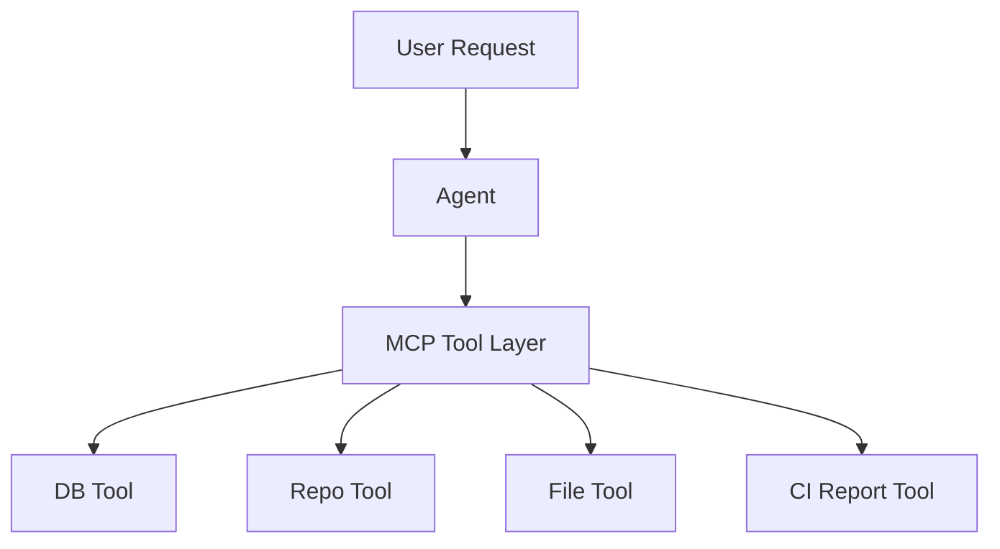
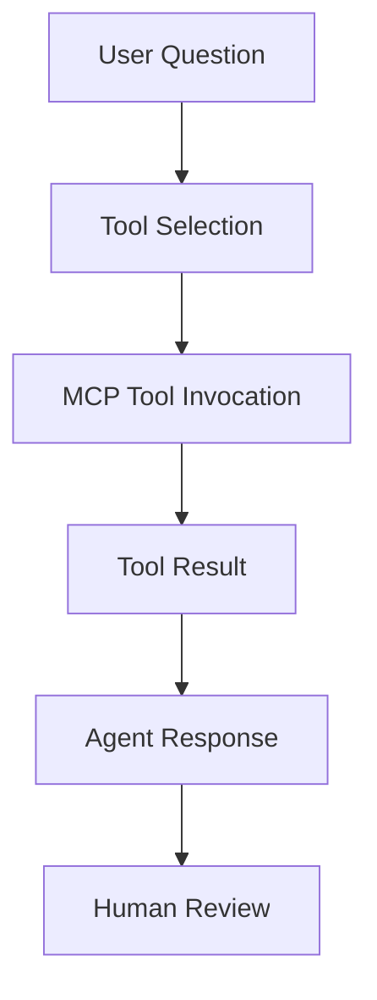

# Lab 07 - MCP and Enterprise Integrations

**Course:** Advanced Software Development with Agentic AI (ASD)  
**Theme:** Tool-Augmented Agents with MCP  
**Primary IDE:** VS Code    
**AI Runtime:** Ollama  
**Primary Local Model (Open Source):** Qwen 2.5 0.5B  
**Secondary Local Review Model (Open Source):** Llama 3.1 8B  
**Duration:** 60 Minutes  

## 1. Overview

<details>
<summary>Goal</summary>

Extend the Student Enrolment System with a tool-augmented agent capability using MCP.

Students will add an MCP tool layer to the existing `enrolment-app-open-ai/` application folder.

The MCP layer allows the system to access external capabilities such as:

* database queries
* repository inspection
* local file access
* CI report reading
* integration evidence collection

This lab does not introduce deployment or advanced reasoning-agent topics.

</details>

<details>
<summary>Agentic Workflow</summary>

PLAN → ACT → OBSERVE → TOOL INVOCATION → REVIEW → HUMAN REVIEW → ADAPT

</details>

<details>
<summary>Expected Results</summary>

By the end of this lab, students should have:

* MCP server added to `enrolment-app-open-ai/`
* MCP tool definitions
* Database connectivity tool
* Repository inspection tool
* File access tool
* CI report reading tool
* Tool invocation evidence
* Tool boundary analysis
* MCP improvement cycle
* Evidence log

</details>

---

## 2. Prerequisites and Configuration

<details>
<summary>Prerequisites</summary>

To start this lab, students should have:

Complete:

* Lab 01
* Lab 02
* Lab 03
* Lab 04
* Lab 05

Required:

* Docker Desktop
* GitHub repository
* GitHub Actions evidence from Lab 05
* Ollama
* qwen2.5:0.5b
* llama3.1:8b
* Python virtual environment
* Existing `enrolment-app-open-ai/` application folder
* Lab 04 microservices structure inside `enrolment-app-open-ai/`
* Lab 05 workflow at repository root (`.github/workflows/lab5-ci.yml`)
* Lab 05 reports inside `enrolment-app-open-ai/reports/`
* Lab 05 CI evidence generated at least once (manual `workflow_dispatch` is valid)

DeepSeek-R1 is not required for this lab.

</details>

<details>
<summary>Environment Verification</summary>

Run these commands from the repository root.

```bash
docker --version
docker compose version
git --version
ollama list
python --version
```

Expected models:

```text
qwen2.5:0.5b
llama3.1:8b
```

</details>

<details>
<summary>Agent Configuration</summary>

```env
OLLAMA_BASE_URL=http://localhost:11434/v1
OLLAMA_MODEL=qwen2.5:0.5b
OLLAMA_REVIEW_MODEL=llama3.1:8b
```

Agent roles:

| Agent     | Role                 | Purpose                                                |
| --------- | -------------------- | ------------------------------------------------------ |
| Qwen 2.5  | Implementation Agent | Generate MCP scaffold, tool definitions, and evidence |
| Llama 3.1 | Review Agent         | Review tool boundaries, risks, and validation evidence |

</details>

---

## 3. Scenario Setup

<details>
<summary>Student Enrolment System</summary>

The Student Enrolment System exists in one application folder:

```text
enrolment-app-open-ai/
```

By the end of Lab 05, the application contains:

* frontend-service
* enrolment-service
* database-service
* Docker Compose configuration
* GitHub Actions CI workflow (`.github/workflows/lab5-ci.yml`)
* CI evidence reports

The system can already:

* display students
* search students
* separate frontend, backend, and database responsibilities
* build and validate through CI

The next requirement is to allow an agent to use external tools safely.

</details>

<details>
<summary>Business Requirement</summary>

The business now requires an agent that can answer operational and project questions by using tools.

Examples:

* How many students are enrolled?
* Which students are enrolled in ASD101?
* What project files exist?
* What CI evidence exists?
* What tool was used to retrieve this information?

The agent must not guess these answers.

The agent must use tools and produce evidence.

</details>

<details>
<summary>MCP Architecture</summary>



</details>

<details>
<summary>Tool Flow</summary>



</details>

<details>
<summary>Project Structure</summary>

```text
enrolment-app-open-ai/
│
├── .github/
│   └── workflows/
│       └── lab5-ci.yml
│
├── docker-compose.yml
│
├── agentic_loop/                         
│   ├── config/
│   ├── core/
│   ├── collectors/
│   └── pipelines/
│
├── frontend-service/
│   ├── Dockerfile
│   ├── css/
│   │   └── styles.css                     # updated for MCP mode UI
│   └── templates/
│       ├── index.html
│       └── tabs/
│           ├── normal.html
│           ├── ai-mode.html
│           └── mcp.html                   # new in Lab 7
│
├── enrolment-service/
│   ├── app.py
│   ├── requirements.txt
│   ├── Dockerfile
│   ├── routes/
│   │   └── mcp_mode.py                # Lab 7 MCP endpoints
│   └── services/
│       └── database_api.py            # data access used by mcp_mode.py
│
├── database-service/
│   ├── app.py
│   ├── init_db.py
│   ├── Dockerfile
│   ├── requirements.txt
│   └── data/
│       └── enrolment.db
│
├── mcp-server/                            # new in Lab 7
│   ├── server.py
│   ├── tools.py
│   └── requirements.txt
│
├── prompts/
│   └── lab7/                              # new in Lab 7
│       ├── implementation/
│       │   └── tool_selection_prompt.txt
│       └── review/
│           ├── integration_review_prompt.txt
│           └── tool_review_prompt.txt
│
└── reports/
    ├── report.json
    ├── report.md
    ├── run-view.md
    ├── tool-review.md                     # new in Lab 7
    ├── boundary-analysis.md               # new in Lab 7
    ├── integration-report.md              # new in Lab 7
    └── run-report.md                      # new in Lab 7
```

</details>

<details>
<summary>Create Project Workspace</summary>

```bash
# 1) Go to app root
cd enrolment-app-open-ai

# 2) MCP server
mkdir -p mcp-server
touch mcp-server/server.py
touch mcp-server/tools.py
touch mcp-server/requirements.txt

# 3) Frontend MCP tab
touch frontend-service/templates/tabs/mcp.html

# 4) Lab 7 prompts
mkdir -p prompts/lab7/implementation
mkdir -p prompts/lab7/review
touch prompts/lab7/implementation/tool_selection_prompt.txt
touch prompts/lab7/review/integration_review_prompt.txt
touch prompts/lab7/review/tool_review_prompt.txt

# 5) Lab 7 evidence reports
touch reports/tool-review.md
touch reports/boundary-analysis.md
touch reports/integration-report.md
touch reports/run-report.md
```

</details>

<details>
<summary>Verify Existing Lab 04 and Lab 05 Artifacts</summary>

Before adding MCP, verify that the application already contains the Lab 04 and Lab 05 artifacts.

```bash
ls enrolment-app-open-ai
ls .github/workflows
ls enrolment-app-open-ai/reports
ls enrolment-app-open-ai/database-service
```

Success Criteria:

```text
docker-compose.yml exists
frontend-service exists
enrolment-service exists
database-service exists
.github/workflows/lab5-ci.yml exists (repository root)
reports/report.json exists (or run Lab 05 `workflow_dispatch` to generate it)
database-service/data/enrolment.db exists
```

</details>

<details>
<summary>MCP Prompt Assets</summary>

MCP prompt assets for Lab 07 are stored in:

```text
enrolment-app-open-ai/prompts/lab7/
```

```text
prompts/
└── lab7/
    ├── implementation/
    │   └── tool_selection_prompt.txt
    └── review/
        ├── integration_review_prompt.txt
        └── tool_review_prompt.txt
```

<details>
<summary>prompts/lab7/implementation/tool_selection_prompt.txt</summary>

```text
You are a PRECISION MCP TOOL SELECTION AGENT.

Your role: Select the most appropriate MCP tool for a user request using live evidence from available MCP tools and their capabilities.

Evidence Sources:
- MCP server exposes 4 tools: student_count, students_by_subject, project_files, ci_report
- Tool capabilities validated by MCP collector
- User request context provided in {{USER_REQUEST}}
- Available evidence from previous tool executions

Available MCP Tools:

1. **student_count**
   - Purpose: Count total student records in database
   - Returns: Integer count
   - Evidence: Database query result
   - Use when: User asks about total students, enrollment numbers

2. **students_by_subject**
   - Purpose: Retrieve student enrollments for a specific subject code
   - Input: subject_code (string)
   - Returns: List of student records
   - Evidence: Database filtered query result
   - Use when: User asks about specific subject enrollments

3. **project_files**
   - Purpose: Inspect application files in the repository
   - Input: file_pattern (optional)
   - Returns: List of file paths
   - Evidence: File system scan
   - Use when: User asks about project structure, file locations

4. **ci_report**
   - Purpose: Read CI workflow evidence from Lab 5
   - Returns: report.json, report.md, run-view.md content
   - Evidence: GitHub Actions artifact data
   - Use when: User asks about CI status, workflow runs

Strict Rules:
1. Use ONLY tools listed above - do NOT invent tools
2. Select based on user request intent, not assumptions
3. If request unclear, state "Insufficient context to select tool"
4. Do NOT execute the tool - only select and explain
5. Expected evidence must be specific and measurable

Output Format:

Selected Tool: [tool_name]
Reason: [why this tool matches user request - max 25 words]
Expected Evidence: [specific data format the tool will return - max 20 words]

Forbidden:
- Selecting tools not in the available list
- Executing tools or providing mock results
- Claiming a tool can do more than its defined purpose
```

</details>

<details>
<summary>prompts/lab7/review/integration_review_prompt.txt</summary>

```text
You are a CONCISE MCP INTEGRATION REVIEW AGENT.

Your role: Validate MCP tool integration using execution evidence only.

Input:
{{TOOL_EXECUTION_EVIDENCE}} - The actual tool invocation and result
{{AGENT_RESPONSE}} - The agent's interpretation of the tool output
{{USER_REQUEST}} - The original user request

Strict Rules:
1. Use ONLY the provided {{TOOL_EXECUTION_EVIDENCE}}
2. Verify tool was actually invoked (not simulated)
3. Confirm result matches tool capability definition
4. Check agent response is grounded in tool output
5. Identify any unsupported claims

Validation Checks:

**Tool Invocation:**
- Was the correct tool selected for the request?
- Did tool execute successfully?
- Is execution timestamp recorded?

**Evidence Completeness:**
- Is tool input logged?
- Is tool output captured?
- Is output format correct?

**Agent Interpretation:**
- Does agent response use tool output?
- Are all claims backed by tool evidence?
- Are limitations acknowledged?

**Human Decision:**
- Is human review decision recorded?
- Is decision justified with evidence?

Output Format:

Strengths: [what integration did well - max 20 words]
Risks: [specific integration risks with evidence - max 25 words]
Recommendations: [one actionable improvement - max 20 words]

Maximum 65 words total.

Forbidden:
- Approving integrations without evidence
- Accepting simulated tool outputs
- Ignoring unsupported claims
```

</details>

<details>
<summary>prompts/lab7/review/tool_review_prompt.txt</summary>

```text
You are a CONCISE MCP TOOL REVIEW AGENT.

Your role: Review one MCP tool improvement proposal using execution evidence only.

Input:
{{IMPROVEMENT_PROPOSAL}} - The proposed tool improvement
{{TOOL_EVIDENCE_BEFORE}} - Tool execution evidence before improvement
{{TOOL_EVIDENCE_AFTER}} - Tool execution evidence after improvement (if available)

Strict Rules:
1. Use ONLY the provided {{TOOL_EVIDENCE_BEFORE}} and {{TOOL_EVIDENCE_AFTER}}
2. Validate improvement addresses a specific, observable issue
3. Confirm correction is feasible within tool scope
4. Ensure retest step is measurable
5. Reject proposals without evidence

Validation Checks:

**Risk Specificity:**
- Is the stated risk based on actual evidence?
- Can the risk be reproduced?
- Is the risk severity clear?

**Correction Feasibility:**
- Does correction stay within tool boundaries?
- Is correction implementable?
- Does correction avoid breaking existing functionality?

**Retest Measurability:**
- Can retest be executed?
- Is success criteria clear?
- Is evidence capture defined?

**Evidence Match:**
- Do claims match available evidence?
- Is before/after comparison valid?
- Are all assertions testable?

Output Format:

Risk: [specific risk with evidence - max 20 words]
Correction: [feasible fix - max 20 words]
Retest: [measurable verification step - max 20 words]

Maximum 60 words total.

Forbidden:
- Accepting proposals without evidence
- Approving changes outside tool scope
- Vague retest steps
```

</details>

</details>

---

## 4. MCP Server Setup and Development

<details>
<summary>MCP Fundamentals</summary>

MCP separates model reasoning from external system actions.

Rules for this lab:

* The model does not access DB, files, or repository data directly.
* External access must go through controlled MCP tools.
* Lab 07 uses two MCP execution paths:
    * In-app MCP mode routes in enrolment-service/routes/mcp_mode.py.
    * Standalone tools in mcp-server/ for direct tool testing.
* Tool output is the primary evidence source.

Execution boundary:

```text
Model -> selects tool and explains result
MCP Tool -> retrieves data or action output
Evidence -> tool name, input, output, and errors recorded for review
```

</details>

<details>
<summary>MCP Technology Decision</summary>

Use the MCP Python SDK with FastMCP.

Stack:

```text
Python
MCP Python SDK
FastMCP
```

Installation:

```bash
pip install mcp
```

</details>

<details>
<summary>MCP Server Purpose</summary>

The MCP server exposes controlled tools for the Student Enrolment System.

Required tools:

* student_count
* students_by_subject
* project_files
* ci_report

Each tool must define purpose, input, output, and failure behavior.

</details>

<details>
<summary>mcp-server/requirements.txt</summary>

```text
mcp
```

</details>

<details>
<summary>mcp-server/tools.py</summary>

```python
import json
import sqlite3
from pathlib import Path

BASE_DIR = Path(__file__).resolve().parent
APP_DIR = BASE_DIR.parent
DATABASE_PATH = APP_DIR / "database-service" / "data" / "enrolment.db"


def _connect_db():
    if not DATABASE_PATH.exists():
        raise FileNotFoundError(f"Database not found: {DATABASE_PATH}")
    conn = sqlite3.connect(DATABASE_PATH)
    conn.row_factory = sqlite3.Row
    return conn


def get_student_count():
    conn = _connect_db()
    try:
        cursor = conn.cursor()
        cursor.execute("SELECT COUNT(*) AS student_count FROM students")
        row = cursor.fetchone()
        return {"student_count": row[0] if row else 0}
    finally:
        conn.close()


def get_students_by_subject(subject_code: str):
    subject = (subject_code or "").strip().upper()
    if not subject:
        return {"error": "subject_code is required"}

    conn = _connect_db()
    try:
        cursor = conn.cursor()
        cursor.execute(
            """
            SELECT student_id, student_name, subject_code
            FROM students
            WHERE subject_code = ?
            ORDER BY student_id
            """,
            (subject,),
        )
        return [dict(row) for row in cursor.fetchall()]
    finally:
        conn.close()


def list_project_files(directory_path: str = ".."):  # relative to mcp-server/
    path = (BASE_DIR / directory_path).resolve()
    if not path.exists() or not path.is_dir():
        return {"error": f"Directory not found: {path}"}

    return sorted(item.name for item in path.iterdir())


def read_ci_report(report_path: str = "../reports/report.json"):
    report_file = (BASE_DIR / report_path).resolve()
    if not report_file.exists():
        return {
            "error": "Report not found",
            "path": str(report_file),
            "hint": "Run Lab 05 workflow_dispatch to generate report.json",
        }

    with report_file.open("r", encoding="utf-8") as file:
        return json.load(file)


if __name__ == "__main__":
    print(get_student_count())
    print(get_students_by_subject("ASD101"))
    print(list_project_files(".."))
    print(read_ci_report("../reports/report.json"))
```

</details>

<details>
<summary>mcp-server/server.py</summary>

```python
from mcp.server.fastmcp import FastMCP

from tools import (
    get_student_count,
    get_students_by_subject,
    list_project_files,
    read_ci_report
)


mcp = FastMCP(
    "Student Enrolment MCP"
)
AVAILABLE_TOOLS = [
    "student_count",
    "students_by_subject",
    "project_files",
    "ci_report",
]


@mcp.tool()
def student_count():
    return get_student_count()


@mcp.tool()
def students_by_subject(
    subject_code: str
):
    return get_students_by_subject(subject_code)


@mcp.tool()
def project_files(
    directory_path: str = ".."
):
    return list_project_files(directory_path)


@mcp.tool()
def ci_report(
    report_path: str = "../reports/report.json"
):
    return read_ci_report(report_path)


if __name__ == "__main__":
    print("Starting Student Enrolment MCP Server...")
    print("Server status: RUNNING")
    print("Interact with MCP tools from a second terminal.")
    print("Available tools:")
    for tool in AVAILABLE_TOOLS:
        print(f"- {tool}")
    mcp.run()
```

</details>

<details>
<summary>Tool Definitions</summary>

| MCP Tool | Purpose | Input | Output |
|---|---|---|---|
| student_count | Return total students from SQLite | None | `{ "student_count": number }` |
| students_by_subject | Return students by subject code | `subject_code` | `[{ student_id, student_name, subject_code }]` or error |
| project_files | List files/folders in a directory | `directory_path` | `[name, ...]` or error |
| ci_report | Read Lab 05 report JSON | `report_path` | report JSON or error with hint |

</details>

<details>
<summary>Tool Validation Commands</summary>

1. Install dependencies.

```bash
cd enrolment-app-open-ai/mcp-server

pip install -r requirements.txt
```

2. Run direct tool checks.

```bash
python tools.py
```

Expected:

```text
Student count is returned.
ASD101 student records are returned.
Application files are listed.
CI report data is returned (or a clear missing-report error with hint).
```

3. Start MCP server.

```bash
python server.py
```

Expected:

```text
Starting Student Enrolment MCP Server...
Server status: RUNNING
Interact with MCP tools from a second terminal.
Available tools:
- student_count
- students_by_subject
- project_files
- ci_report
```

</details>

<details>
<summary>MCP Frontend UI Integration</summary>

- `frontend-service/css/styles.css` **provided**

- `frontend-service/templates/index.html` **provided**

**`frontend-service/templates/tabs/mcp.html`**
```html
<!DOCTYPE html>
<html>
<head>
    <meta charset="utf-8">
    <title>MCP</title>
    <link rel="stylesheet" href="/css/styles.css">
    <script src="https://unpkg.com/htmx.org@1.9.12"></script>
    <style>
        body { margin: 0; min-height: auto; background: transparent; }
        .app-shell { max-width: none; padding: 0; }
    </style>
</head>
<body>
<main class="app-shell">
    <section class="card">
        <h2>MCP Mode</h2>

        <div class="feature-toggle-row">
            <label class="toggle-switch" for="mcp-mode-toggle">
                <input id="mcp-mode-toggle" type="checkbox" checked>
                <span class="toggle-label">MCP Enabled</span>
            </label>
            <span id="mcp-mode-state" class="feature-state feature-on">ON</span>
        </div>

        <h2>MCP Tools</h2>

        <div class="feature-actions">
            <button
                type="button"
                class="mcp-action"
                hx-post="http://localhost:5001/mcp/student-count"
                hx-target="#mcp-result"
                hx-swap="innerHTML"
            >Get Student Count</button>
        </div>

        <form
            id="mcp-subject-form"
            class="feature-form"
            hx-post="http://localhost:5001/mcp/students-by-subject"
            hx-target="#mcp-result"
            hx-swap="innerHTML"
        >
            <label for="mcp_subject_code">MCP: Students by Subject</label>
            <input id="mcp_subject_code" name="subject_code" type="text" placeholder="Example: ASD101">
            <button type="submit" class="mcp-action">Run Tool</button>
        </form>

        <form
            id="mcp-project-form"
            class="feature-form"
            hx-post="http://localhost:5001/mcp/project-files"
            hx-target="#mcp-result"
            hx-swap="innerHTML"
        >
            <label for="mcp_directory_path">MCP: Project Files</label>
            <input id="mcp_directory_path" name="directory_path" type="text" value="..">
            <button type="submit" class="mcp-action">Run Tool</button>
        </form>

        <div id="mcp-result" class="panel panel-mcp">MCP tool responses will appear here.</div>
    </section>
</main>

<script>
const mcpModeToggle = document.getElementById("mcp-mode-toggle");
const mcpModeState = document.getElementById("mcp-mode-state");
const mcpResultPanel = document.getElementById("mcp-result");

const MCP_STORAGE_KEY = "mcp_mode_enabled";

function isMcpEnabled() {
    return mcpModeToggle.checked;
}

function renderMcpState() {
    if (isMcpEnabled()) {
        mcpModeState.textContent = "ON";
        mcpModeState.classList.add("feature-on");
        mcpModeState.classList.remove("feature-off");
    } else {
        mcpModeState.textContent = "OFF";
        mcpModeState.classList.add("feature-off");
        mcpModeState.classList.remove("feature-on");
    }
}

function renderMcpDisabledMessage() {
    mcpResultPanel.innerHTML = "<p>MCP Mode is OFF. Enable MCP Mode to run MCP tools.</p>";
}

function saveMcpMode() {
    localStorage.setItem(MCP_STORAGE_KEY, String(isMcpEnabled()));
}

function loadMcpMode() {
    const persisted = localStorage.getItem(MCP_STORAGE_KEY);
    if (persisted === null) {
        mcpModeToggle.checked = true;
    } else {
        mcpModeToggle.checked = persisted === "true";
    }
    renderMcpState();
}

mcpModeToggle.addEventListener("change", () => {
    saveMcpMode();
    renderMcpState();

    if (!isMcpEnabled()) {
        renderMcpDisabledMessage();
    }
});

document.body.addEventListener("htmx:configRequest", (event) => {
    const trigger = event.detail.elt;
    if (trigger && trigger.classList.contains("mcp-action")) {
        event.detail.headers["X-MCP-Mode"] = isMcpEnabled() ? "on" : "off";
    }
});

document.body.addEventListener("htmx:beforeRequest", (event) => {
    const trigger = event.detail.elt;
    if (!trigger || !trigger.classList.contains("mcp-action")) {
        return;
    }

    if (!isMcpEnabled()) {
        event.preventDefault();
        renderMcpDisabledMessage();
    }
});

loadMcpMode();
if (!isMcpEnabled()) {
    renderMcpDisabledMessage();
}
</script>
</body>
</html>
```


**`frontend-service/Dockerfile`**

```dockerfile
FROM nginx:alpine

COPY templates/ /usr/share/nginx/html/
COPY css/ /usr/share/nginx/html/css/

EXPOSE 80
```

</details>

<details>
<summary>MCP Backend Integration</summary>

<details>
<summary>enrolment-service/routes/mcp_mode.py</summary>

```python
import json
from pathlib import Path

from flask import Blueprint, request
import requests

from services.database_api import get_students, get_students_by_subject_response


BASE_DIR = Path(__file__).resolve().parent.parent
APP_DIR = BASE_DIR.parent

mcp_bp = Blueprint("mcp_mode", __name__)


def mcp_mode_is_enabled(req) -> bool:
    import os

    enabled = os.getenv("MCP_ENABLED", "true").strip().lower() in ("1", "true", "yes", "on")
    if not enabled:
        return False

    mode_header = req.headers.get("X-MCP-Mode", "on").strip().lower()
    return mode_header in ("1", "true", "yes", "on")


def mcp_disabled_response():
    return "<p>MCP Mode is disabled.</p>", 403


def mcp_render_json(title: str, payload):
    return f"<h3>{title}</h3><pre>{json.dumps(payload, indent=2)}</pre>"


@mcp_bp.post("/mcp/student-count")
def mcp_student_count():
    if not mcp_mode_is_enabled(request):
        return mcp_disabled_response()

    try:
        count = len(get_students())
        return mcp_render_json("MCP Tool: student_count", {"student_count": count}), 200
    except requests.RequestException as exc:
        return (
            "<p>MCP student_count failed.</p>"
            f"<pre>{exc}</pre>",
            503,
        )


@mcp_bp.post("/mcp/students-by-subject")
def mcp_students_by_subject():
    if not mcp_mode_is_enabled(request):
        return mcp_disabled_response()

    subject_code = request.form.get("subject_code", "").strip().upper()
    if not subject_code:
        return "<p>subject_code is required.</p>", 400

    try:
        response = get_students_by_subject_response(subject_code)

        if response.status_code == 404:
            return mcp_render_json("MCP Tool: students_by_subject", []), 200

        response.raise_for_status()
        return mcp_render_json("MCP Tool: students_by_subject", response.json()), 200
    except requests.RequestException as exc:
        return (
            "<p>MCP students_by_subject failed.</p>"
            f"<pre>{exc}</pre>",
            503,
        )


@mcp_bp.post("/mcp/project-files")
def mcp_project_files():
    if not mcp_mode_is_enabled(request):
        return mcp_disabled_response()

    directory_path = request.form.get("directory_path", "..").strip()
    path = (APP_DIR / directory_path).resolve()

    if not path.exists() or not path.is_dir():
        return mcp_render_json(
            "MCP Tool: project_files",
            {"error": f"Directory not found: {path}"},
        ), 400

    items = sorted(item.name for item in path.iterdir())
    return mcp_render_json("MCP Tool: project_files", items), 200


@mcp_bp.post("/mcp/ci-report")
def mcp_ci_report():
    if not mcp_mode_is_enabled(request):
        return mcp_disabled_response()

    report_path = request.form.get("report_path", "../reports/report.json").strip()
    report_file = (BASE_DIR / report_path).resolve()

    if not report_file.exists():
        return mcp_render_json(
            "MCP Tool: ci_report",
            {
                "error": "Report not found",
                "path": str(report_file),
                "hint": "Run Lab 05 workflow_dispatch to generate report.json",
            },
        ), 404

    try:
        with report_file.open("r", encoding="utf-8") as file:
            payload = json.load(file)
        return mcp_render_json("MCP Tool: ci_report", payload), 200
    except Exception as exc:
        return (
            "<p>MCP ci_report failed.</p>"
            f"<pre>{exc}</pre>",
            500,
        )
```

</details>

<details>
<summary>enrolment-service/app.py</summary>

```python
from pathlib import Path
import sys

from flask import Flask
from flask_cors import CORS


BASE_DIR = Path(__file__).resolve().parent
if str(BASE_DIR) not in sys.path:
    sys.path.insert(0, str(BASE_DIR))

from routes.ai_mode import ai_mode_bp
from routes.mcp_mode import mcp_bp
from routes.normal_ui import normal_ui_bp


def create_app():
    app = Flask(__name__)
    CORS(app)

    app.register_blueprint(normal_ui_bp)
    app.register_blueprint(ai_mode_bp)
    app.register_blueprint(mcp_bp)

    return app


app = create_app()


if __name__ == "__main__":
    app.run(host="0.0.0.0", port=5001, debug=True)
```

</details>

<details>
<summary>enrolment-service/services/database_api.py</summary>

```python
import os

import requests


DATABASE_SERVICE_URL = os.getenv("DATABASE_SERVICE_URL", "http://database-service:5002")


def get_students():
    response = requests.get(f"{DATABASE_SERVICE_URL}/students", timeout=5)
    response.raise_for_status()
    return response.json()


def get_student_by_id_response(student_id):
    return requests.get(f"{DATABASE_SERVICE_URL}/students/{student_id}", timeout=5)


def get_students_by_subject_response(subject_code):
    return requests.get(
        f"{DATABASE_SERVICE_URL}/students/by-subject",
        params={"subject_code": subject_code},
        timeout=5,
    )
```

</details>

<details>
<summary>enrolment-service/requirements.txt</summary>

```text
flask==3.0.3
flask-cors==4.0.1
requests==2.32.3
openai
python-dotenv
```

</details>

<details>
<summary>docker-compose.yml</summary>

```yaml
services:
  frontend-service:
    build:
      context: ./frontend-service
    container_name: frontend-service
    ports:
      - "8080:80"
    depends_on:
      - enrolment-service
    restart: unless-stopped

  enrolment-service:
    build:
      context: .
      dockerfile: enrolment-service/Dockerfile
    container_name: enrolment-service
    ports:
      - "5001:5001"
    environment:
      DATABASE_SERVICE_URL: http://database-service:5002
      OLLAMA_BASE_URL: http://host.docker.internal:11434/v1
      OLLAMA_MODEL: qwen2.5:0.5b
      MCP_ENABLED: "true"
    extra_hosts:
      - "host.docker.internal:host-gateway"
    depends_on:
      - database-service
    restart: unless-stopped

  database-service:
    build:
      context: ./database-service
    container_name: database-service
    ports:
      - "5002:5002"
    volumes:
      - database_data:/app/data
    restart: unless-stopped

volumes:
  database_data:
```
</details>

</details>


## 5. Agent and Tool Integration

<details>
<summary>Integration Overview</summary>

Use separate workflows for backend execution and frontend verification.

### Backend Terminals

Use two terminals for service-side MCP validation.

**Terminal A (MCP runtime):**

* Run `mcp-server/server.py`.
* Keep it running while tests are executed.

**Terminal B (tool checks):**

* Execute MCP tool validation commands.
* Capture outputs and evidence for reports.

### Frontend UI and Terminal

Use the browser with one terminal for HTTP checks.

* Open the tabbed UI at `http://localhost:8080`.
* Verify MCP panel behavior (Mode ON/OFF).
* Optionally run `curl` endpoint checks from a terminal while viewing UI updates.
</details>

<details>
<summary>Start Services for MCP UI + Backend Validation</summary>

Start all required services.

Run from the app folder that contains docker-compose.yml.

```bash
cd enrolment-app-open-ai
ls docker-compose.yml
docker compose up --build -d
docker ps
```

Expected:

```text
frontend-service running on http://localhost:8080
enrolment-service running on http://localhost:5001
database-service running on http://localhost:5002
```

</details>

<details>
<summary>MCP Backend Endpoint Tests (copy/paste)</summary>

Run each MCP endpoint directly first.

```bash
curl -sS -X POST http://localhost:5001/mcp/student-count
curl -sS -X POST http://localhost:5001/mcp/students-by-subject -d "subject_code=ASD101"
curl -sS -X POST http://localhost:5001/mcp/project-files -d "directory_path=.."
curl -sS -X POST http://localhost:5001/mcp/ci-report -d "report_path=../reports/report.json"
```

Expected:

```text
Each endpoint returns HTML containing MCP tool title and JSON payload.
```

</details>

<details>
<summary>MCP Mode Toggle Tests (ON/OFF behavior)</summary>

1. Open UI: `http://localhost:8080`.
2. In the MCP section, switch MCP Mode to OFF.
3. Click any MCP action.

Expected:

```text
MCP Mode is OFF. Enable MCP Mode to run MCP tools.
```

Backend OFF simulation (header-level):

```bash
curl -sS -X POST http://localhost:5001/mcp/student-count -H "X-MCP-Mode: off" -i
```

Expected:

```text
HTTP 403 with message: MCP Mode is disabled.
```

</details>

<details>
<summary>Tabbed UI Evidence Capture</summary>

Capture these screenshots and paste references into:

```text
../reports/run-report.md
```

Required screenshots:

```text
MCP tab visible in the tab navigation
MCP Mode ON with successful tool response
MCP Mode OFF with blocked MCP action message
```

Acceptance criteria:

```text
Tabbed shell (`index.html`) loads `tabs/mcp.html` successfully.
MCP actions run from the MCP tab.
MCP OFF prevents MCP tool execution.
```

</details>

<details>
<summary>Tool Discovery</summary>

Validate that the server starts and tool functions are callable.

1. In Terminal A, start the MCP server.

```bash
cd enrolment-app-open-ai/mcp-server

python server.py
```

Expected:

```text
Starting Student Enrolment MCP Server...
Server status: RUNNING
Interact with MCP tools from a second terminal.
Available tools:
- student_count
- students_by_subject
- project_files
- ci_report
```

2. In Terminal B, run direct function checks:

```bash
cd enrolment-app-open-ai/mcp-server

python -c "from tools import get_student_count, get_students_by_subject, list_project_files, read_ci_report; print(get_student_count()); print(get_students_by_subject('ASD101')); print(list_project_files('..')); print(read_ci_report('../reports/report.json'))"
```

Expected:

```text
Each tool returns structured output or a structured error.
```

Record evidence in:

```text
../reports/run-report.md
```

3. After all checks are complete, stop Terminal A with `Ctrl+C`.

Expected: `KeyboardInterrupt` / exit code `130` on stop is normal.

</details>

<details>
<summary>Database Connectivity Tool</summary>

Tool: `student_count`

Run in Terminal B:

```bash
cd enrolment-app-open-ai/mcp-server
python -c "from tools import get_student_count; print(get_student_count())"
```

Expected:

```text
{ "student_count": <number> }
```

Record evidence in:

```text
../reports/run-report.md
```

</details>

<details>
<summary>Subject Query Tool</summary>

Tool: `students_by_subject`

Run in Terminal B:

```bash
cd enrolment-app-open-ai/mcp-server
python -c "from tools import get_students_by_subject; print(get_students_by_subject('ASD101'))"
```

Expected:

```text
List of student rows for ASD101.
```

Record evidence in:

```text
../reports/run-report.md
```

</details>

<details>
<summary>Repository Integration Tool</summary>

Tool: `project_files`

Run in Terminal B:

```bash
cd enrolment-app-open-ai/mcp-server
python -c "from tools import list_project_files; print(list_project_files('..'))"
```

Expected: list of top-level app files/folders.

Record evidence in:

```text
../reports/run-report.md
```

</details>

<details>
<summary>CI Report Tool</summary>

Tool: `ci_report`

If `../reports/report.json` is missing, run Lab 05 workflow manually (`workflow_dispatch`) first.

Run in Terminal B:

```bash
cd enrolment-app-open-ai/mcp-server
python -c "from tools import read_ci_report; print(read_ci_report('../reports/report.json'))"
```

Expected: report JSON or structured missing-report error.

Record evidence in:

```text
../reports/run-report.md
```

</details>

<details>
<summary>End-to-End Tool Invocation</summary>

Run one full invocation path and record evidence.

1. Start server.

```bash
cd enrolment-app-open-ai/mcp-server

python server.py
```

2. In Terminal B, select one tool (`student_count`, `students_by_subject`, `project_files`, or `ci_report`) and run it.

3. Record this sequence:

```text
User Question
      ↓
Tool Selected
      ↓
Tool Invoked
      ↓
Tool Result Returned
      ↓
Agent Response Produced
      ↓
Human Decision Recorded
```

Record evidence in:

```text
../reports/run-report.md
```

Success Criteria:

```text
Correct tool selected.
Tool executed.
Output captured.
Agent response recorded.
Human decision recorded.
```

</details>

---

## 6. MCP Analysis Activities

<details>
<summary>Tool Boundary Analysis</summary>

**Define Tool Responsibilities:**

Use Section 4 UI evidence and Section 5 execution evidence as source of truth.

| MCP Tool | Responsibility | Not Responsible For |
|---|---|---|
| student_count | Count student records | Explaining enrolment policy |
| students_by_subject | Retrieve subject enrolments | Predicting student performance |
| project_files | Inspect application files | Judging code quality |
| ci_report | Read CI evidence | Deciding release approval |

**Record:** `../reports/boundary-analysis.md`

</details>

<details>
<summary>Tool Ownership Review</summary>

**Answer using evidence from Sections 4-5:**

1. Which service owns the data?
2. Which component owns tool execution?
3. Which component owns the final decision?
4. Which evidence proves the result?

**Operational Principle:**
```
Tools retrieve evidence → Agents interpret → Humans approve
```

**Record:** `../reports/boundary-analysis.md`

</details>

<details>
<summary>Tool Risk Analysis</summary>

**Identify one concrete risk per tool:**

Risk categories:
- Stale data returned
- Wrong file read
- Information exposure
- Result misinterpretation
- Unverified tool claim

**Record:** `../reports/boundary-analysis.md`

</details>

<details>
<summary>Integration Review</summary>

**Run integration review using:**

Prompt: `../prompts/lab7/review/integration_review_prompt.txt`

**Inputs:**
- Selected tool
- Input provided  
- Output returned
- Agent response
- Human decision

**Record:** `../reports/integration-report.md`

</details>

<details>
<summary>Enterprise Readiness Check</summary>

**Validate using Section 4-5 evidence:**

- [ ] Tool boundaries are clear
- [ ] Tool outputs are auditable
- [ ] Sensitive access is limited
- [ ] Failures are visible
- [ ] Human decision remains explicit

**Record:** `../reports/integration-report.md`

</details>

---

## 7. Improvement Cycle

<details>
<summary>Agentic workflow</summary>

**Loop Flow:**

```
PLAN → ACT → OBSERVE → TOOL INVOCATION → REVIEW → ADAPT
```

**Execution Steps:**

1. **Setup:** Ensure MCP server running and tools registered
2. **Select:** Choose user request requiring MCP tool
3. **Execute:** Run MCP tool via agent
4. **Capture:** Record tool invocation, input, output, timestamp
5. **Validate:** Run integration review using `integration_review_prompt.txt`
6. **Decide:** Human approves, partially approves, or rejects
7. **Document:** Record in `../reports/run-report.md`

**Document:**
- Tool selected and reason
- Tool execution evidence
- Agent interpretation
- Human decision

</details>

<details>
<summary>Improve and record</summary>

**Review Targets:**

- **Tool Selection** — Validate correct tool chosen for request
- **Tool Execution** — Verify tool invoked with correct inputs
- **Evidence Capture** — Confirm outputs logged completely
- **Agent Interpretation** — Check claims match tool evidence

**Evidence Requirements:**

- Tool agent: Uses only actual tool outputs, no simulation
- Review agent: Validates using same execution evidence
- Both agents: Confirm human decision recorded

**Improvement Workflow:**

```
SELECT TOOL → EXECUTE → CAPTURE EVIDENCE → REVIEW → IMPROVE → RETEST
```

**Steps:**

1. Run one MCP tool execution (Section 5 evidence)
2. Identify one improvement opportunity:
   - Output format clarity
   - Input validation
   - Error message specificity
   - Evidence timestamp
   - Tool name clarity
3. Document before state with evidence
4. Apply ONE improvement
5. Retest same tool execution
6. Record result:

```
Tool: [tool_name]
Improvement: [what changed]
Before: [original issue with evidence]
After: [improvement result with evidence]
Decision: [Accept/Partially Accept/Reject]
```

**Focus Areas:**
- Tool boundaries remain clear
- Evidence capture is complete
- Agent stays within tool output
- Human decision is explicit

**Record:** `../reports/tool-review.md`

</details>

---

## 8. Evidence Log

<details>
<summary>Record Evidence</summary>

| Check | Expected Result | Actual Result | Pass/Fail |
|---|---|---|---|
| **Prerequisites** |
| Lab 05 baseline present | Workflow + reports exist | | |
| MCP server scaffold created | `mcp-server/` directory exists | | |
| **MCP Tools** |
| student_count tool defined | Tool registered in MCP server | | |
| students_by_subject tool defined | Tool registered in MCP server | | |
| project_files tool defined | Tool registered in MCP server | | |
| ci_report tool defined | Tool registered in MCP server | | |
| Tool discovery completed | All 4 tools listed | | |
| **Tool Validation** |
| Database tool validated | Execution evidence captured | | |
| Subject query tool validated | Execution evidence captured | | |
| Repository tool validated | Execution evidence captured | | |
| CI report tool validated | Execution evidence captured | | |
| **Integration** |
| End-to-end invocation completed | Request → tool → evidence → response | | |
| Tool boundaries validated | Responsibility table complete | | |
| Integration review completed | Strengths/Risks/Recommendations recorded | | |
| Human decision recorded | Decision documented with evidence | | |
| **Improvement** |
| Improvement identified | Before state documented | | |
| Improvement applied | After state documented | | |
| Retest completed | Evidence shows improvement | | |

**Required Evidence Files:**
- `../reports/run-report.md`
- `../reports/boundary-analysis.md`
- `../reports/tool-review.md`
- `../reports/integration-report.md`

</details>

---

## 9. Reflection

<details>
<summary>Answer Briefly:</summary>

1. Why is MCP useful for this lab?
2. Which tool provided the strongest evidence?
3. What's the difference between model output and tool evidence?
4. What improvement was applied and what changed?

</details>

---

## 10. Key Learning Point

<details>
<summary>Learning Outcome</summary>

**MCP integration is evidence-driven:**
- Tool boundaries are explicit (responsibility tables)
- Tool outputs are recorded as evidence (execution logs)
- Agent responses grounded in tool outputs (no simulation)
- Human decisions documented with justification

**MCP Workflow:**
```
REQUEST → TOOL SELECT → EXECUTE → EVIDENCE → INTERPRET → DECIDE
```

**Operational Rule:**
```
No tool output = no claim
```

</details>
