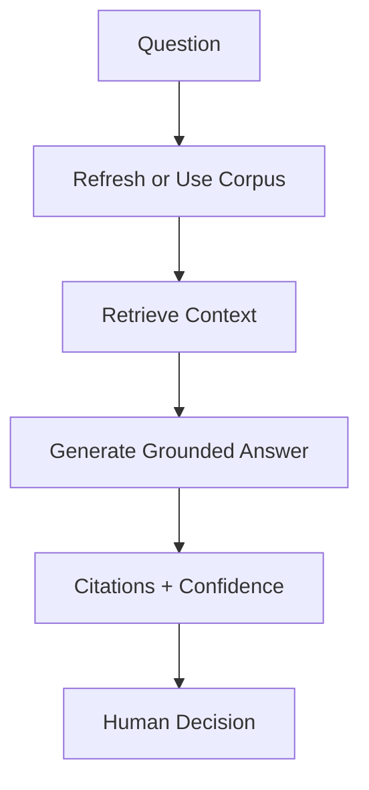
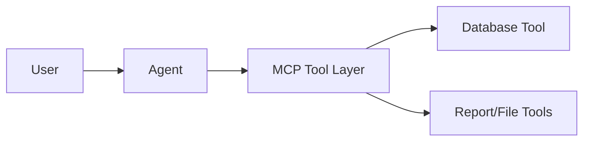
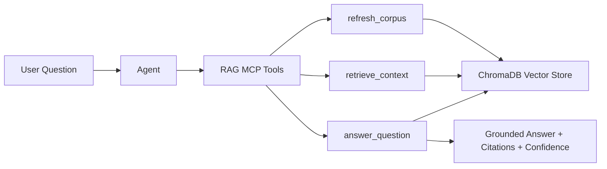

# Lab 08 - RAG and Enterprise Context Pipelines

**Course:** Advanced Software Development with Agentic AI (ASD) \
**Theme:** Local RAG, embeddings, vector search, and grounded responses \
**Primary IDE:** VS Code (Optional: AWS Kiro) \
**AI Runtime:** Ollama (open-source local models) \
**Duration:** 60 Minutes

---

## 1. Overview

<details>
<summary>Goal</summary>

Add a local RAG layer to the existing `enrolment-app-open-ai/` project from Lab 07.

RAG in this lab means:
1. collect local context
2. chunk and embed
3. index in ChromaDB
4. retrieve relevant chunks
5. answer with citations and confidence

</details>

<details>
<summary>Scope</summary>

In scope:
- local enterprise context sources (DB, reports, repo index)
- lightweight local deterministic embeddings
- local vector store (`chromadb`)
- MCP tools for RAG pipeline

Out of scope:
- hosted/commercial model APIs
- cloud vector DB services
- deployment work

</details>

<details>
<summary>Workflow</summary>



</details>

<details>
<summary>Expected results</summary>

- `rag-server/` added under `enrolment-app-open-ai/`
- RAG pipeline code implemented
- MCP RAG server tools implemented
- retrieval evaluation (`P@5`, `R@5`) produced
- evidence and audit artifacts recorded

</details>

---

## 2. Prerequisites and Configuration

<details>
<summary>Prerequisites</summary>

Complete:
- Lab 01 to Lab 07

Required:
- Python virtual environment
- Ollama running locally
- Models available: `qwen2.5:0.5b`, `llama3.1:8b`
- Existing Lab 07 app structure:
  - `enrolment-app-open-ai/mcp-server/`
  - `enrolment-app-open-ai/reports/`
- Lab 05 workflow at repository root:
  - `.github/workflows/lab5-ci.yml`

</details>

<details>
<summary>Environment checks</summary>

```bash
docker --version
docker compose version
git --version
python --version
ollama --version
ollama list
```

</details>

<details>
<summary>Verify models</summary>

```bash
ollama pull qwen2.5:0.5b
ollama pull llama3.1:8b
```

</details>

<details>
<summary>Update .env (project root inside app)</summary>

```bash
OLLAMA_BASE_URL=http://localhost:11434/v1
OLLAMA_MODEL=qwen2.5:0.5b
OLLAMA_REVIEW_MODEL=llama3.1:8b
```

</details>

---

## 3. Scenario Setup

<details>
<summary>Starting architecture (from Lab 07)</summary>



</details>

<details>
<summary>Lab 08 extension</summary>



</details>

<details>
<summary>Project structure</summary>

```text
enrolment-app-open-ai/
│
├── .github/
│   └── workflows/
│       └── lab5-ci.yml
│
├── docker-compose.yml
│
├── agentic_loop/                         
│   ├── config/ ...
│   ├── core/ ...
│   ├── collectors/ ...
│   └── pipelines/ ...
│
├── frontend-service/
│   ├── Dockerfile
│   ├── css/
│   │   └── styles.css                     # updated for MCP + RAG mode UI
│   └── templates/
│       ├── index.html
│       └── tabs/
│           ├── normal.html
│           ├── ai-mode.html
│           ├── mcp.html                   
│           └── rag.html                   # Lab 08 add
│
├── enrolment-service/
│   ├── app.py                             # updated in Lab 08 (registers RAG routes)
│   ├── requirements.txt
│   ├── Dockerfile
│   ├── routes/
│   │   ├── ai_mode.py                     
│   │   ├── normal_ui.py                   
│   │   ├── mcp_mode.py                    
│   │   └── rag_mode.py                    # Lab 08 add
│   └── services/
│       ├── database_api.py                
│       ├── llm_client.py                  
│       ├── prompt_loader.py               
│       └── rag_api.py                     # Lab 08 add
│
├── database-service/
│   ├── app.py
│   ├── init_db.py
│   ├── Dockerfile
│   ├── requirements.txt
│   └── data/
│       └── enrolment.db
│
├── mcp-server/
│   ├── server.py
│   ├── tools.py
│   └── requirements.txt
│
├── rag-server/                            # Lab 08 add
│   ├── Dockerfile                         # Lab 08 add
│   ├── .dockerignore                      # Lab 08 add
│   ├── rag_server.py                      # Lab 08 add
│   ├── rag_http_server.py                 # Lab 08 add
│   ├── rag_pipeline.py                    # Lab 08 add
│   ├── rag_eval.py                        # Lab 08 add
│   ├── requirements.txt                   # Lab 08 add
│   ├── mcp-config.json                    # Lab 08 add
│   ├── tool-contracts.md                  # Lab 08 add
│   ├── retrieval-metrics.md               # Lab 08 add
│   ├── rag-audit.jsonl                    # Lab 08 add
│   ├── corpus/                            # Lab 08 add
│   │   └── corpus.jsonl                   # Lab 08 add
│   └── chroma/                            # Lab 08 add
│
├── prompts/
│   ├── lab3/ ...
│   ├── lab4/ ...
│   ├── lab5/ ...
│   ├── lab7/ ...
│   ├── lab8/ ...                             
│   │   ├── implementation/
│   │   │   └── rag_implementation_prompt.txt      # Lab 08 add
│   │   └── review/
│   │       ├── rag_review_prompt.txt              # Lab 08 add
│   │       └── rag_reasoning_prompt.txt           # Lab 08 add
│   └── service/ ...
│
└── reports/
    |
    ├── ...
    └── rag-report.md                      # Lab 08 add
```

</details>

<details>
<summary>Create workspace files</summary>

```bash
# 1) Go to app root
cd enrolment-app-open-ai

# 2) RAG server
mkdir -p rag-server/corpus
mkdir -p rag-server/chroma
touch rag-server/rag_server.py
touch rag-server/rag_http_server.py
touch rag-server/rag_pipeline.py
touch rag-server/rag_eval.py
touch rag-server/requirements.txt
touch rag-server/Dockerfile
touch rag-server/.dockerignore
touch rag-server/mcp-config.json
touch rag-server/tool-contracts.md
touch rag-server/retrieval-metrics.md
touch rag-server/rag-audit.jsonl
touch rag-server/corpus/corpus.jsonl

# 3) Enrolment service RAG integration
touch enrolment-service/routes/rag_mode.py
touch enrolment-service/services/rag_api.py

# 4) Frontend RAG tab
touch frontend-service/templates/tabs/rag.html

# 5) Lab 8 prompts
mkdir -p prompts/lab8/implementation
mkdir -p prompts/lab8/review
touch prompts/lab8/implementation/rag_implementation_prompt.txt
touch prompts/lab8/review/rag_review_prompt.txt
touch prompts/lab8/review/rag_reasoning_prompt.txt

# 6) Lab 8 evidence report
touch reports/rag-report.md
```

</details>

---

## 4. RAG Pipeline Development

<details>
<summary>rag-server/requirements.txt</summary>

```text
mcp
chromadb
requests
```

**Install:**
Run from the **repository root**.

```bash
cd enrolment-app-open-ai/rag-server
python -m pip install --upgrade pip
pip install -r requirements.txt
```

</details>


<details>
<summary>Prompt assets</summary>

**`enrolment-app-open-ai/prompts/lab8/implementation/rag_implementation_prompt.txt`**
```text
Implement local RAG pipeline tools.

Constraints:
- local open-source stack only
- Python + chromadb + MCP
- no hosted commercial APIs

Required tools:
- refresh_corpus
- retrieve_context
- answer_question

Requirements:
- structured outputs
- structured errors
- citations
- confidence category
- audit logging

Maximum 60 words.
```

**`enrolment-app-open-ai/prompts/lab8/review/rag_review_prompt.txt`**
```text
Review RAG output quality.

Check:
- retrieval quality
- citation quality
- confidence justification
- unsupported claims

Return exactly:
Risk:
Correction:
Retest:

Maximum 35 words.
```

**`enrolment-app-open-ai/prompts/lab8/review/rag_reasoning_prompt.txt`**
```text
Evaluate RAG architecture.

Check:
- corpus design
- chunking
- embedding strategy
- vector store usage
- governance risks

Return exactly:
Strengths:
Risks:
Recommendations:

Maximum 45 words.
```

</details>

<details>
<summary>rag-server/rag_pipeline.py</summary>

See [enrolment-app-open-ai/rag-server/rag_pipeline.py](enrolment-app-open-ai/rag-server/rag_pipeline.py) and keep this section aligned with that file.

**Run:**

```bash
cd enrolment-app-open-ai/rag-server
python rag_pipeline.py
```

**Expected:**
- `refresh_corpus` returns `status: success`
- `retrieve_context` returns `results`
- `answer_question` returns answer + citations + confidence

</details>

<details>
<summary> UI Update (RAG Mode)</summary>

- `frontend-service/css/styles.css` **provided**
- `frontend-service/templates/index.html` **provided**

**`frontend-service/templates/tabs/rag.html`**

```html
<!DOCTYPE html>
<html>
<head>
    <meta charset="utf-8">
    <title>RAG Tab</title>
    <link rel="stylesheet" href="../css/styles.css">
</head>
<body>
<section class="card">
    <h2>RAG Mode</h2>
    <p>Refresh corpus, retrieve context, and generate grounded answers with citations.</p>

    <div class="feature-toggle-row">
        <label class="toggle-switch" for="rag-mode-toggle">
            <input id="rag-mode-toggle" type="checkbox" checked>
            <span class="toggle-label">RAG Enabled</span>
        </label>
        <span id="rag-mode-state" class="feature-state feature-on">ON</span>
    </div>

    <form id="rag-refresh-form" class="stack-form">
        <button type="submit" class="rag-action">Refresh Corpus</button>
    </form>

    <form id="rag-retrieve-form" class="stack-form">
        <label for="rag-retrieve-query">Query</label>
        <input
            id="rag-retrieve-query"
            name="query"
            required
            placeholder="Example: students enrolled in ASD101"
        >
        <p class="rag-helper">Hint: use short retrieval phrases.</p>
        <button type="submit" class="rag-action">Retrieve Context</button>
    </form>

    <form id="rag-answer-form" class="stack-form">
        <label for="rag-answer-query">Question</label>
        <input
            id="rag-answer-query"
            name="query"
            required
            placeholder="Example: Which students are enrolled in ASD101?"
        >
        <p class="rag-helper">Hint: ask a full question for grounded answers.</p>
        <button type="submit" class="rag-action">Answer with Citations</button>
    </form>

    <div id="rag-results" class="panel panel-mcp">RAG responses will appear here.</div>
</section>

<script>
const apiBase = "http://localhost:5001";
const output = document.getElementById("rag-results");
const ragModeToggle = document.getElementById("rag-mode-toggle");
const ragModeState = document.getElementById("rag-mode-state");
const RAG_STORAGE_KEY = "rag_mode_enabled";

function isRagEnabled() {
    return ragModeToggle.checked;
}

function renderRagState() {
    if (isRagEnabled()) {
        ragModeState.textContent = "ON";
        ragModeState.classList.add("feature-on");
        ragModeState.classList.remove("feature-off");
    } else {
        ragModeState.textContent = "OFF";
        ragModeState.classList.add("feature-off");
        ragModeState.classList.remove("feature-on");
    }
}

function renderRagDisabledMessage() {
    output.innerHTML = "<p>RAG Mode is OFF. Enable RAG Mode to run RAG tools.</p>";
}

function saveRagMode() {
    localStorage.setItem(RAG_STORAGE_KEY, String(isRagEnabled()));
}

function loadRagMode() {
    const persisted = localStorage.getItem(RAG_STORAGE_KEY);
    if (persisted === null) {
        ragModeToggle.checked = true;
    } else {
        ragModeToggle.checked = persisted === "true";
    }
    renderRagState();
}

function renderJson(title, payload) {
    output.innerHTML = `<h3>${title}</h3><pre>${JSON.stringify(payload, null, 2)}</pre>`;
}

async function postForm(path, data) {
    if (!isRagEnabled()) {
        renderRagDisabledMessage();
        return { status: "error", error: "RAG Mode is OFF" };
    }

    const res = await fetch(`${apiBase}${path}`, {
        method: "POST",
        headers: {
            "Content-Type": "application/x-www-form-urlencoded",
            "X-RAG-Mode": isRagEnabled() ? "on" : "off",
        },
        body: new URLSearchParams(data),
    });
    const text = await res.text();
    try {
        return JSON.parse(text);
    } catch {
        return { raw: text };
    }
}

ragModeToggle.addEventListener("change", () => {
    saveRagMode();
    renderRagState();

    if (!isRagEnabled()) {
        renderRagDisabledMessage();
    }
});

document.getElementById("rag-refresh-form").addEventListener("submit", async (e) => {
    e.preventDefault();
    const payload = await postForm("/rag/refresh", {});
    renderJson("RAG Tool: refresh_corpus", payload);
});

document.getElementById("rag-retrieve-form").addEventListener("submit", async (e) => {
    e.preventDefault();
    const query = document.getElementById("rag-retrieve-query").value.trim();
    const payload = await postForm("/rag/retrieve", { query, k: "5" });
    renderJson("RAG Tool: retrieve_context", payload);
});

document.getElementById("rag-answer-form").addEventListener("submit", async (e) => {
    e.preventDefault();
    const query = document.getElementById("rag-answer-query").value.trim();
    const payload = await postForm("/rag/answer", { query, k: "5" });
    renderJson("RAG Tool: answer_question", payload);
});

loadRagMode();
if (!isRagEnabled()) {
    renderRagDisabledMessage();
}
</script>

</body>
</html>
```


</details>

<details>
<summary>Backend Update (RAG Integration Endpoints)</summary>

Update these backend files:

```text
enrolment-app-open-ai/enrolment-service/app.py
enrolment-app-open-ai/enrolment-service/routes/rag_mode.py
enrolment-app-open-ai/enrolment-service/services/rag_api.py
enrolment-app-open-ai/docker-compose.yml
enrolment-app-open-ai/rag-server/rag_http_server.py
enrolment-app-open-ai/rag-server/Dockerfile
enrolment-app-open-ai/rag-server/.dockerignore
```

<details>
<summary>enrolment-service/app.py</summary>

```python
from pathlib import Path
import sys

from flask import Flask
from flask_cors import CORS


BASE_DIR = Path(__file__).resolve().parent
if str(BASE_DIR) not in sys.path:
    sys.path.insert(0, str(BASE_DIR))

from routes.ai_mode import ai_mode_bp
from routes.mcp_mode import mcp_bp
from routes.multi_agent_mode import multi_agent_bp
from routes.normal_ui import normal_ui_bp
from routes.rag_mode import rag_bp


def create_app():
    app = Flask(__name__)
    CORS(app)

    app.register_blueprint(normal_ui_bp)
    app.register_blueprint(ai_mode_bp)
    app.register_blueprint(mcp_bp)
    app.register_blueprint(rag_bp)
    app.register_blueprint(multi_agent_bp)

    return app


app = create_app()


if __name__ == "__main__":
    app.run(host="0.0.0.0", port=5001, debug=True)
```

</details>

<details>
<summary>enrolment-service/routes/rag_mode.py</summary>

```python
from flask import Blueprint, request
import requests

from services.rag_api import call_rag_service, rag_disabled_response, rag_mode_is_enabled


rag_bp = Blueprint("rag_mode", __name__)


@rag_bp.post("/rag/refresh")
def rag_refresh():
    if not rag_mode_is_enabled(request):
        return rag_disabled_response()

    caller = request.form.get("caller", "student").strip() or "student"
    try:
        payload = call_rag_service("/refresh", {"caller": caller})
        return payload, 200
    except requests.RequestException as exc:
        return {"status": "error", "error": str(exc)}, 503


@rag_bp.post("/rag/retrieve")
def rag_retrieve():
    if not rag_mode_is_enabled(request):
        return rag_disabled_response()

    query = request.form.get("query", "").strip()
    k = int(request.form.get("k", "5"))
    if not query:
        return {"status": "error", "error": "query is required"}, 400

    try:
        payload = call_rag_service("/retrieve", {"query": query, "k": k, "caller": "student"})
        return payload, 200
    except requests.RequestException as exc:
        return {"status": "error", "error": str(exc)}, 503


@rag_bp.post("/rag/answer")
def rag_answer():
    if not rag_mode_is_enabled(request):
        return rag_disabled_response()

    query = request.form.get("query", "").strip()
    k = int(request.form.get("k", "5"))
    if not query:
        return {"status": "error", "error": "query is required"}, 400

    try:
        payload = call_rag_service("/answer", {"query": query, "k": k, "caller": "student"})
        return payload, 200
    except requests.RequestException as exc:
        return {"status": "error", "error": str(exc)}, 503
```

</details>

<details>
<summary>enrolment-service/services/rag_api.py</summary>

```python
import os

import requests


RAG_SERVICE_URL = os.getenv("RAG_SERVICE_URL", "http://rag-server:5003")
RAG_ENABLED = os.getenv("RAG_ENABLED", "true").strip().lower() in ("1", "true", "yes", "on")

try:
    RAG_SERVICE_TIMEOUT_SECONDS = int(os.getenv("RAG_SERVICE_TIMEOUT_SECONDS", "180"))
except ValueError:
    RAG_SERVICE_TIMEOUT_SECONDS = 180


def rag_mode_is_enabled(req) -> bool:
    if not RAG_ENABLED:
        return False

    mode_header = req.headers.get("X-RAG-Mode", "on").strip().lower()
    return mode_header in ("1", "true", "yes", "on")


def rag_disabled_response():
    return {"status": "error", "error": "RAG mode is disabled."}, 403


def call_rag_service(path: str, payload: dict):
    response = requests.post(
        f"{RAG_SERVICE_URL}{path}",
        json=payload,
        timeout=RAG_SERVICE_TIMEOUT_SECONDS,
    )

    try:
        data = response.json()
    except ValueError:
        response.raise_for_status()
        return {}

    if response.status_code >= 400:
        raise requests.HTTPError(
            f"RAG service {path} failed with status {response.status_code}: {data}",
            response=response,
        )

    return data
```

</details>

<details>
<summary>docker-compose.yml</summary>

```yaml
services:
  frontend-service:
    build:
      context: ./frontend-service
    container_name: frontend-service
    ports:
      - "8080:80"
    depends_on:
      - enrolment-service
    restart: unless-stopped

  enrolment-service:
    build:
      context: .
      dockerfile: enrolment-service/Dockerfile
    container_name: enrolment-service
    ports:
      - "5001:5001"
    environment:
      DATABASE_SERVICE_URL: http://database-service:5002
      OLLAMA_BASE_URL: http://host.docker.internal:11434/v1
      OLLAMA_MODEL: qwen2.5:0.5b
      MCP_ENABLED: "true"
      RAG_SERVICE_URL: http://rag-server:5003
      RAG_ENABLED: "true"
    extra_hosts:
      - "host.docker.internal:host-gateway"
    depends_on:
      - database-service
      - rag-server
    restart: unless-stopped

  rag-server:
    build:
      context: ./rag-server
    container_name: rag-server
    ports:
      - "5003:5003"
    restart: unless-stopped

  multi-agent-server:
    build:
      context: ./multi-agent-server
    container_name: multi-agent-server
    ports:
      - "5004:5004"
    environment:
      DATABASE_SERVICE_URL: http://database-service:5002
      OLLAMA_BASE_URL: http://host.docker.internal:11434/v1
      OLLAMA_MODEL: qwen2.5:0.5b
      OLLAMA_REVIEW_MODEL: llama3.1:8b
      PORT: "5004"
    extra_hosts:
      - "host.docker.internal:host-gateway"
    depends_on:
      - database-service
    restart: unless-stopped

  database-service:
    build:
      context: ./database-service
    container_name: database-service
    ports:
      - "5002:5002"
    volumes:
      - database_data:/app/data
    restart: unless-stopped

volumes:
  database_data:
```

</details>

<details>
<summary>rag-server/rag_http_server.py</summary>

```python
import json
import os
from http.server import BaseHTTPRequestHandler, ThreadingHTTPServer

from rag_pipeline import answer_question, refresh_corpus, retrieve_context


class RAGHandler(BaseHTTPRequestHandler):
    def _send_json(self, status_code: int, payload: dict):
        response = json.dumps(payload).encode("utf-8")
        self.send_response(status_code)
        self.send_header("Content-Type", "application/json")
        self.send_header("Content-Length", str(len(response)))
        self.end_headers()
        self.wfile.write(response)

    def _read_json(self):
        content_length = int(self.headers.get("Content-Length", "0"))
        if content_length == 0:
            return {}
        raw = self.rfile.read(content_length)
        if not raw:
            return {}
        return json.loads(raw.decode("utf-8"))

    def do_GET(self):
        if self.path == "/health":
            self._send_json(200, {"status": "ok", "service": "rag-server"})
            return
        self._send_json(404, {"status": "error", "error": "not_found"})

    def do_POST(self):
        try:
            payload = self._read_json()
        except Exception as exc:
            self._send_json(400, {"status": "error", "error": f"invalid_json: {exc}"})
            return

        try:
            if self.path == "/refresh":
                caller = (payload.get("caller") or "student").strip() or "student"
                result = refresh_corpus(caller=caller)
                self._send_json(200 if result.get("status") == "success" else 500, result)
                return

            if self.path == "/retrieve":
                query = (payload.get("query") or "").strip()
                if not query:
                    self._send_json(400, {"status": "error", "error": "query is required"})
                    return
                k = int(payload.get("k", 5))
                caller = (payload.get("caller") or "student").strip() or "student"
                result = retrieve_context(query=query, k=k, caller=caller)
                self._send_json(200 if result.get("status") == "success" else 500, result)
                return

            if self.path == "/answer":
                query = (payload.get("query") or "").strip()
                if not query:
                    self._send_json(400, {"status": "error", "error": "query is required"})
                    return
                k = int(payload.get("k", 5))
                caller = (payload.get("caller") or "student").strip() or "student"
                result = answer_question(query=query, k=k, caller=caller)
                self._send_json(200 if result.get("status") == "success" else 500, result)
                return

            self._send_json(404, {"status": "error", "error": "not_found"})
        except Exception as exc:
            self._send_json(500, {"status": "error", "error": str(exc)})


def main():
    host = "0.0.0.0"
    port = int(os.getenv("PORT", "5003"))
    server = ThreadingHTTPServer((host, port), RAGHandler)
    print(f"RAG HTTP server running on {host}:{port}")
    server.serve_forever()


if __name__ == "__main__":
    main()
```

</details>

<details>
<summary>rag-server/Dockerfile</summary>

```dockerfile
FROM python:3.11-slim

WORKDIR /app

COPY requirements.txt .
RUN pip install --no-cache-dir -r requirements.txt

COPY . .

EXPOSE 5003

CMD ["python", "rag_http_server.py"]
```

</details>

<details>
<summary>rag-server/.dockerignore</summary>

```text
.venv
__pycache__
*.pyc
chroma
corpus
rag-audit.jsonl
```

</details>

</details>
<details>
<summary>Deploy and Test</summary>

```bash
cd enrolment-app-open-ai
docker compose up --build -d
curl http://localhost:5003/health
curl -X POST http://localhost:5001/rag/refresh
curl -X POST http://localhost:5001/rag/retrieve -d "query=students enrolled in ASD101&k=5"
curl -X POST http://localhost:5001/rag/answer -d "query=Which students are enrolled in ASD101?&k=5"
```

**Browser test:** `http://localhost:8080` → RAG tab → Refresh Corpus → Retrieve Context → Answer with Citations

**Pass criteria:**
- Health check returns `status: ok`
- All endpoints return `status: success`
- Retrieval returns ranked chunks with source/authority
- Answer includes citations and confidence

</details>

---

## 5. MCP RAG Server Setup

<details>
<summary>rag-server/rag_server.py</summary>

```python
from mcp.server.fastmcp import FastMCP

from rag_pipeline import answer_question as answer_question_impl
from rag_pipeline import refresh_corpus as refresh_corpus_impl
from rag_pipeline import retrieve_context as retrieve_context_impl

mcp = FastMCP("Student Enrolment RAG MCP")
AVAILABLE_TOOLS = ["refresh_corpus", "retrieve_context", "answer_question"]


@mcp.tool()
def refresh_corpus(caller: str = "student"):
    return refresh_corpus_impl(caller=caller)


@mcp.tool()
def retrieve_context(query: str, k: int = 5, caller: str = "student"):
    return retrieve_context_impl(query=query, k=k, caller=caller)


@mcp.tool()
def answer_question(query: str, k: int = 5, caller: str = "student"):
    return answer_question_impl(query=query, k=k, caller=caller)


if __name__ == "__main__":
    print("Starting Student Enrolment RAG MCP Server...")
    print("Server status: RUNNING")
    print("Interact with RAG tools from a second terminal.")
    print("Available tools:")
    for tool in AVAILABLE_TOOLS:
        print(f"- {tool}")
    mcp.run()
```

</details>

<details>
<summary>rag-server/tool-contracts.md</summary>

```markdown
# RAG Tool Contracts

## refresh_corpus
- Purpose: rebuild corpus and vector index
- Input: `caller` (optional)
- Output: `status`, `chunk_count`, `collection`, `corpus_path` or `error`
- Policy class: read + index update

## retrieve_context
- Purpose: retrieve relevant chunks
- Input: `query` (required), `k` (optional), `caller` (optional)
- Output: `status`, `results[]` with `chunk_id`, `source_id`, `authority_tier`, `distance`, `text`
- Policy class: read

## answer_question
- Purpose: answer from retrieved context only
- Input: `query` (required), `k` (optional), `caller` (optional)
- Output: `answer`, `citations[]`, `confidence_category`, `retrieval_summary` or `error`
- Policy class: read + grounded response
```

</details>

<details>
<summary>rag-server/mcp-config.json</summary>

```json
{
  "mcpServers": {
    "student-enrolment-rag": {
      "command": "python",
      "args": ["rag_server.py"]
    }
  }
}
```

**Validate config:**
```bash
cd enrolment-app-open-ai/rag-server
python -m json.tool mcp-config.json
```

</details>

<details>
<summary>Start MCP server</summary>

**Terminal A - Start server (blocking):**
```bash
cd enrolment-app-open-ai/rag-server
python rag_server.py
```

**Expected output:**
```text
Starting Student Enrolment RAG MCP Server...
Server status: RUNNING
Available tools:
- refresh_corpus
- retrieve_context
- answer_question
```

**Keep Terminal A running. Do not close.**

</details>

<details>
<summary>Test RAG tools</summary>

**Terminal B - Test client:**
```bash
cd enrolment-app-open-ai/rag-server
python -c "from rag_pipeline import refresh_corpus; import json; print(json.dumps(refresh_corpus(), indent=2))"
python -c "from rag_pipeline import retrieve_context; import json; print(json.dumps(retrieve_context('students enrolled in ASD101', 5), indent=2))"
python -c "from rag_pipeline import answer_question; import json; print(json.dumps(answer_question('Which students are enrolled in ASD101?', 5), indent=2))"
```

**Pass criteria:**
- `refresh_corpus` returns `status: success` with `chunk_count`
- `retrieve_context` returns `results[]` with `chunk_id`, `source_id`, `authority_tier`, `text`
- `answer_question` returns `answer`, `citations[]`, `confidence_category`

</details>

---

## 6. Retrieval and Grounded Response Activities

<details>
<summary>Prerequisite</summary>

Terminal A must be running `python rag_server.py` from Step 5.

Use **Terminal B** for all commands below.

</details>

<details>
<summary>Step 1: Refresh corpus</summary>

```bash
cd enrolment-app-open-ai/rag-server
python -c "from rag_pipeline import refresh_corpus; import json; print(json.dumps(refresh_corpus(), indent=2))"
```

**Verify output:**
- `status: success`
- `chunk_count` > 0

</details>

<details>
<summary>Step 2: Retrieve context</summary>

```bash
python -c "from rag_pipeline import retrieve_context; import json; print(json.dumps(retrieve_context('students enrolled in ASD101', 5), indent=2))"
```

**Verify output:**
- `status: success`
- `results[]` contains chunks with `chunk_id`, `source_id`, `authority_tier`, `text`

</details>

<details>
<summary>Step 3: Answer question</summary>

```bash
python -c "from rag_pipeline import answer_question; import json; print(json.dumps(answer_question('Which students are enrolled in ASD101?', 5), indent=2))"
```

**Verify output:**
- `answer` contains grounded response
- `citations[]` lists source chunks
- `confidence_category` is `high`, `medium`, or `low`

</details>

<details>
<summary>Step 4: Test live data query</summary>

```bash
python -c "from rag_pipeline import answer_question; import json; print(json.dumps(answer_question('How many students are in the enrolment database?', 5), indent=2))"
```

**Verify output:**
- Answer is grounded in retrieved chunks
- Citations reference database sources

</details>

<details>
<summary>Step 5: Record evidence</summary>

Create `enrolment-app-open-ai/reports/rag-report.md` with:
- Query used
- Retrieval results count
- Answer confidence category
- Citations provided

</details>

---

## 7. Retrieval Evaluation and Analysis

<details>
<summary>Create the eval script</summary>

**Build a benchmark evaluation script to measure retrieval quality.**

- Runs 3 test queries against the RAG pipeline
- Calculates `P@5` (precision) and `R@5` (recall) for each query

**`enrolment-app-open-ai/rag-server/rag_eval.py`**

```python
from rag_pipeline import retrieve_context

BENCHMARKS = [
    {
        "query": "students enrolled in ASD101",
        "relevant_keywords": ["ASD101"],
        "expected_relevant": 2,
    },
    {
        "query": "student count",
        "relevant_keywords": ["student", "count"],
        "expected_relevant": 1,
    },
    {
        "query": "CI report status",
        "relevant_keywords": ["report", "workflow", "run"],
        "expected_relevant": 1,
    },
]


def is_relevant(text: str, keywords: list[str]) -> bool:
    lowered = text.lower()
    return any(keyword.lower() in lowered for keyword in keywords)


def evaluate_query(benchmark: dict) -> dict:
    response = retrieve_context(benchmark["query"], 5)
    results = response.get("results", [])[:5]

    relevant = [r for r in results if is_relevant(r.get("text", ""), benchmark["relevant_keywords"])]

    retrieved_count = len(results)
    precision_at_5 = len(relevant) / 5
    raw_recall_at_5 = len(relevant) / max(benchmark["expected_relevant"], 1)
    recall_at_5 = min(1.0, raw_recall_at_5)

    return {
        "query": benchmark["query"],
        "retrieved_chunk_ids": [r.get("chunk_id") for r in results],
        "relevant_chunk_ids": [r.get("chunk_id") for r in relevant],
        "p_at_5": precision_at_5,
        "r_at_5": recall_at_5,
    }


def main() -> None:
    for benchmark in BENCHMARKS:
        result = evaluate_query(benchmark)
        print("Query:", result["query"])
        print("Retrieved:", result["retrieved_chunk_ids"])
        print("Relevant:", result["relevant_chunk_ids"])
        print("P@5:", result["p_at_5"])
        print("R@5:", result["r_at_5"])
        print("---")


if __name__ == "__main__":
    main()
```

**Terminal B:**
```bash
cd enrolment-app-open-ai/rag-server
python rag_eval.py
```

**Expected output per query:**
```
Query: students enrolled in ASD101
Retrieved: [chunk_1, chunk_2, ...]
Relevant: [chunk_1, ...]
P@5: 0.4
R@5: 1.0
---
```

**Record in `enrolment-app-open-ai/rag-server/retrieval-metrics.md`:**
- Query
- P@5 (precision at 5)
- R@5 (recall at 5)
- Retrieved vs Relevant chunk IDs

</details>

<details>
<summary>Verify answer quality</summary>

Check each answer from Step 6 has:
- ✅ `citations[]` present
- ✅ `source_id` in each citation
- ✅ `confidence_category` present
- ✅ Answer claims match retrieved chunks

</details>

<details>
<summary>Check audit log</summary>

```bash
cd enrolment-app-open-ai/rag-server
cat rag-audit.jsonl
```

**Verify each entry contains:**
`request_id`, `trace_id`, `tool_name`, `tool_input`, `tool_output`, `timestamp`, `duration_ms`, `validation_status`, `outcome`

</details>

---

## 8. RAG Workflow and Improvement Cycle

<details>
<summary>RAG workflow</summary>

**Execution Steps:**

1. **Start MCP server:** Terminal A → `cd enrolment-app-open-ai/rag-server && python rag_server.py` (keep running)
2. **Refresh corpus:** Terminal B → `python -c "from rag_pipeline import refresh_corpus; import json; print(json.dumps(refresh_corpus(), indent=2))"`
3. **Retrieve context:** Terminal B → `python -c "from rag_pipeline import retrieve_context; import json; print(json.dumps(retrieve_context('students enrolled in ASD101', 5), indent=2))"`
4. **Answer question:** Terminal B → `python -c "from rag_pipeline import answer_question; import json; print(json.dumps(answer_question('Which students are enrolled in ASD101?', 5), indent=2))"`
5. **Run evaluation:** Terminal B → `python rag_eval.py`
6. **Capture:** Retrieval results, answer quality, `P@5`, `R@5` metrics
7. **Check audit:** `cat rag-audit.jsonl`

**Document:**
- Retrieved chunks and relevance
- Answer citations and confidence
- Evaluation metrics per query

</details>

<details>
<summary>Improve and record</summary>

**Review Target:**

- **RAG Pipeline** — Validate retrieval quality, answer grounding, citation accuracy, confidence scoring

**Evidence Requirements:**

- Implementation agent: Uses retrieval metrics (`P@5`, `R@5`) + retrieved chunks + citations
- Review agent: Validates answer quality using same evidence
- Both agents: Confirm answers are grounded in retrieved context only

**Improvement Workflow:**

```
REFRESH → RETRIEVE → ANSWER → EVALUATE → ADAPT
```

**Steps:**

1. Run RAG workflow (Steps 1-7 above)
2. Record baseline metrics: `P@5`, `R@5`, confidence category
3. Select one prompt to improve:
   - `prompts/lab8/implementation/rag_implementation_prompt.txt`
   - `prompts/lab8/review/rag_review_prompt.txt`
   - `prompts/lab8/review/rag_reasoning_prompt.txt`
4. Apply prompt change
5. Rerun RAG workflow (refresh → retrieve → answer → evaluate)
6. Record result:

```
Review Target: RAG
Prompt Changed: [filename]
Before: P@5=[value] R@5=[value] Confidence=[category]
After: P@5=[value] R@5=[value] Confidence=[category]
Evidence: [retrieval/answer comparison]
Decision: [Accept/Partially Accept/Reject]
```

**Focus Areas:**
- Retrieval precision and recall
- Citation completeness and accuracy
- Confidence category justification
- Answer grounding in retrieved chunks

</details>

---

## 9. Evidence Log

<details>
<summary>Evidence Log</summary>

Use this checklist and populate it from the evidence produced in Sections 4-8. The evidence log should combine UI observations, terminal execution results, retrieval outputs, metrics, quality-check observations, and the final improvement record.

| Check | Expected Result | Actual Result | Pass/Fail |
|---|---|---|---|
| UI evidence from Section 4 recorded | Yes | | |
| Terminal execution evidence from Sections 5-6 recorded | Yes | | |
| RAG retrieval outputs from Section 6 recorded | Yes | | |
| Retrieval metrics from Section 7 (`P@5`, `R@5`) recorded | Yes | | |
| Citations and confidence present in answers | Yes | | |
| Audit log generated | Yes | | |
| Quality-check review observations recorded | Yes | | |
| Improvement + retest from Section 8 recorded | Yes | | |
| Evidence links to UI, terminal, and retrieval artifacts | Yes | | |
| Final RAG report completed | Yes | | |

</details>

---

## 10. Reflection

<details>
<summary>Reflection questions</summary>

Answer briefly and reference evidence from Sections 4-8 where possible.
1. Which sources produced the most relevant retrievals and why?
2. Which query gave the best retrieval quality, and which gave the weakest results?
3. Were the citations and confidence scores supported by the retrieved chunks and the audit log?
4. What did the UI evidence, terminal execution evidence, and retrieval metrics tell you that the model output alone did not?
5. Which improvement changed retrieval quality most clearly, and how do you know?
6. What is still missing before this RAG flow is ready for production use?

</details>

<details>
<summary>Key points</summary>

- RAG quality depends on evidence from the UI, terminal runs, retrieval outputs, and audit logs, not just model output.
- Strong answers require both relevant retrieved chunks and explicit citations.
- Confidence should be supported by retrieval metrics such as $P@5$ and $R@5$.
- A retrieval improvement is only meaningful if it is backed by before/after evidence.
- Production readiness requires traceable retrieval, auditable outputs, and repeatable evaluation.

</details>
