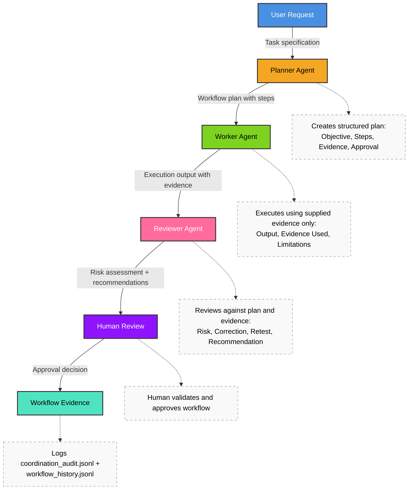

# Lab 10 - Multi-Agent Systems and Three-Agent Coordination

**Course:** Advanced Software Development with Agentic AI (ASD)  
**Theme:** Multi-Agent Coordination, Evidence, Review, and Human Oversight  
**Primary IDE:** VS Code  (Optiona IDE: AWS Kiro) \
**AI Agent Runtime:** Ollama  
**Duration:** 60 Minutes

---

## 1. Overview

<details>
<summary>Goal</summary>

### Goal

Build a runnable three-agent workflow for the Student Enrolment System.

Students will implement:

* Planner Agent
* Worker Agent
* Reviewer Agent
* Workflow Coordinator
* Multi-Agent API
* Workflow Evidence Logging

</details>

<details>
<summary>Agentic Workflow</summary>



</details>

<details>
<summary>Expected Results</summary>

By the end of this lab, students should have:

* A Planner Agent
* A Worker Agent
* A Reviewer Agent
* A Workflow Coordinator
* A Multi-Agent API
* Workflow execution evidence
* Human approval evidence

</details>

---

## 2. Prerequisites and Configuration

<details>
<summary>Prerequisites</summary>

Complete:

* Lab 01 to Lab 09

Required:

* Docker Desktop (optional for container execution)
* Python
* Ollama
* VS Code
* Existing `enrolment-app-open-ai/` application folder
* Existing `database-service/`, `mcp-server/`, and `rag-server/`

</details>

<details>
<summary>Model Configuration</summary>

```env
OLLAMA_BASE_URL=http://localhost:11434/v1
OLLAMA_MODEL=qwen2.5:0.5b
OLLAMA_REVIEW_MODEL=llama3.1:8b
DATABASE_SERVICE_URL=http://localhost:5002
```

Verify models:

```bash
ollama list
```

Expected:

```text
qwen2.5:0.5b
llama3.1:8b
```

</details>

<details>
<summary>Agent Roles</summary>

| Model | Role | Purpose |
|---|---|---|
| qwen2.5:0.5b | Planner Agent | Create workflow plan |
| qwen2.5:0.5b | Worker Agent | Generate output from database evidence |
| llama3.1:8b | Reviewer Agent | Review risks and recommendations |
| Human | Final Decision Maker | Accept, partially accept, or reject |

</details>

---

## 3. Scenario Setup

<details>
<summary>Scenario</summary>

The Student Enrolment System already contains:

* frontend-service
* enrolment-service
* database-service

This lab adds:

* multi-agent-server

The new service retrieves student enrolment data from database-service and executes a coordinated three-agent workflow.

</details>

<details>
<summary>User Story</summary>

```text
As a technical reviewer

I want a coordinated AI workflow

So that generated outputs are reviewed before approval.
```

</details>

<details>
<summary>Expected Behaviour</summary>

The workflow must:

* accept a request
* retrieve evidence
* generate an output
* review the output
* record workflow evidence
* require human approval

</details>

<details>
<summary>Project structure</summary>

```text
enrolment-app-open-ai/
│
├── .github/
│   └── workflows/
│       └── lab5-ci.yml
│
├── docker-compose.yml
│
├── agentic_loop/                         
│   ├── config/ ...
│   ├── core/ ...
│   ├── collectors/ ...
│   └── pipelines/ ...
│
├── frontend-service/
│   ├── Dockerfile
│   ├── css/
│   │   └── styles.css
│   └── templates/
│       ├── index.html                     # updated in Lab 10 (multi-agent tab)
│       └── tabs/
│           ├── normal.html
│           ├── ai-mode.html
│           ├── mcp.html
│           ├── rag.html
│           └── multi-agent.html    # Lab 10 add
│
├── enrolment-service/
│   ├── app.py                      # Lab 10 (registers multi-agent routes)
│   ├── requirements.txt
│   ├── Dockerfile
│   ├── routes/
│   │   ├── ai_mode.py
│   │   ├── normal_ui.py
│   │   ├── mcp_mode.py
│   │   ├── rag_mode.py
│   │   └── multi_agent_mode.py     # Lab 10 add
│   └── services/
│       ├── database_api.py
│       ├── llm_client.py
│       ├── prompt_loader.py
│       ├── rag_api.py
│       └── multi_agent_api.py      # Lab 10 add
│
├── database-service/
│   ├── app.py
│   ├── init_db.py
│   ├── Dockerfile
│   ├── requirements.txt
│   └── data/
│       └── enrolment.db
│
├── mcp-server/
│   ├── server.py
│   ├── tools.py
│   └── requirements.txt
│
├── rag-server/
│   ├── Dockerfile
│   ├── .dockerignore
│   ├── rag_server.py
│   ├── rag_http_server.py
│   ├── rag_pipeline.py
│   ├── rag_eval.py
│   ├── requirements.txt
│   ├── mcp-config.json
│   ├── tool-contracts.md
│   ├── retrieval-metrics.md
│   ├── rag-audit.jsonl
│   ├── corpus/
│   │   └── corpus.jsonl
│   └── chroma/
│
├── multi-agent-server/                    # Lab 10 add
│   ├── Dockerfile                         # Lab 10 add
│   ├── requirements.txt                   # Lab 10 add
│   ├── app.py                             # Lab 10 add
│   ├── coordinator.py                     # Lab 10 add
│   ├── workflow_runner.py                 # Lab 10 add
│   ├── workflow_history.jsonl             # Lab 10 add
│   ├── coordination_audit.jsonl           # Lab 10 add
│   ├── agents/                            # Lab 10 add
│   │   ├── __init__.py                    # Lab 10 add
│   │   ├── planner_agent.py               # Lab 10 add
│   │   ├── worker_agent.py                # Lab 10 add
│   │   └── reviewer_agent.py              # Lab 10 add
│   └── prompts/                           # Lab 10 add
│       ├── planner_prompt.txt             # Lab 10 add
│       ├── worker_prompt.txt              # Lab 10 add
│       └── reviewer_prompt.txt            # Lab 10 add
│
├── prompts/
│   ├── lab3/ ...
│   ├── lab4/ ...
│   ├── lab5/ ...
│   ├── lab7/ ...
│   ├── lab8/ ...
│   │   ├── implementation/
│   │   │   └── rag_implementation_prompt.txt
│   │   └── review/
│   │       ├── rag_review_prompt.txt
│   │       └── rag_reasoning_prompt.txt
│   └── service/ ...
│
└── reports/
    ├── ...
    └── rag-report.md
```

</details>

---

## 4. Application Setup and Development

<details>
<summary>Create workspace files</summary>

```bash
# 1) Go to app root
cd enrolment-app-open-ai

# 2) Multi-agent server
mkdir -p multi-agent-server/agents
mkdir -p multi-agent-server/prompts
touch multi-agent-server/agents/__init__.py
touch multi-agent-server/Dockerfile
touch multi-agent-server/requirements.txt
touch multi-agent-server/app.py
touch multi-agent-server/coordinator.py
touch multi-agent-server/workflow_runner.py
touch multi-agent-server/workflow_history.jsonl
touch multi-agent-server/coordination_audit.jsonl

# 3) Agents
touch multi-agent-server/agents/planner_agent.py
touch multi-agent-server/agents/worker_agent.py
touch multi-agent-server/agents/reviewer_agent.py

# 4) Prompts
touch multi-agent-server/prompts/planner_prompt.txt
touch multi-agent-server/prompts/worker_prompt.txt
touch multi-agent-server/prompts/reviewer_prompt.txt

# 5) Enrolment service multi-agent integration
touch enrolment-service/routes/multi_agent_mode.py
touch enrolment-service/services/multi_agent_api.py

# 6) Frontend multi-agent tab
touch frontend-service/templates/tabs/multi-agent.html
```

</details>

</details>

<details>
<summary>frontend-service/templates/index.html</summary>

Paste into:

```text
frontend-service/templates/index.html
```

```html
<!DOCTYPE html>
<html>
<head>
    <title>Student Enrolment App</title>
    <link rel="stylesheet" href="css/styles.css">
</head>
<body>
<main class="app-shell">
    <header class="app-header">
        <h1>Student Enrolment App</h1>
        <p>HTMX UI: Normal UI, AI Mode, MCP, RAG, Multi-Agent</p>
    </header>

    <section class="tab-shell card">
        <nav class="tab-nav" aria-label="Application tabs">
            <button class="tab-btn is-active" data-tab="normal" type="button">Normal UI</button>
            <button class="tab-btn" data-tab="ai-mode" type="button">AI Mode</button>
            <button class="tab-btn" data-tab="mcp" type="button">MCP</button>
            <button class="tab-btn" data-tab="rag" type="button">RAG</button>
            <button class="tab-btn" data-tab="multi-agent" type="button">Multi-Agent</button>
        </nav>

        <div class="tab-content">
            <iframe id="tab-frame-normal" class="tab-frame is-active" src="tabs/normal.html" title="Normal UI tab"></iframe>
            <iframe id="tab-frame-ai-mode" class="tab-frame" src="tabs/ai-mode.html" title="AI Mode tab"></iframe>
            <iframe id="tab-frame-mcp" class="tab-frame" src="tabs/mcp.html" title="MCP tab"></iframe>
            <iframe id="tab-frame-rag" class="tab-frame" src="tabs/rag.html" title="RAG tab"></iframe>
            <iframe id="tab-frame-multi-agent" class="tab-frame" src="tabs/multi-agent.html" title="Multi-Agent tab"></iframe>
        </div>
    </section>
</main>

<script>
const tabButtons = Array.from(document.querySelectorAll(".tab-btn"));
const tabFrames = {
    normal: document.getElementById("tab-frame-normal"),
    "ai-mode": document.getElementById("tab-frame-ai-mode"),
    mcp: document.getElementById("tab-frame-mcp"),
    rag: document.getElementById("tab-frame-rag"),
    "multi-agent": document.getElementById("tab-frame-multi-agent"),
};

function activateTab(tabName) {
    tabButtons.forEach((button) => {
        button.classList.toggle("is-active", button.dataset.tab === tabName);
    });

    Object.entries(tabFrames).forEach(([name, frame]) => {
        frame.classList.toggle("is-active", name === tabName);
    });

    window.location.hash = tabName;
}

tabButtons.forEach((button) => {
    if (button.disabled) {
        return;
    }

    button.addEventListener("click", () => {
        activateTab(button.dataset.tab);
    });
});

const hashTab = window.location.hash.replace("#", "");
if (hashTab && tabFrames[hashTab]) {
    activateTab(hashTab);
} else {
    activateTab("normal");
}
</script>

</body>
</html>
```

</details>

<details>
<summary>frontend-service/templates/tabs/multi-agent.html</summary>

Paste into:

```text
frontend-service/templates/tabs/multi-agent.html
```

```html
<!DOCTYPE html>
<html>
<head>
    <meta charset="utf-8">
    <title>Multi-Agent Tab</title>
    <link rel="stylesheet" href="../css/styles.css">
</head>
<body>
<section class="card">
    <h2>Multi-Agent Mode</h2>
    <p>Run planner, worker, and reviewer agents in a coordinated workflow.</p>

    <div class="feature-toggle-row">
        <label class="toggle-switch" for="multi-agent-toggle">
            <input id="multi-agent-toggle" type="checkbox" checked>
            <span class="toggle-label">Multi-Agent Enabled</span>
        </label>
        <span id="multi-agent-state" class="feature-state feature-on">ON</span>
    </div>

    <form id="workflow-form" class="stack-form">
        <label for="workflow-request">User Request</label>
        <input
            id="workflow-request"
            name="user_request"
            list="workflow-request-samples"
            required
            placeholder="Example: Generate a student enrolment summary for ASD101."
        >
        <datalist id="workflow-request-samples">
            <option value="Generate a student enrolment summary for ASD101."></option>
            <option value="Build a study plan for cloud fundamentals with 3 milestones and expected outcomes."></option>
            <option value="Recommend a learning pathway for AI DevOps based on ASD101 prerequisites."></option>
        </datalist>
        <div class="feature-actions" aria-label="Sample workflow requests">
            <button type="button" class="rag-action" data-sample-request="Generate a student enrolment summary for ASD101.">Use Sample 1</button>
            <button type="button" class="rag-action" data-sample-request="Build a study plan for cloud fundamentals with 3 milestones and expected outcomes.">Use Sample 2</button>
            <button type="button" class="rag-action" data-sample-request="Recommend a learning pathway for AI DevOps based on ASD101 prerequisites.">Use Sample 3</button>
        </div>
        <p class="rag-helper">Hint: use a full task request for planner-worker-reviewer flow.</p>
        <button type="submit" class="rag-action">Run Workflow</button>
    </form>

    <form id="status-form" class="stack-form">
        <button type="submit" class="rag-action">Get Workflow Status</button>
    </form>

    <div id="multi-agent-results" class="panel panel-mcp">Multi-agent responses will appear here.</div>
</section>

<script>
const apiBase = "http://localhost:5004";
const output = document.getElementById("multi-agent-results");
const modeToggle = document.getElementById("multi-agent-toggle");
const modeState = document.getElementById("multi-agent-state");
const workflowRequestInput = document.getElementById("workflow-request");
const STORAGE_KEY = "multi_agent_mode_enabled";

function isEnabled() {
    return modeToggle.checked;
}

function renderState() {
    if (isEnabled()) {
        modeState.textContent = "ON";
        modeState.classList.add("feature-on");
        modeState.classList.remove("feature-off");
    } else {
        modeState.textContent = "OFF";
        modeState.classList.add("feature-off");
        modeState.classList.remove("feature-on");
    }
}

function renderDisabledMessage() {
    output.innerHTML = "<p>Multi-Agent Mode is OFF. Enable Multi-Agent Mode to run workflows.</p>";
}

function saveMode() {
    localStorage.setItem(STORAGE_KEY, String(isEnabled()));
}

function loadMode() {
    const persisted = localStorage.getItem(STORAGE_KEY);
    if (persisted === null) {
        modeToggle.checked = true;
    } else {
        modeToggle.checked = persisted === "true";
    }
    renderState();
}

function renderJson(title, payload) {
    output.innerHTML = `<h3>${title}</h3><pre>${JSON.stringify(payload, null, 2)}</pre>`;
}

function renderError(title, error) {
    const message = error && error.message ? error.message : String(error);
    output.innerHTML = `<h3>${title}</h3><pre>${message}</pre>`;
}

async function postJson(path, data) {
    const res = await fetch(`${apiBase}${path}`, {
        method: "POST",
        headers: {
            "Content-Type": "application/json",
        },
        body: JSON.stringify(data),
    });
    const text = await res.text();
    try {
        return JSON.parse(text);
    } catch {
        return { raw: text };
    }
}

async function getJson(path) {
    const res = await fetch(`${apiBase}${path}`);
    const text = await res.text();
    try {
        return JSON.parse(text);
    } catch {
        return { raw: text };
    }
}

modeToggle.addEventListener("change", () => {
    saveMode();
    renderState();

    if (!isEnabled()) {
        renderDisabledMessage();
    }
});

document.querySelectorAll("[data-sample-request]").forEach((button) => {
    button.addEventListener("click", () => {
        workflowRequestInput.value = button.dataset.sampleRequest || "";
        workflowRequestInput.focus();
    });
});

document.getElementById("workflow-form").addEventListener("submit", async (e) => {
    e.preventDefault();

    if (!isEnabled()) {
        renderDisabledMessage();
        return;
    }

    try {
        const user_request = document.getElementById("workflow-request").value.trim();
        const payload = await postJson("/workflow", { user_request });
        renderJson("Multi-Agent API: /workflow", payload);
    } catch (error) {
        renderError("Multi-Agent API Error: /workflow", error);
    }
});

document.getElementById("status-form").addEventListener("submit", async (e) => {
    e.preventDefault();

    if (!isEnabled()) {
        renderDisabledMessage();
        return;
    }

    try {
        const payload = await getJson("/workflow/status");
        renderJson("Multi-Agent API: /workflow/status", payload);
    } catch (error) {
        renderError("Multi-Agent API Error: /workflow/status", error);
    }
});

loadMode();
if (!isEnabled()) {
    renderDisabledMessage();
}
</script>

</body>
</html>
```

</details>

<details>
<summary>multi-agent-server/requirements.txt</summary>

Paste into:

```text
multi-agent-server/requirements.txt
```

```text
flask==3.0.3
flask-cors==4.0.1
requests==2.32.3
openai
python-dotenv
```

</details>

<details>
<summary>multi-agent-server/Dockerfile</summary>

Paste into:

```text
multi-agent-server/Dockerfile
```

```dockerfile
FROM python:3.11-slim

WORKDIR /app

COPY requirements.txt .

RUN pip install --no-cache-dir -r requirements.txt

COPY . .

EXPOSE 5004

CMD ["python","app.py"]
```

</details>

<details>
<summary>docker-compose.yml</summary>

Paste full file:

```yaml
services:
    frontend-service:
        build:
            context: ./frontend-service
        container_name: frontend-service
        ports:
            - "8080:80"
        depends_on:
            - enrolment-service
        restart: unless-stopped

    enrolment-service:
        build:
            context: ./enrolment-service
        container_name: enrolment-service
        ports:
            - "5001:5001"
        environment:
            DATABASE_SERVICE_URL: http://database-service:5002
            OLLAMA_BASE_URL: http://host.docker.internal:11434/v1
            OLLAMA_MODEL: qwen2.5:0.5b
            MCP_ENABLED: "true"
            RAG_SERVICE_URL: http://rag-server:5003
            RAG_ENABLED: "true"
        extra_hosts:
            - "host.docker.internal:host-gateway"
        depends_on:
            - database-service
            - rag-server
        restart: unless-stopped

    rag-server:
        build:
            context: ./rag-server
        container_name: rag-server
        ports:
            - "5003:5003"
        restart: unless-stopped

    multi-agent-server:
        build:
            context: ./multi-agent-server
        container_name: multi-agent-server
        ports:
            - "5004:5004"
        environment:
            DATABASE_SERVICE_URL: http://database-service:5002
            OLLAMA_BASE_URL: http://host.docker.internal:11434/v1
            OLLAMA_MODEL: qwen2.5:0.5b
            OLLAMA_REVIEW_MODEL: llama3.1:8b
            PORT: "5004"
        extra_hosts:
            - "host.docker.internal:host-gateway"
        depends_on:
            - database-service
        restart: unless-stopped

    database-service:
        build:
            context: ./database-service
        container_name: database-service
        ports:
            - "5002:5002"
        volumes:
            - database_data:/app/data
        restart: unless-stopped

volumes:
    database_data:
```

</details>

<details>
<summary>multi-agent-server/agents/__init__.py</summary>

Create as an empty file:

```text
multi-agent-server/agents/__init__.py
```

</details>

<details>
<summary>multi-agent-server/workflow_history.jsonl</summary>

Create as an empty file initially:

```text
multi-agent-server/workflow_history.jsonl
```

It will be populated automatically after workflow runs.

</details>

<details>
<summary>multi-agent-server/coordination_audit.jsonl</summary>

Create as an empty file initially:

```text
multi-agent-server/coordination_audit.jsonl
```

It will be populated automatically after workflow runs.

</details>

<details>
<summary>Database Integration</summary>

The Worker Agent uses existing:

```text
database-service
```

Expected endpoints:

```text
GET /students

GET /students/{student_id}

GET /students/by-subject?subject_code=ASD101
```

Expected result:

```text
Student enrolment evidence is retrieved through database-service.
```

</details>

<details>
<summary>multi-agent-server/prompts/planner_prompt.txt</summary>

Create:

```text
multi-agent-server/prompts/planner_prompt.txt
```

Paste:

```text
You are the Planner Agent.

Create a concise workflow plan for the given task.

Constraints:
- Use supplied context only
- Maximum 3-5 steps
- Specify evidence sources

Return exactly:

Objective:
Steps:
Evidence Required:
Human Approval:

Maximum 80 words.
```

</details>

<details>
<summary>multi-agent-server/prompts/worker_prompt.txt</summary>

Create:

```text
multi-agent-server/prompts/worker_prompt.txt
```

Paste:

```text
You are the Worker Agent.

Execute the assigned task using supplied evidence only.

Constraints:
- No assumptions
- Cite evidence sources
- Flag missing evidence

Return exactly:

Output:
Evidence Used:
Limitations:

Maximum 100 words.
```

</details>

<details>
<summary>multi-agent-server/prompts/reviewer_prompt.txt</summary>

Create:

```text
multi-agent-server/prompts/reviewer_prompt.txt
```

Paste:

```text
You are the Reviewer Agent.

Review worker output against evidence and plan.

Check:
- Evidence support
- Plan compliance
- Output quality
- Unsupported claims

Return exactly:

Risk:
Correction:
Retest:
Recommendation:

Maximum 60 words.
```

</details>

<details>
<summary>multi-agent-server/agents/planner_agent.py</summary>

Paste into:

```text
multi-agent-server/agents/planner_agent.py
```

```python
import os
from pathlib import Path
from typing import Any, Dict, List

from openai import OpenAI


BASE_DIR = Path(__file__).resolve().parents[1]
PROMPT_PATH = BASE_DIR / "prompts" / "planner_prompt.txt"

OLLAMA_BASE_URL = os.getenv(
    "OLLAMA_BASE_URL",
    "http://localhost:11434/v1"
)

OLLAMA_MODEL = os.getenv(
    "OLLAMA_MODEL",
    "qwen2.5:0.5b"
)

OLLAMA_TIMEOUT_SECONDS = float(
    os.getenv("OLLAMA_TIMEOUT_SECONDS", "45")
)

FAST_MODE = os.getenv(
    "FAST_MODE",
    "true"
).lower() == "true"

PLANNER_MAX_TOKENS = int(
    os.getenv(
        "PLANNER_MAX_TOKENS",
        "120" if FAST_MODE else "300"
    )
)

client = OpenAI(
    base_url=OLLAMA_BASE_URL,
    api_key="ollama",
    timeout=OLLAMA_TIMEOUT_SECONDS
)


def load_prompt() -> str:
    return PROMPT_PATH.read_text(
        encoding="utf-8"
    ).strip()


def default_steps() -> List[Dict[str, Any]]:
    return [
        {
            "step": 1,
            "agent": "planner_agent",
            "action": "Create workflow plan"
        },
        {
            "step": 2,
            "agent": "worker_agent",
            "action": "Retrieve database evidence and generate output"
        },
        {
            "step": 3,
            "agent": "reviewer_agent",
            "action": "Review output for risk, correction, retest, and recommendation"
        },
        {
            "step": 4,
            "agent": "human_reviewer",
            "action": "Accept, partially accept, or reject"
        }
    ]


def call_model(
    user_request: str
) -> str:
    prompt = f"""
{load_prompt()}

Constraints:
- Keep output concise.
- Provide exactly 3 milestones.
- Keep response under 140 words.

User Request:

{user_request}
"""

    try:
        response = client.chat.completions.create(
            model=OLLAMA_MODEL,
            messages=[
                {
                    "role": "user",
                    "content": prompt
                }
            ],
            temperature=0.1,
            max_tokens=PLANNER_MAX_TOKENS
        )

        return response.choices[0].message.content.strip()

    except Exception as exc:
        return (
            "Objective: Process the user request.\n"
            "Steps: Plan, work, review, human decision.\n"
            "Evidence Required: Student enrolment evidence from database-service.\n"
            "Human Approval: Required.\n"
            f"Fallback Reason: {exc}"
        )


def plan_workflow(
    user_request: str
) -> Dict[str, Any]:
    return {
        "status": "success",
        "agent": "planner_agent",
        "model": OLLAMA_MODEL,
        "objective": user_request,
        "plan": call_model(
            user_request
        ),
        "steps": default_steps(),
        "human_approval_required": True
    }


if __name__ == "__main__":
    import json

    result = plan_workflow(
        "Generate a student enrolment summary for ASD101."
    )

    print(
        json.dumps(
            result,
            indent=2
        )
    )
```

</details>

<details>
<summary>multi-agent-server/agents/worker_agent.py</summary>

Paste into:

```text
multi-agent-server/agents/worker_agent.py
```

```python
import os
from pathlib import Path
from typing import Any, Dict, List

import requests
from openai import OpenAI


BASE_DIR = Path(__file__).resolve().parents[1]
PROMPT_PATH = BASE_DIR / "prompts" / "worker_prompt.txt"

DATABASE_SERVICE_URL = os.getenv(
    "DATABASE_SERVICE_URL",
    "http://database-service:5002"
)

OLLAMA_BASE_URL = os.getenv(
    "OLLAMA_BASE_URL",
    "http://localhost:11434/v1"
)

OLLAMA_MODEL = os.getenv(
    "OLLAMA_MODEL",
    "qwen2.5:0.5b"
)

OLLAMA_TIMEOUT_SECONDS = float(
    os.getenv("OLLAMA_TIMEOUT_SECONDS", "45")
)

FAST_MODE = os.getenv(
    "FAST_MODE",
    "true"
).lower() == "true"

WORKER_MAX_TOKENS = int(
    os.getenv(
        "WORKER_MAX_TOKENS",
        "180" if FAST_MODE else "400"
    )
)

client = OpenAI(
    base_url=OLLAMA_BASE_URL,
    api_key="ollama",
    timeout=OLLAMA_TIMEOUT_SECONDS
)


def load_prompt() -> str:
    return PROMPT_PATH.read_text(
        encoding="utf-8"
    ).strip()


def extract_subject_code(
    user_request: str
) -> str:
    request_upper = user_request.upper()

    for token in request_upper.replace(".", " ").replace(",", " ").split():
        if token.startswith("ASD"):
            return token

    return "ASD101"


def get_students_by_subject(
    subject_code: str
) -> List[Dict[str, Any]]:
    response = requests.get(
        f"{DATABASE_SERVICE_URL}/students/by-subject",
        params={
            "subject_code": subject_code
        },
        timeout=5
    )

    if response.status_code == 404:
        return []

    response.raise_for_status()

    return response.json()


def format_evidence(
    students: List[Dict[str, Any]],
    subject_code: str
) -> str:
    if not students:
        return f"No students found for {subject_code}."

    lines = []

    for student in students:
        lines.append(
            f"- {student['student_id']} | "
            f"{student['student_name']} | "
            f"{student['subject_code']}"
        )

    return "\n".join(lines)


def call_model(
    user_request: str,
    subject_code: str,
    evidence_text: str
) -> str:
    prompt = f"""
{load_prompt()}

Constraints:
- Use only the provided Student Evidence.
- Do not invent students or fields.
- Return concise output under 180 words.

User Request:

{user_request}

Subject Code:

{subject_code}

Student Evidence:

{evidence_text}
"""

    try:
        response = client.chat.completions.create(
            model=OLLAMA_MODEL,
            messages=[
                {
                    "role": "user",
                    "content": prompt
                }
            ],
            temperature=0.1,
            max_tokens=WORKER_MAX_TOKENS
        )

        return response.choices[0].message.content.strip()

    except Exception as exc:
        return (
            "Output:\n"
            "Model output could not be generated.\n\n"
            "Evidence Used:\n"
            f"{evidence_text}\n\n"
            "Limitations:\n"
            f"Model call failed. Human review required. Error: {exc}"
        )


def generate_output(
    user_request: str
) -> Dict[str, Any]:
    subject_code = extract_subject_code(
        user_request
    )

    try:
        students = get_students_by_subject(
            subject_code
        )

        evidence_text = format_evidence(
            students,
            subject_code
        )

        output = call_model(
            user_request,
            subject_code,
            evidence_text
        )

        return {
            "status": "success",
            "agent": "worker_agent",
            "model": OLLAMA_MODEL,
            "subject_code": subject_code,
            "evidence_count": len(students),
            "evidence": students,
            "output": output,
            "human_approval_required": True
        }

    except requests.RequestException as exc:
        return {
            "status": "error",
            "agent": "worker_agent",
            "subject_code": subject_code,
            "evidence_count": 0,
            "evidence": [],
            "output": "Database evidence could not be retrieved.",
            "error": str(exc),
            "human_approval_required": True
        }


if __name__ == "__main__":
    import json

    result = generate_output(
        "Generate a student enrolment summary for ASD101."
    )

    print(
        json.dumps(
            result,
            indent=2
        )
    )
```

</details>

<details>
<summary>multi-agent-server/agents/reviewer_agent.py</summary>

Paste into:

```text
multi-agent-server/agents/reviewer_agent.py
```

```python
import json
import os
from pathlib import Path
from typing import Any, Dict

from openai import OpenAI


BASE_DIR = Path(__file__).resolve().parents[1]
PROMPT_PATH = BASE_DIR / "prompts" / "reviewer_prompt.txt"

OLLAMA_BASE_URL = os.getenv(
    "OLLAMA_BASE_URL",
    "http://localhost:11434/v1"
)

OLLAMA_REVIEW_MODEL = os.getenv(
    "OLLAMA_REVIEW_MODEL",
    "llama3.1:8b"
)

OLLAMA_TIMEOUT_SECONDS = float(
    os.getenv("OLLAMA_TIMEOUT_SECONDS", "45")
)

FAST_MODE = os.getenv(
    "FAST_MODE",
    "true"
).lower() == "true"

REVIEWER_MAX_TOKENS = int(
    os.getenv(
        "REVIEWER_MAX_TOKENS",
        "160" if FAST_MODE else "400"
    )
)

client = OpenAI(
    base_url=OLLAMA_BASE_URL,
    api_key="ollama",
    timeout=OLLAMA_TIMEOUT_SECONDS
)


def load_prompt() -> str:
    return PROMPT_PATH.read_text(
        encoding="utf-8"
    ).strip()


def call_model(
    user_request: str,
    worker_result: Dict[str, Any]
) -> str:
    prompt = f"""
{load_prompt()}

Constraints:
- Keep each section brief and actionable.
- Return only: Risk, Correction, Retest, Recommendation.
- Keep response under 160 words.

User Request:

{user_request}

Worker Result:

{json.dumps(worker_result, indent=2)}
"""

    try:
        response = client.chat.completions.create(
            model=OLLAMA_REVIEW_MODEL,
            messages=[
                {
                    "role": "user",
                    "content": prompt
                }
            ],
            temperature=0.1,
            max_tokens=REVIEWER_MAX_TOKENS
        )

        return response.choices[0].message.content.strip()

    except Exception as exc:
        return (
            "Risk: Review model unavailable.\n"
            "Correction: Verify Ollama and reviewer model.\n"
            "Retest: Run the workflow again.\n"
            f"Recommendation: Do not approve until reviewed. Error: {exc}"
        )


def review_output(
    user_request: str,
    worker_result: Dict[str, Any]
) -> Dict[str, Any]:
    return {
        "status": "success",
        "agent": "reviewer_agent",
        "model": OLLAMA_REVIEW_MODEL,
        "review": call_model(
            user_request,
            worker_result
        ),
        "human_approval_required": True
    }


if __name__ == "__main__":
    sample_worker_result = {
        "status": "success",
        "subject_code": "ASD101",
        "evidence_count": 2,
        "output": "Two students are enrolled in ASD101."
    }

    result = review_output(
        "Generate a student enrolment summary for ASD101.",
        sample_worker_result
    )

    print(
        json.dumps(
            result,
            indent=2
        )
    )
```

</details>

<details>
<summary>multi-agent-server/coordinator.py</summary>

Paste into:

```text
multi-agent-server/coordinator.py
```

```python
import json
import os
import time
import uuid
from concurrent.futures import ThreadPoolExecutor
from concurrent.futures import TimeoutError as FutureTimeoutError
from datetime import datetime, timezone
from pathlib import Path
from typing import Any, Dict

from agents.planner_agent import plan_workflow
from agents.worker_agent import generate_output
from agents.reviewer_agent import review_output


BASE_DIR = Path(__file__).resolve().parent
HISTORY_PATH = BASE_DIR / "workflow_history.jsonl"
AUDIT_PATH = BASE_DIR / "coordination_audit.jsonl"
AGENT_STEP_TIMEOUT_SECONDS = float(
    os.getenv("AGENT_STEP_TIMEOUT_SECONDS", "30")
)


def now_iso() -> str:
    return datetime.now(
        timezone.utc
    ).isoformat()


def append_jsonl(
    path: Path,
    record: Dict[str, Any]
) -> None:
    with path.open(
        "a",
        encoding="utf-8"
    ) as file:
        file.write(
            json.dumps(record) + "\n"
        )


def read_jsonl(
    path: Path
) -> list[Dict[str, Any]]:
    if not path.exists():
        return []

    records = []

    with path.open(
        "r",
        encoding="utf-8"
    ) as file:
        for line in file:
            if line.strip():
                records.append(
                    json.loads(line)
                )

    return records


def run_workflow(
    user_request: str
) -> Dict[str, Any]:
    start_time = time.time()
    workflow_id = str(
        uuid.uuid4()
    )

    # Planner and worker do not depend on each other; run them concurrently.
    executor = ThreadPoolExecutor(max_workers=2)
    planner_future = executor.submit(
        plan_workflow,
        user_request
    )
    worker_future = executor.submit(
        generate_output,
        user_request
    )

    try:
        try:
            planner_result = planner_future.result(
                timeout=AGENT_STEP_TIMEOUT_SECONDS
            )
        except FutureTimeoutError:
            planner_future.cancel()
            planner_result = {
                "status": "timeout",
                "agent": "planner_agent",
                "plan": "Planner timed out. Continue with worker evidence and human review.",
                "human_approval_required": True
            }

        try:
            worker_result = worker_future.result(
                timeout=AGENT_STEP_TIMEOUT_SECONDS
            )
        except FutureTimeoutError:
            worker_future.cancel()
            worker_result = {
                "status": "timeout",
                "agent": "worker_agent",
                "subject_code": "ASD101",
                "evidence_count": 0,
                "evidence": [],
                "output": "Worker timed out before generating output.",
                "human_approval_required": True
            }
    finally:
        # Do not wait for straggler model calls after timeout.
        executor.shutdown(wait=False, cancel_futures=True)

    reviewer_executor = ThreadPoolExecutor(max_workers=1)
    reviewer_future = reviewer_executor.submit(
        review_output,
        user_request,
        worker_result
    )

    try:
        try:
            reviewer_result = reviewer_future.result(
                timeout=AGENT_STEP_TIMEOUT_SECONDS
            )
        except FutureTimeoutError:
            reviewer_future.cancel()
            reviewer_result = {
                "status": "timeout",
                "agent": "reviewer_agent",
                "review": "Reviewer timed out. Human must decide based on available evidence.",
                "human_approval_required": True
            }
    finally:
        reviewer_executor.shutdown(wait=False, cancel_futures=True)

    duration_ms = int(
        (time.time() - start_time) * 1000
    )

    workflow_result = {
        "status": "success",
        "workflow_id": workflow_id,
        "timestamp": now_iso(),
        "duration_ms": duration_ms,
        "user_request": user_request,
        "participating_agents": [
            "planner_agent",
            "worker_agent",
            "reviewer_agent"
        ],
        "planner_result": planner_result,
        "worker_result": worker_result,
        "reviewer_result": reviewer_result,
        "human_decision": {
            "required": True,
            "status": "pending",
            "allowed_values": [
                "Accept",
                "Partially Accept",
                "Reject"
            ]
        }
    }

    audit_record = {
        "workflow_id": workflow_id,
        "timestamp": workflow_result["timestamp"],
        "duration_ms": duration_ms,
        "status": workflow_result["status"],
        "participating_agents": workflow_result["participating_agents"],
        "human_approval_required": True,
        "worker_status": worker_result.get("status"),
        "evidence_count": worker_result.get("evidence_count", 0)
    }

    append_jsonl(
        HISTORY_PATH,
        workflow_result
    )

    append_jsonl(
        AUDIT_PATH,
        audit_record
    )

    return workflow_result


def workflow_status() -> Dict[str, Any]:
    history = read_jsonl(
        HISTORY_PATH
    )

    audit = read_jsonl(
        AUDIT_PATH
    )

    return {
        "status": "success",
        "workflow_history_count": len(history),
        "audit_record_count": len(audit),
        "latest_workflow": history[-1] if history else None
    }


if __name__ == "__main__":
    result = run_workflow(
        "Generate a student enrolment summary for ASD101."
    )

    print(
        json.dumps(
            result,
            indent=2
        )
    )
```

</details>

<details>
<summary>multi-agent-server/app.py</summary>

Paste into:

```text
multi-agent-server/app.py
```

```python
import os

from flask import Flask, jsonify, request
from flask_cors import CORS

from coordinator import run_workflow, workflow_status


app = Flask(__name__)
CORS(app)


@app.get("/")
def health():
    return jsonify(
        {
            "service": "multi-agent-server",
            "status": "running"
        }
    )


@app.post("/workflow")
def workflow():
    data = request.get_json(
        silent=True
    ) or {}

    user_request = data.get(
        "user_request",
        ""
    ).strip()

    if not user_request:
        return jsonify(
            {
                "status": "error",
                "error": "user_request is required"
            }
        ), 400

    result = run_workflow(
        user_request
    )

    return jsonify(
        result
    ), 200


@app.get("/workflow/status")
def status():
    return jsonify(
        workflow_status()
    ), 200


if __name__ == "__main__":
    app.run(
        host="0.0.0.0",
        port=int(os.getenv("PORT", "5004")),
        debug=True
    )
```

</details>

<details>
<summary>multi-agent-server/workflow_runner.py</summary>

Paste into:

```text
multi-agent-server/workflow_runner.py
```

```python
import json

from coordinator import run_workflow


def main() -> None:
    result = run_workflow(
        "Generate a student enrolment summary for ASD101."
    )

    print(
        json.dumps(
            result,
            indent=2
        )
    )


if __name__ == "__main__":
    main()
```

</details>

---

## 5. Application Testing

<details>
<summary>Terminal Plan (Use Exactly 3 Terminals)</summary>

Use three terminals in all environments:

```text
Terminal 1: database-service (keep running)
Terminal 2: multi-agent-server (keep running)
Terminal 3: run all tests
```

</details>

<details>
<summary>Quick Run Commands (Docker Compose)</summary>

**Run from repository root:**

```bash
cd enrolment-app-open-ai
docker compose up --build -d
docker compose ps

curl -s http://localhost:5004/
echo
curl -s http://localhost:5004/workflow/status
echo
curl -s -X POST http://localhost:5004/workflow -H "Content-Type: application/json" -d '{"user_request":"Generate a student enrolment summary for ASD101."}'
echo
```

**Open UI:**

```text
http://localhost:8080
```

</details>

<details>
<summary>Copy/Paste Commands</summary>

Terminal 1 (keep running):

```bash
cd enrolment-app-open-ai/rag-server
PY="./.venv/bin/python"
"$PY" ../database-service/app.py
```

Terminal 2 (keep running):

```bash
cd enrolment-app-open-ai/rag-server
export DATABASE_SERVICE_URL="http://localhost:5002"
export OLLAMA_BASE_URL="http://localhost:11434/v1"
export OLLAMA_MODEL="qwen2.5:0.5b"
export OLLAMA_REVIEW_MODEL="llama3.1:8b"
PY="./.venv/bin/python"
"$PY" ../multi-agent-server/app.py
```

Terminal 3 (tests):

```bash
cd enrolment-app-open-ai/rag-server
PY="./.venv/bin/python"

"$PY" ../multi-agent-server/agents/planner_agent.py
echo planner_exit=$?

"$PY" ../multi-agent-server/agents/worker_agent.py
echo worker_exit=$?

"$PY" ../multi-agent-server/agents/reviewer_agent.py
echo reviewer_exit=$?

"$PY" ../multi-agent-server/workflow_runner.py
echo runner_exit=$?

curl -s http://localhost:5002/students
echo
curl -s http://localhost:5004/
echo
curl -s -X POST http://localhost:5004/workflow -H "Content-Type: application/json" -d '{"user_request":"Generate a student enrolment summary for ASD101."}'
echo
curl -s http://localhost:5004/workflow/status
echo
```

Pass conditions:

```text
planner_exit=0
worker_exit=0
reviewer_exit=0
runner_exit=0
GET /students returns records
GET / returns status
POST /workflow returns success
GET /workflow/status returns latest_workflow
```

</details>

<details>
<summary>Container Validation (Optional)</summary>

Use this only if Docker Desktop engine is running.

Terminal 1 (keep running):

```bash
cd enrolment-app-open-ai
docker compose up --build
```

Terminal 2:

```bash
curl http://localhost:5002/students
```

Terminal 3:

```bash
curl http://localhost:5004/
curl -X POST http://localhost:5004/workflow -H "Content-Type: application/json" -d '{"user_request":"Generate a student enrolment summary for ASD101."}'
curl http://localhost:5004/workflow/status
```

</details>

<details>
<summary>NFR Validation</summary>

Run:

```bash
for i in $(seq 1 10); do
    curl -s -o /dev/null -w "%{time_total}\n" \
    -X POST http://localhost:5004/workflow \
    -H "Content-Type: application/json" \
    -d '{"user_request":"Generate a student enrolment summary for ASD101."}'
done
```

Pass condition:

```text
At least 9 out of 10 workflow requests complete without server error.
```

Record times in the evidence log.

</details>

---

## 6. Workflow Execution

<details>
<summary>Execute multi-agent workflow</summary>

**Purpose:** Test three-agent coordination (Planner → Worker → Reviewer) and record workflow evidence.

**Run workflow:**

```bash
curl -X POST http://localhost:5004/workflow \
  -H "Content-Type: application/json" \
  -d '{"user_request":"Generate a student enrolment summary for ASD101."}'
```

**Expected response structure:**

```json
{
  "workflow_id": "...",
  "status": "completed",
  "duration_ms": 1234,
  "planner_result": { "status": "...", "objective": "...", "steps": [...] },
  "worker_result": { "status": "...", "output": "...", "evidence_count": 3 },
  "reviewer_result": { "status": "...", "review": "..." }
}
```

**Record these fields (required for Section 7 validation):**

```text
Workflow ID: _______________ (tracks this execution in audit logs)

Planner Status: _______________ (confirms planning succeeded)
Planner Steps Count: _______________ (workflow complexity indicator)

Worker Status: _______________ (confirms execution succeeded)
Worker Evidence Count: _______________ (database records retrieved)

Reviewer Status: _______________ (confirms review completed)
Reviewer Risk Level: _______________ (governance check result)

Overall Status: _______________ (workflow success/failure)
```

**Why record:** Workflow ID links to audit logs; agent statuses prove all three agents participated; evidence count validates database integration; risk level confirms governance review occurred.

</details>

<details>
<summary>Make human decision</summary>

**Purpose:** Exercise human oversight by reviewing AI output and making final approval decision.

**Review the workflow output above, then select:**

- ☐ Accept (output meets requirements, no risks identified)
- ☐ Partially Accept (output acceptable with noted limitations)
- ☐ Reject (output fails requirements or has unacceptable risks)

**Record decision:**

```text
Decision: _______________ (Accept/Partially Accept/Reject)

Reason: _______________ (why this decision was made)

Evidence Used: _______________ (which fields informed this decision)
```

**Why record:** Proves human remained final decision maker; decision rationale enables audit trail; evidence linkage validates decision was based on facts not assumptions.

</details>

---

## 7. Workflow Validation

<details>
<summary>Validate agent coordination</summary>

**Purpose:** Confirm all three agents participated in workflow and followed correct sequence.

**Check recorded fields from Section 6:**

```text
☐ Planner Status = "completed" (planning stage succeeded)
☐ Worker Status = "completed" (execution stage succeeded)
☐ Reviewer Status = "completed" (review stage succeeded)
☐ Overall Status = "completed" (end-to-end workflow succeeded)
```

**Pass condition:** All four statuses show "completed".

**Why validate:** Proves three-agent pattern (Planner → Worker → Reviewer) executed correctly; missing agent indicates coordination failure.

</details>

<details>
<summary>Validate evidence integration</summary>

**Purpose:** Confirm Worker Agent retrieved real database evidence (not hallucinated data).

**Check recorded Worker Evidence Count from Section 6:**

```text
☐ Worker Evidence Count > 0 (database returned student records)
☐ Worker Output contains student names or IDs (not generic text)
```

**Verify audit logs exist:**

```bash
cd enrolment-app-open-ai
ls -la multi-agent-server/logs/coordination_audit.jsonl
ls -la multi-agent-server/logs/workflow_history.jsonl
```

**Pass condition:** Evidence count > 0, student data present, both audit files exist.

**Why validate:** Proves Worker used real database evidence; audit logs enable workflow traceability; prevents AI hallucination.

</details>

<details>
<summary>Validate human governance</summary>

**Purpose:** Confirm human decision was required and recorded (AI did not auto-approve).

**Check recorded decision from Section 6:**

```text
☐ Decision field completed (Accept/Partially Accept/Reject)
☐ Reason field completed (rationale provided)
☐ Evidence Used field completed (decision based on facts)
☐ Reviewer Risk Level was assessed before human decision
```

**Pass condition:** All four fields completed; decision made after reviewer output.

**Why validate:** Proves human remained final decision maker; reviewer assessment informed human decision; governance controls prevent autonomous AI actions.

</details>

---

## 8. Evidence Log

<details>
<summary>Record Evidence</summary>

**Purpose:** Create audit trail proving all workflow components executed and were validated.

**Complete this evidence checklist using outputs from Sections 5, 6, and 7:**

| Evidence Item | Expected | Actual Result | Pass/Fail |
|---|---|---|---|
| Workflow ID recorded (Section 6) | Present | | |
| Planner Status recorded (Section 6) | completed | | |
| Worker Status recorded (Section 6) | completed | | |
| Worker Evidence Count (Section 6) | > 0 | | |
| Reviewer Status recorded (Section 6) | completed | | |
| Human Decision recorded (Section 6) | Accept/Partial/Reject | | |
| Agent coordination validated (Section 7) | Pass | | |
| Evidence integration validated (Section 7) | Pass | | |
| Human governance validated (Section 7) | Pass | | |
| coordination_audit.jsonl exists | Yes | | |
| workflow_history.jsonl exists | Yes | | |

**Why record:** Evidence log proves workflow executed correctly; enables traceability for governance audits; validates multi-agent coordination pattern worked as designed.

</details>

---

## 9. Reflection

<details>
<summary>Answer Briefly</summary>

**Purpose:** Reflect on workflow execution, validation, and governance outcomes.

**Use evidence from Sections 5, 6, 7, and 8 to answer:**

```text
1. What worked in the multi-agent workflow execution (Section 6)?

2. Which agent coordination check failed or was weak (Section 7)?

3. What did the Planner Agent produce in the workflow output?

4. How many database records did Worker Agent retrieve as evidence?

5. What risk level did Reviewer Agent identify?

6. What human decision was made and why?

7. What would you improve in the workflow based on validation results?
```

</details>

---

## 10. Key Learning Point

<details>
<summary>Learning Outcome</summary>

**Multi-agent coordination pattern:**

```text
Planner Agent (create plan)
    ↓
Worker Agent (execute with evidence)
    ↓
Reviewer Agent (assess risk)
    ↓
Human Review (final decision)
    ↓
Audit Logs (workflow evidence)
```

**Evidence-based governance:**

```text
Execution (Section 6)
→ Validation (Section 7)
→ Evidence Log (Section 8)
→ Traceability
```

**Key principle:**

```text
AI output alone is insufficient.

Workflow requires: evidence + review + human approval.

Governance prevents autonomous AI actions.
```

</details>

</details>