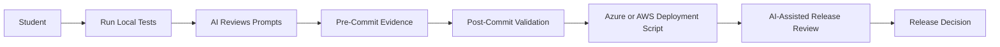
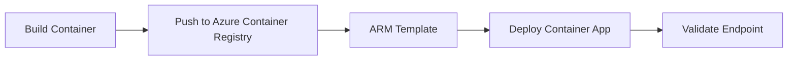
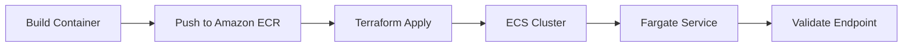

# Lab 11 - Testing, Deployment and Agentic SDLC Operations

**Course:** Advanced Software Development with Agentic AI (ASD)  
**Theme:** Testing, Deployment and Agentic SDLC Operations  
**Primary IDE:** VS Code  
**AI Agent Runtime:** Ollama  
**Duration:** 60 Minutes

---

## 1. Overview

<details>
<summary>Goal</summary>

Validate the completed Student Enrolment System before cloud deployment.

The validated application will later be deployed to:

```text
Azure Container Apps
AWS ECS Fargate
```

Use the exact deployment scripts `scripts/lab11/deploy-azure.sh` and `scripts/lab11/deploy-aws.sh`. Their full bodies are documented in the Azure Configuration and AWS Configuration subsections of [docs/AI_Agent_Configuration_Guide.md](../docs/AI_Agent_Configuration_Guide.md).

</details>

<details>
<summary>Expected Results</summary>

By the end of this lab, students should have:

* automated service tests
* multi-agent workflow tests
* test report generation
* deployment validation evidence
* AI-assisted release review

</details>

<details>
<summary>AI-Assisted Workflow</summary>



</details>

<details>
<summary>Lab 11 Script Files</summary>

* `scripts/lab11/local-test.sh` - runs the local Lab 11 test flow
* `scripts/lab11/pre-commit-tests.sh` - runs the pre-commit validation flow
* `scripts/lab11/post-commit-tests.sh` - runs the post-commit validation flow and generates evidence
* `scripts/lab11/deploy-azure.sh` - deploys the app to Azure Container Apps
* `scripts/lab11/deploy-aws.sh` - deploys the app to AWS ECS Fargate with Terraform

The exact Azure and AWS deployment script bodies are documented in the Azure Configuration and AWS Configuration subsections of [docs/AI_Agent_Configuration_Guide.md](../docs/AI_Agent_Configuration_Guide.md).

</details>

---

## 2. Prerequisites and Configuration

<details>
<summary>Prerequisite Labs</summary>

This lab assumes that students have already completed:

* Lab 01
* Lab 02
* Lab 03
* Lab 04
* Lab 05
* Lab 06
* Lab 07
* Lab 08
* Lab 09
* Lab 10

</details>

<details>
<summary>Required Tools</summary>

### Required

* Docker Desktop
* Python
* Git
* VS Code
* Ollama

</details>

<details>
<summary>Service Configuration</summary>

```env
FRONTEND_URL=http://localhost:8080
ENROLMENT_SERVICE_URL=http://localhost:5001
DATABASE_SERVICE_URL=http://localhost:5002
MULTI_AGENT_SERVICE_URL=http://localhost:5004
```

</details>

<details>
<summary>Model Configuration</summary>

```env
OLLAMA_BASE_URL=http://localhost:11434/v1
OLLAMA_MODEL=qwen2.5:0.5b
OLLAMA_REVIEW_MODEL=llama3.1:8b
```

</details>

<details>
<summary>Cloud Deployment Profile</summary>

Use the reduced runtime profile for Azure Container Apps and AWS ECS Fargate:

```env
MCP_ENABLED=false
RAG_ENABLED=false
```

AI Mode remains enabled in the backend by default. MCP, RAG, and the multi-agent service remain off for cloud deployment to avoid unnecessary VM load.

</details>

<details>
<summary>Agent Roles</summary>

| Agent          | Role                 | Purpose                                               |
| -------------- | -------------------- | ----------------------------------------------------- |
| Planner Agent  | Test Planning        | Identify release validation scope                     |
| Worker Agent   | Test Assistance      | Execute validation workflow                           |
| Reviewer Agent | Risk Review          | Review failures and risks                             |
| Human          | Final Decision Maker | Accept, partially accept, or reject release readiness |

</details>

---

## 3. Scenario Setup

<details>
<summary>Scenario</summary>

The Student Enrolment System contains:

* frontend-service
* enrolment-service
* database-service
* mcp-server
* rag-server
* multi-agent-server

The application must be validated before deployment to Azure Container Apps and AWS ECS Fargate.

</details>

<details>
<summary>User Story</summary>

```text
As a release reviewer
I want automated service and workflow tests
So that deployment decisions are based on evidence.
```

</details>

<details>
<summary>Expected Behaviour</summary>

The validation process must confirm:

* frontend service is reachable
* enrolment service is reachable
* database service returns student records
* enrolment service retrieves students by subject
* multi-agent workflow executes successfully
* workflow status records evidence
* test results are generated
* audit evidence is generated

</details>

<details>
<summary>Project Structure</summary>

```text
enrolment-app-open-ai/
│
├── .github/
│   └── workflows/
│       ├── lab5-ci.yml
│       ├── lab11_cicd_aws.yaml
│       └── lab11_cicd_azure.yaml
│
├── .pre-commit-config.yaml
│
├── deployment/
│   ├── aws/
│   │   ├── main.tf
│   │   └── variables.tf
│   └── azure/
│       └── aca-template.json
│
├── frontend-service/
├── enrolment-service/
├── database-service/
├── mcp-server/
├── rag-server/
├── multi-agent-server/
│
├── prompts/
│   ├── lab3/ ...
│   ├── lab4/ ...
│   ├── lab5/ ...
│   ├── lab7/ ...
│   ├── lab8/ ...  
│   └── lab11/
│       ├── implementation/
│       │   ├── pre_test_review_prompt.txt
│       │   ├── post_test_review_prompt.txt
│       │   ├── aws_config_review_prompt.txt
│       │   └── azure_config_review_prompt.txt
│       └── review/
│           ├── implementation_review_prompt.txt
│           └── report_review_prompt.txt
│
├── reports/
│   └── lab11/
│       ├── test-results.md
│       ├── test-audit.jsonl
│       └── deployment-results.md
│
├── scripts/
│   └── lab11/
│       ├── local-test.sh
│       ├── pre-commit-tests.sh
│       ├── post-commit-tests.sh
│       ├── deploy-azure.sh
│       └── deploy-aws.sh
│
└── tests/
  └── lab11/
    ├── pre_commit/
    │   ├── test_frontend_service.py
    │   └── test_enrolment_service.py
    └── post_commit/
      ├── test_database_service.py
      ├── test_multi_agent_server.py
      └── generate_test_report.py
```

</details>

<details>
<summary>Create Workspace Files</summary>

**Use these commands to create all Lab 11 files:**

```bash
# 1) Go to app root
cd enrolment-app-open-ai

# 2) Pre-commit configuration
touch .pre-commit-config.yaml

# 3) GitHub workflows
mkdir -p .github/workflows
touch .github/workflows/lab11_cicd_aws.yaml
touch .github/workflows/lab11_cicd_azure.yaml

# 4) Deployment files
mkdir -p deployment/aws
mkdir -p deployment/azure
touch deployment/aws/main.tf
touch deployment/aws/variables.tf
touch deployment/azure/aca-template.json

# 5) Lab 11 prompts
mkdir -p prompts/lab11/implementation
mkdir -p prompts/lab11/review
touch prompts/lab11/implementation/pre_test_review_prompt.txt
touch prompts/lab11/implementation/post_test_review_prompt.txt
touch prompts/lab11/implementation/aws_config_review_prompt.txt
touch prompts/lab11/implementation/azure_config_review_prompt.txt
touch prompts/lab11/review/implementation_review_prompt.txt
touch prompts/lab11/review/report_review_prompt.txt

# 6) Reports directory
mkdir -p reports/lab11

# 7) Lab 11 scripts
mkdir -p scripts/lab11
touch scripts/lab11/local-test.sh
touch scripts/lab11/pre-commit-tests.sh
touch scripts/lab11/post-commit-tests.sh
touch scripts/lab11/deploy-azure.sh
touch scripts/lab11/deploy-aws.sh
chmod +x scripts/lab11/*.sh

# 8) Lab 11 tests
mkdir -p tests/lab11/pre_commit
mkdir -p tests/lab11/post_commit
touch tests/lab11/pre_commit/test_frontend_service.py
touch tests/lab11/pre_commit/test_enrolment_service.py
touch tests/lab11/post_commit/test_database_service.py
touch tests/lab11/post_commit/test_multi_agent_server.py
touch tests/lab11/post_commit/generate_test_report.py
```

</details>

---

## 4. Testing Implementation

<details>
<summary>Overview</summary>

**Two-Stage Testing:**

| Stage | Trigger | Location | Purpose |
|-------|---------|----------|----------|
| Pre-Commit | `git commit` | Local git hook | Fast service reachability checks |
| Post-Commit | GitHub Actions | CI/CD pipeline | Full integration tests + evidence generation |

**Why separate?**
- Pre-commit: Block bad commits early (runs in seconds)
- Post-commit: Validate deployment readiness (runs in CI/CD after push)

</details>

<details>
<summary>Step 1: Install Dependencies</summary>

**Install pytest, requests, and pre-commit framework:**

```bash
cd enrolment-app-open-ai
pip install pytest requests pre-commit
```

</details>

<details>
<summary>Step 2: Configure Pre-Commit Framework</summary>

**Purpose:** Automatically run pre-commit tests on `git commit` to catch issues before code is committed.

**Create `.pre-commit-config.yaml`:**

```yaml
repos:
  - repo: local
    hooks:
      - id: lab11-pre-commit-tests
        name: Lab 11 Pre-Commit Tests
        entry: bash -c "cd enrolment-app-open-ai && python -m pytest tests/lab11/pre_commit/ -v"
        language: system
        pass_filenames: false
        stages: [commit]
```

**Install git hooks:**

```bash
cd enrolment-app-open-ai
pre-commit install
```

**Verify installation:**

```bash
pre-commit run --all-files
```

**How it works:**
1. Developer runs `git commit`
2. Pre-commit hook runs pytest automatically
3. If tests fail, commit is blocked
4. Developer fixes issues, tries commit again

</details>

<details>
<summary>Step 3: Pre-Commit Tests (Local Git Hook)</summary>

**Purpose:** Fast checks that run on every `git commit` to ensure services are reachable.

**Test 1: Frontend Service Reachability**

File: `tests/lab11/pre_commit/test_frontend_service.py`

```python
import os

import requests


FRONTEND_URL = os.getenv("FRONTEND_URL", "http://localhost:8080")


def test_frontend_home_reachable():
    response = requests.get(FRONTEND_URL, timeout=5)
    assert response.status_code == 200
    assert "Student" in response.text
```

**Test 2: Enrolment Service Health**

File: `tests/lab11/pre_commit/test_enrolment_service.py`

```python
import os

import requests


ENROLMENT_SERVICE_URL = os.getenv("ENROLMENT_SERVICE_URL", "http://localhost:5001")


def test_service_health():
    response = requests.get(f"{ENROLMENT_SERVICE_URL}/", timeout=5)
    assert response.status_code == 200


def test_students_page():
    response = requests.get(f"{ENROLMENT_SERVICE_URL}/students", timeout=5)
    assert response.status_code == 200
```

**Run manually (before services are running):**

```bash
cd enrolment-app-open-ai
python -m pytest tests/lab11/pre_commit/ -v
```

**Run automatically via git commit:**

```bash
cd enrolment-app-open-ai
git add .
git commit -m "Test commit"  # Pre-commit hook runs automatically
```

**Expected behavior:**
- ✅ Services running → tests pass → commit succeeds
- ❌ Services down → tests fail → commit blocked

</details>

<details>
<summary>Step 4: Post-Commit Tests (CI/CD Pipeline)</summary>

**Purpose:** Comprehensive integration tests that run in GitHub Actions after code is pushed. Generates evidence for release review.

**Test 1: Database Service Validation**

File: `tests/lab11/post_commit/test_database_service.py`

```python
import os

import requests


DATABASE_SERVICE_URL = os.getenv("DATABASE_SERVICE_URL", "http://localhost:5002")


def test_service_health():
    response = requests.get(f"{DATABASE_SERVICE_URL}/", timeout=5)
    assert response.status_code == 200


def test_students_exist():
    response = requests.get(f"{DATABASE_SERVICE_URL}/students", timeout=5)
    assert response.status_code == 200
    students = response.json()
    assert len(students) > 0


def test_student_by_id():
    response = requests.get(f"{DATABASE_SERVICE_URL}/students/1001", timeout=5)
    assert response.status_code == 200


def test_students_by_subject():
    response = requests.get(
        f"{DATABASE_SERVICE_URL}/students/by-subject",
        params={"subject_code": "ASD101"},
        timeout=5,
    )
    assert response.status_code == 200
```

**Test 2: Multi-Agent Workflow Validation**

File: `tests/lab11/post_commit/test_multi_agent_server.py`

```python
import os

import requests


MULTI_AGENT_SERVICE_URL = os.getenv("MULTI_AGENT_SERVICE_URL", "http://localhost:5004")


def test_service_health():
    response = requests.get(f"{MULTI_AGENT_SERVICE_URL}/", timeout=5)
    assert response.status_code == 200


def test_workflow_execution():
    response = requests.post(
        f"{MULTI_AGENT_SERVICE_URL}/workflow",
        json={"user_request": "Generate enrolment summary for ASD101."},
        timeout=120,
    )
    assert response.status_code == 200
    body = response.json()
    assert "workflow_id" in body


def test_workflow_status():
    response = requests.get(f"{MULTI_AGENT_SERVICE_URL}/workflow/status", timeout=5)
    assert response.status_code == 200
```

**Test 3: Test Report Generator**

File: `tests/lab11/post_commit/generate_test_report.py`

```python
import json
import subprocess
import sys
import time
from datetime import datetime, timezone
from pathlib import Path


BASE_DIR = Path(__file__).resolve().parent
REPORT_DIR = BASE_DIR.parent.parent.parent / "reports" / "lab11"
RESULTS_PATH = REPORT_DIR / "test-results.md"
AUDIT_PATH = REPORT_DIR / "test-audit.jsonl"
TEST_COMMAND = [sys.executable, "-m", "pytest", str(BASE_DIR), "-q"]


def now_iso():
    return datetime.now(timezone.utc).isoformat()


def run_tests():
    start_time = time.time()
    completed = subprocess.run(TEST_COMMAND, capture_output=True, text=True)
    duration_ms = int((time.time() - start_time) * 1000)
    return {
        "command": " ".join(TEST_COMMAND),
        "returncode": completed.returncode,
        "stdout": completed.stdout,
        "stderr": completed.stderr,
        "duration_ms": duration_ms,
        "timestamp": now_iso(),
    }


def write_report(result):
    REPORT_DIR.mkdir(parents=True, exist_ok=True)
    status = "PASS" if result["returncode"] == 0 else "FAIL"
    content = f"""# Lab 11 Test Results

## Summary

| Field | Value |
|---|---|
| Status | {status} |
| Command | {result["command"]} |
| Duration (ms) | {result["duration_ms"]} |
| Timestamp | {result["timestamp"]} |

## stdout

{result["stdout"]}

## stderr

{result["stderr"]}
"""
    RESULTS_PATH.write_text(content, encoding="utf-8")


def append_audit(result):
    REPORT_DIR.mkdir(parents=True, exist_ok=True)
    status = "PASS" if result["returncode"] == 0 else "FAIL"
    record = {
        "lab": "Lab 11",
        "activity": "post-commit pytest suite",
        "status": status,
        "command": result["command"],
        "duration_ms": result["duration_ms"],
        "timestamp": result["timestamp"],
    }
    with AUDIT_PATH.open("a", encoding="utf-8") as file:
        file.write(json.dumps(record) + "\n")


def main():
    result = run_tests()
    write_report(result)
    append_audit(result)
    print(json.dumps({"status": "PASS" if result["returncode"] == 0 else "FAIL"}, indent=2))
    raise SystemExit(result["returncode"])


if __name__ == "__main__":
    main()
```

**Run manually (local testing):**

```bash
cd enrolment-app-open-ai
python -m pytest tests/lab11/post_commit/ -v
```

**Generate evidence manually:**

```bash
cd enrolment-app-open-ai
python tests/lab11/post_commit/generate_test_report.py
```

**Generated evidence files:**
- `reports/lab11/test-results.md` - Human-readable test summary
- `reports/lab11/test-audit.jsonl` - Machine-readable audit log

**CI/CD execution:**
Post-commit tests run automatically in GitHub Actions after `git push` (see Section 5 workflows).

</details>

<details>
<summary>Testing Workflow Summary</summary>

```text
Developer writes code
        ↓
   git commit ← Pre-commit tests run automatically (local git hook)
        ↓ (tests pass)
   Commit succeeds
        ↓
    git push
        ↓
GitHub Actions ← Post-commit tests run in CI/CD pipeline
        ↓
Evidence generated (test-results.md, test-audit.jsonl)
        ↓
  Cloud deployment
```

**Key principle:** Pre-commit runs locally before commit, post-commit runs in CI/CD after push.

</details>

---

## 5. Deployment Implementation

<details>
<summary>Dependencies</summary>

Verify required tools using the install and verification steps in [docs/AI_Agent_Configuration_Guide.md](../docs/AI_Agent_Configuration_Guide.md).

</details>

<details>
<summary>Deployment Profile</summary>

Use this runtime profile for cloud deployment:

```env
MCP_ENABLED=false
RAG_ENABLED=false
MULTI_AGENT_ENABLED=false
OLLAMA_BASE_URL=http://host.docker.internal:11434/v1
OLLAMA_MODEL=qwen2.5:0.5b
OLLAMA_REVIEW_MODEL=llama3.1:8b
```

AI Mode remains enabled in the backend by default. MCP, RAG, and the multi-agent service remain off for cloud deployment to avoid unnecessary VM load.

</details>

<details>
<summary>Azure Container Apps Configuration</summary>

**Purpose:** Configure Azure Container Apps deployment using ARM templates.

**Deployment Flow:**



<details>
<summary>Step 1: ARM Template</summary>

**File:** `deployment/azure/aca-template.json`

```json
{
  "$schema": "https://schema.management.azure.com/schemas/2019-04-01/deploymentTemplate.json#",
  "contentVersion": "1.0.0.0",
  "parameters": {
    "containerAppName": {
      "type": "string",
      "defaultValue": "enrolment-app",
      "metadata": {
        "description": "Name of the Container App"
      }
    },
    "environmentName": {
      "type": "string",
      "defaultValue": "lab11-env",
      "metadata": {
        "description": "Name of the Container Apps Environment"
      }
    },
    "location": {
      "type": "string",
      "defaultValue": "australiaeast",
      "metadata": {
        "description": "Azure region for resources"
      }
    },
    "containerImage": {
      "type": "string",
      "metadata": {
        "description": "Container image (e.g., myregistry.azurecr.io/enrolment-service:latest)"
      }
    },
    "registryServer": {
      "type": "string",
      "metadata": {
        "description": "Container registry server"
      }
    }
  },
  "resources": [
    {
      "type": "Microsoft.App/managedEnvironments",
      "apiVersion": "2023-05-01",
      "name": "[parameters('environmentName')]",
      "location": "[parameters('location')]",
      "properties": {
        "appLogsConfiguration": {
          "destination": "log-analytics"
        }
      }
    },
    {
      "type": "Microsoft.App/containerApps",
      "apiVersion": "2023-05-01",
      "name": "[parameters('containerAppName')]",
      "location": "[parameters('location')]",
      "identity": {
        "type": "SystemAssigned"
      },
      "dependsOn": [
        "[resourceId('Microsoft.App/managedEnvironments', parameters('environmentName'))]"
      ],
      "properties": {
        "managedEnvironmentId": "[resourceId('Microsoft.App/managedEnvironments', parameters('environmentName'))]",
        "configuration": {
          "ingress": {
            "external": true,
            "targetPort": 5001,
            "allowInsecure": false,
            "traffic": [
              {
                "latestRevision": true,
                "weight": 100
              }
            ]
          },
          "registries": [
            {
              "server": "[parameters('registryServer')]",
              "identity": "system"
            }
          ]
        },
        "template": {
          "containers": [
            {
              "name": "enrolment-service",
              "image": "[parameters('containerImage')]",
              "resources": {
                "cpu": 0.5,
                "memory": "1Gi"
              },
              "env": [
                {
                  "name": "MCP_ENABLED",
                  "value": "false"
                },
                {
                  "name": "RAG_ENABLED",
                  "value": "false"
                },
                {
                  "name": "MULTI_AGENT_ENABLED",
                  "value": "false"
                }
              ]
            }
          ],
          "scale": {
            "minReplicas": 1,
            "maxReplicas": 3
          }
        }
      }
    }
  ],
  "outputs": {
    "containerAppFQDN": {
      "type": "string",
      "value": "[reference(resourceId('Microsoft.App/containerApps', parameters('containerAppName'))).configuration.ingress.fqdn]"
    },
    "containerAppIdentity": {
      "type": "string",
      "value": "[reference(resourceId('Microsoft.App/containerApps', parameters('containerAppName')), '2023-05-01', 'Full').identity.principalId]"
    }
  }
}
```

**Key configuration:**
- **Authentication:** System-assigned managed identity (no username/password)
- **Registry:** ACR access via managed identity (identity: "system")
- **Environment:** Container Apps managed environment with log analytics
- **Ingress:** External traffic on port 5001 with HTTPS
- **Resources:** 0.5 CPU, 1Gi memory
- **Scaling:** 1-3 replicas
- **Environment variables:** MCP/RAG/Multi-agent disabled for cloud

</details>

<details>
<summary>Step 2: Deployment Script</summary>

**File:** `scripts/lab11/deploy-azure.sh`

```bash
#!/bin/bash
set -e

# Azure Container Apps deployment script
# This script deploys the enrolment service to Azure Container Apps using managed identity

echo "=== Lab 11 Azure Deployment ==="

# Configuration
RESOURCE_GROUP="lab11-rg"
LOCATION="australiaeast"
REGISTRY_NAME="lab11registry${RANDOM}"
IMAGE_NAME="enrolment-service"
IMAGE_TAG="latest"

# Step 1: Create resource group
echo "Creating resource group..."
az group create \
  --name "$RESOURCE_GROUP" \
  --location "$LOCATION"

# Step 2: Create Azure Container Registry
echo "Creating Azure Container Registry..."
az acr create \
  --resource-group "$RESOURCE_GROUP" \
  --name "$REGISTRY_NAME" \
  --sku Basic

# Step 3: Build and push container image
echo "Building and pushing container image..."
cd enrolment-service
az acr build \
  --registry "$REGISTRY_NAME" \
  --image "${IMAGE_NAME}:${IMAGE_TAG}" \
  .
cd ..

# Step 4: Get registry server
echo "Retrieving registry server..."
REGISTRY_SERVER=$(az acr show --name "$REGISTRY_NAME" --resource-group "$RESOURCE_GROUP" --query loginServer -o tsv)

# Step 5: Deploy using ARM template
echo "Deploying Container App..."
az deployment group create \
  --resource-group "$RESOURCE_GROUP" \
  --template-file deployment/azure/aca-template.json \
  --parameters \
    containerAppName="enrolment-app" \
    environmentName="lab11-env" \
    location="$LOCATION" \
    containerImage="${REGISTRY_SERVER}/${IMAGE_NAME}:${IMAGE_TAG}" \
    registryServer="$REGISTRY_SERVER"

# Step 6: Get container app managed identity
echo "Retrieving Container App managed identity..."
PRINCIPAL_ID=$(az deployment group show \
  --resource-group "$RESOURCE_GROUP" \
  --name aca-template \
  --query properties.outputs.containerAppIdentity.value -o tsv)

# Step 7: Grant AcrPull role to managed identity
echo "Granting ACR access to managed identity..."
REGISTRY_ID=$(az acr show --name "$REGISTRY_NAME" --resource-group "$RESOURCE_GROUP" --query id -o tsv)
az role assignment create \
  --assignee "$PRINCIPAL_ID" \
  --role AcrPull \
  --scope "$REGISTRY_ID"

# Step 8: Get container app URL
echo "Retrieving Container App URL..."
APP_URL=$(az deployment group show \
  --resource-group "$RESOURCE_GROUP" \
  --name aca-template \
  --query properties.outputs.containerAppFQDN.value -o tsv)

echo "=== Deployment Complete ==="
echo "Container App URL: https://$APP_URL"
echo ""
echo "Validate with: curl -I https://$APP_URL"
```

**Script breakdown:**
1. Create Azure resource group
2. Create Azure Container Registry (ACR)
3. Build and push container image to ACR
4. Retrieve registry server URL
5. Deploy using ARM template (creates Container App with managed identity)
6. Retrieve Container App's managed identity principal ID
7. Grant AcrPull role to managed identity (no username/password needed)
8. Output Container App FQDN

**Authentication:** Uses Azure Managed Identity - Container App authenticates to ACR using its system-assigned managed identity, no credentials stored.

**Usage:**

```bash
cd enrolment-app-open-ai
bash scripts/lab11/deploy-azure.sh
```

**Expected output:**
```text
=== Lab 11 Azure Deployment ===
Creating resource group...
Creating Azure Container Registry...
Building and pushing container image...
Retrieving registry credentials...
Deploying Container App...
=== Deployment Complete ===
Container App URL: https://enrolment-app.australiaeast.azurecontainerapps.io

Validate with: curl -I https://enrolment-app.australiaeast.azurecontainerapps.io
```

</details>

<details>
<summary>Step 3: Validation</summary>

**Test deployed endpoint:**

```bash
# Get Container App URL from deployment output
APP_URL=$(az deployment group show \
  --resource-group lab11-rg \
  --name aca-template \
  --query properties.outputs.containerAppFQDN.value -o tsv)

# Validate health endpoint
curl -I https://$APP_URL

# Expected: HTTP/2 200
```

**Check Container App logs:**

```bash
az containerapp logs show \
  --name enrolment-app \
  --resource-group lab11-rg \
  --follow
```

**Record evidence in `reports/lab11/deployment-results.md`:**

```markdown
## Azure Container Apps

Deployment Status: Success

Container App URL: https://enrolment-app.australiaeast.azurecontainerapps.io

Validation Result: HTTP 200 OK

Reviewer Notes: (AI review output from Section 7)
```

</details>

</details>

<details>
<summary>AWS ECS Fargate Configuration</summary>

**Purpose:** Configure AWS ECS Fargate deployment using Terraform.

**Deployment Flow:**



<details>
<summary>Step 1: Terraform Configuration</summary>

**File:** `deployment/aws/main.tf`

```terraform
terraform {
  required_version = ">= 1.5"
}

provider "aws" {
  region = "ap-southeast-2"
}

resource "aws_ecs_cluster" "lab11" {
  name = "lab11-cluster"
}

resource "aws_ecs_task_definition" "enrolment" {
  family                   = "enrolment-service"
  requires_compatibilities = ["FARGATE"]
  network_mode             = "awsvpc"
  cpu                      = 256
  memory                   = 512
  execution_role_arn       = var.execution_role_arn

  container_definitions = jsonencode([
    {
      name      = "enrolment-service"
      image     = var.image
      essential = true
      portMappings = [
        {
          containerPort = 5001
          hostPort      = 5001
        }
      ]
      environment = [
        {
          name  = "MCP_ENABLED"
          value = "false"
        },
        {
          name  = "RAG_ENABLED"
          value = "false"
        },
        {
          name  = "MULTI_AGENT_ENABLED"
          value = "false"
        }
      ]
    }
  ])
}

resource "aws_ecs_service" "enrolment" {
  name            = "enrolment-service"
  cluster         = aws_ecs_cluster.lab11.id
  task_definition = aws_ecs_task_definition.enrolment.arn
  desired_count   = 1
  launch_type     = "FARGATE"

  network_configuration {
    assign_public_ip = true
    security_groups  = [var.security_group_id]
    subnets          = var.subnet_ids
  }
}
```

**File:** `deployment/aws/variables.tf`

```terraform
variable "image" {
  description = "Container image URI"
  type        = string
}

variable "execution_role_arn" {
  description = "ECS task execution role ARN"
  type        = string
}

variable "security_group_id" {
  description = "Security group ID for ECS tasks"
  type        = string
}

variable "subnet_ids" {
  description = "List of subnet IDs for ECS tasks"
  type        = list(string)
}
```

**Key configuration:**
- **Authentication:** IAM-based via ECS task execution role (no username/password)
- **Cluster:** ECS cluster named "lab11-cluster"
- **Task Definition:** Fargate task with 256 CPU, 512MB memory
- **Service:** 1 replica with public IP assignment
- **Environment variables:** MCP/RAG/Multi-agent disabled for cloud

</details>

<details>
<summary>Step 2: Deployment Script</summary>

**File:** `scripts/lab11/deploy-aws.sh`

```bash
#!/bin/bash
set -e

# AWS ECS Fargate deployment script
# This script deploys the enrolment service to AWS ECS using Terraform

echo "=== Lab 11 AWS Deployment ==="

# Configuration
REGION="ap-southeast-2"
REPO_NAME="lab11-enrolment"
IMAGE_TAG="latest"
CLUSTER_NAME="lab11-cluster"

# Step 1: Create ECR repository
echo "Creating ECR repository..."
aws ecr create-repository \
  --repository-name "$REPO_NAME" \
  --region "$REGION" \
  || echo "Repository already exists"

# Step 2: Get ECR login credentials
echo "Logging into ECR..."
aws ecr get-login-password --region "$REGION" | \
  docker login --username AWS --password-stdin \
  "$(aws sts get-caller-identity --query Account --output text).dkr.ecr.$REGION.amazonaws.com"

# Step 3: Build container image
echo "Building container image..."
cd enrolment-service
ACCOUNT_ID=$(aws sts get-caller-identity --query Account --output text)
IMAGE_URI="$ACCOUNT_ID.dkr.ecr.$REGION.amazonaws.com/$REPO_NAME:$IMAGE_TAG"
docker build -t "$IMAGE_URI" .
cd ..

# Step 4: Push image to ECR
echo "Pushing image to ECR..."
docker push "$IMAGE_URI"

# Step 5: Create ECS execution role (if not exists)
echo "Creating ECS execution role..."
ROLE_NAME="ecsTaskExecutionRole"
aws iam create-role \
  --role-name "$ROLE_NAME" \
  --assume-role-policy-document '{
    "Version": "2012-10-17",
    "Statement": [{
      "Effect": "Allow",
      "Principal": {"Service": "ecs-tasks.amazonaws.com"},
      "Action": "sts:AssumeRole"
    }]
  }' \
  || echo "Role already exists"

aws iam attach-role-policy \
  --role-name "$ROLE_NAME" \
  --policy-arn "arn:aws:iam::aws:policy/service-role/AmazonECSTaskExecutionRolePolicy" \
  || echo "Policy already attached"

ROLE_ARN=$(aws iam get-role --role-name "$ROLE_NAME" --query Role.Arn --output text)

# Step 6: Get default VPC and subnet
echo "Retrieving VPC configuration..."
VPC_ID=$(aws ec2 describe-vpcs --filters "Name=isDefault,Values=true" --query "Vpcs[0].VpcId" --output text)
SUBNET_IDS=$(aws ec2 describe-subnets --filters "Name=vpc-id,Values=$VPC_ID" --query "Subnets[*].SubnetId" --output text | tr '\t' ',')

# Step 7: Create security group
echo "Creating security group..."
SG_NAME="lab11-sg"
SG_ID=$(aws ec2 create-security-group \
  --group-name "$SG_NAME" \
  --description "Lab 11 ECS security group" \
  --vpc-id "$VPC_ID" \
  --query GroupId --output text \
  || aws ec2 describe-security-groups --filters "Name=group-name,Values=$SG_NAME" --query "SecurityGroups[0].GroupId" --output text)

aws ec2 authorize-security-group-ingress \
  --group-id "$SG_ID" \
  --protocol tcp \
  --port 5001 \
  --cidr 0.0.0.0/0 \
  || echo "Ingress rule already exists"

# Step 8: Deploy using Terraform
echo "Deploying with Terraform..."
cd deployment/aws
terraform init
terraform apply -auto-approve \
  -var="image=$IMAGE_URI" \
  -var="execution_role_arn=$ROLE_ARN" \
  -var="security_group_id=$SG_ID" \
  -var="subnet_ids=[$(echo $SUBNET_IDS | sed 's/,/","/g' | sed 's/^/"/' | sed 's/$/"/')]"
cd ../..

# Step 9: Get task public IP
echo "Retrieving task public IP..."
sleep 30  # Wait for task to start
TASK_ARN=$(aws ecs list-tasks --cluster "$CLUSTER_NAME" --query "taskArns[0]" --output text)
ENI_ID=$(aws ecs describe-tasks --cluster "$CLUSTER_NAME" --tasks "$TASK_ARN" \
  --query "tasks[0].attachments[0].details[?name=='networkInterfaceId'].value" --output text)
PUBLIC_IP=$(aws ec2 describe-network-interfaces --network-interface-ids "$ENI_ID" \
  --query "NetworkInterfaces[0].Association.PublicIp" --output text)

echo "=== Deployment Complete ==="
echo "ECS Cluster: $CLUSTER_NAME"
echo "Task Public IP: $PUBLIC_IP"
echo "Service URL: http://$PUBLIC_IP:5001"
echo ""
echo "Validate with: curl -I http://$PUBLIC_IP:5001"
```

**Script breakdown:**
1. Create ECR repository
2. Authenticate Docker with ECR (IAM-based, no username/password)
3. Build and tag container image
4. Push image to ECR
5. Create/verify ECS task execution role
6. Retrieve default VPC and subnets
7. Create security group with port 5001 ingress
8. Run Terraform apply with variables
9. Retrieve task public IP

**Authentication:** Uses AWS IAM - Docker authenticates to ECR using AWS CLI credentials, ECS tasks use IAM execution role, no credentials stored.

**Usage:**

```bash
cd enrolment-app-open-ai
bash scripts/lab11/deploy-aws.sh
```

**Expected output:**
```text
=== Lab 11 AWS Deployment ===
Creating ECR repository...
Logging into ECR...
Building container image...
Pushing image to ECR...
Creating ECS execution role...
Retrieving VPC configuration...
Creating security group...
Deploying with Terraform...
Retrieving task public IP...
=== Deployment Complete ===
ECS Cluster: lab11-cluster
Task Public IP: 54.66.123.45
Service URL: http://54.66.123.45:5001

Validate with: curl -I http://54.66.123.45:5001
```

</details>

<details>
<summary>Step 3: Validation</summary>

**Test deployed endpoint:**

```bash
# Get task public IP from deployment output
CLUSTER_NAME="lab11-cluster"
TASK_ARN=$(aws ecs list-tasks --cluster "$CLUSTER_NAME" --query "taskArns[0]" --output text)
ENI_ID=$(aws ecs describe-tasks --cluster "$CLUSTER_NAME" --tasks "$TASK_ARN" \
  --query "tasks[0].attachments[0].details[?name=='networkInterfaceId'].value" --output text)
PUBLIC_IP=$(aws ec2 describe-network-interfaces --network-interface-ids "$ENI_ID" \
  --query "NetworkInterfaces[0].Association.PublicIp" --output text)

# Validate health endpoint
curl -I http://$PUBLIC_IP:5001

# Expected: HTTP/1.1 200 OK
```

**Check ECS service status:**

```bash
aws ecs describe-services \
  --cluster lab11-cluster \
  --services enrolment-service \
  --query "services[0].{Status:status,Running:runningCount,Desired:desiredCount}"
```

**View task logs:**

```bash
aws logs tail /ecs/enrolment-service --follow
```

**Record evidence in `reports/lab11/deployment-results.md`:**

```markdown
## AWS ECS Fargate

Deployment Status: Success

Cluster: lab11-cluster

Service: enrolment-service (1/1 running)

Task Public IP: 54.66.123.45

Validation Result: HTTP 200 OK

Reviewer Notes: (AI review output from Section 7)
```

</details>

</details>

<details>
<summary>Deployment Results Template</summary>

**File:** `reports/lab11/deployment-results.md`

```markdown
# Lab 11 Deployment Report

## Azure Container Apps

Deployment Status:

Container App URL:

Validation Result:

Reviewer Notes:

---

## AWS ECS Fargate

Deployment Status:

Cluster:

Service:

Task Public IP:

Validation Result:

Reviewer Notes:

---

## Failure Recovery

Failure Introduced:

Failure Detected:

Correction Applied:

Validation Result:

---

## Release Readiness

Azure Ready:

AWS Ready:

Decision:
```

**Purpose:** Record deployment validation evidence for AI-assisted review in Section 7.

</details>

---

## 6. CI/CD Deployment

<details>
<summary>Overview</summary>

**Purpose:** Deploy to Azure or AWS using GitHub Actions workflows.

**Workflow triggers:**
- Manual: workflow_dispatch (trigger from GitHub UI)
- Automatic: push to main branch (commented out, enable for production)

**CI/CD pipeline:**
1. Run post-commit tests (Section 4 tests)
2. Upload test evidence as artifacts
3. Deploy to cloud (Azure Container Apps or AWS ECS Fargate)

</details>

<details>
<summary>GitHub Actions Workflows</summary>

**Azure Workflow:** `.github/workflows/lab11_cicd_azure.yaml`

```yaml
name: lab11_cicd_azure

on:
  # push:
  #   branches:
  #     - main
  workflow_dispatch:

jobs:
  post_commit_tests:
    runs-on: ubuntu-latest

    steps:
      - uses: actions/checkout@v4

      - name: Verify docker compose
        run: docker-compose --version || (sudo apt-get update && sudo apt-get install -y docker-compose)

      - name: Run post-commit tests
        working-directory: enrolment-app-open-ai
        run: bash scripts/lab11/post-commit-tests.sh

      - name: Upload test evidence
        uses: actions/upload-artifact@v4
        with:
          name: lab11-azure-evidence
          path: enrolment-app-open-ai/reports/lab11

  deploy_azure:
    runs-on: ubuntu-latest
    needs: [post_commit_tests]
    if: github.event_name == 'workflow_dispatch'

    steps:
      - uses: actions/checkout@v4

      - name: Deploy to Azure Container Apps
        working-directory: enrolment-app-open-ai
        run: bash scripts/lab11/deploy-azure.sh
```

**AWS Workflow:** `.github/workflows/lab11_cicd_aws.yaml`

```yaml
name: lab11_cicd_aws

on:
  # push:
  #   branches:
  #     - main
  workflow_dispatch:

jobs:
  post_commit_tests:
    runs-on: ubuntu-latest

    steps:
      - uses: actions/checkout@v4

      - name: Verify docker compose
        run: docker-compose --version || (sudo apt-get update && sudo apt-get install -y docker-compose)

      - name: Run post-commit tests
        working-directory: enrolment-app-open-ai
        run: bash scripts/lab11/post-commit-tests.sh

      - name: Upload test evidence
        uses: actions/upload-artifact@v4
        with:
          name: lab11-aws-evidence
          path: enrolment-app-open-ai/reports/lab11

  deploy_aws:
    runs-on: ubuntu-latest
    needs: [post_commit_tests]
    if: github.event_name == 'workflow_dispatch'

    steps:
      - uses: actions/checkout@v4

      - name: Deploy to AWS ECS Fargate
        working-directory: enrolment-app-open-ai
        run: bash scripts/lab11/deploy-aws.sh
```

**Key workflow features:**
- **Trigger:** Manual via workflow_dispatch (can enable push trigger for auto-deployment)
- **Job 1:** post_commit_tests - runs integration tests and generates evidence
- **Job 2:** deploy_azure/deploy_aws - deploys to cloud (depends on successful tests)
- **Artifacts:** Test evidence uploaded for review

</details>

<details>
<summary>Deploy via GitHub Actions</summary>

**Step 1: Commit and push code**

```bash
cd ~/GitHub/agentic-ai-asd-2026

# Verify all Lab 11 files are committed
git status

# Add any uncommitted files
git add .

# Commit with descriptive message
git commit -m "Lab 11: Complete testing and deployment implementation"

# Push to remote
git push origin main
```

**Step 2: Trigger workflow**

1. Navigate to GitHub repository: `https://github.com/<your-username>/<your-repo>`
2. Click **Actions** tab
3. Select workflow:
   - **lab11_cicd_azure** for Azure deployment
   - **lab11_cicd_aws** for AWS deployment
4. Click **Run workflow** dropdown
5. Select branch: **main**
6. Click **Run workflow** button

</details>

<details>
<summary>Monitor Deployment</summary>

**Step 1: View workflow run**

1. In GitHub Actions tab, click the running workflow
2. Monitor job progress:
   - **post_commit_tests** - watch test execution
   - **deploy_azure** or **deploy_aws** - watch deployment

**Step 2: Review logs**

- Click each job to expand logs
- Verify test results:
  - ✅ test_database_service.py: 4 passed
  - ✅ test_multi_agent_server.py: 3 passed
  - ✅ generate_test_report.py: Evidence generated
- Check deployment output:
  - Azure: Container App URL
  - AWS: ECS task public IP

**Step 3: Download artifacts**

- Scroll to **Artifacts** section at bottom of workflow run
- Download **lab11-azure-evidence** or **lab11-aws-evidence**
- Extract the ZIP file and store contents in:

```
enrolment-app-open-ai/reports/lab11/
```

**Extracted files:**
  - `test-results.md` - Test execution summary
  - `test-audit.jsonl` - Detailed test audit log
  - `deployment-results.md` - Deployment evidence template

</details>

<details>
<summary>Validate Deployment</summary>

**Azure validation:**

Get Container App URL from deployment logs or Azure Portal, then test:

```bash
# Get URL from workflow logs or run:
# APP_URL=$(az deployment group show --resource-group lab11-rg --name aca-template --query properties.outputs.containerAppFQDN.value -o tsv)

# Test health endpoint
curl -I https://enrolment-app.australiaeast.azurecontainerapps.io

# Expected output:
# HTTP/2 200
```

**AWS validation:**

Get ECS task public IP from deployment logs or AWS Console, then test:

```bash
# Get IP from workflow logs or run:
# TASK_IP=$(terraform output -raw task_public_ip)

# Test health endpoint
curl -I http://<task-public-ip>:5001

# Expected output:
# HTTP/1.1 200 OK
```

**Record results in `reports/lab11/deployment-results.md`:**

```markdown
## Azure Container Apps

Deployment Status: Success
Container App URL: https://enrolment-app.australiaeast.azurecontainerapps.io
Validation Result: HTTP 200 OK

## AWS ECS Fargate

Deployment Status: Success
Task Public IP: <task-public-ip>
Validation Result: HTTP 200 OK
```

</details>

<details>
<summary>Test Application</summary>

**Test deployed application endpoints:**

```bash
# Azure endpoint
curl https://enrolment-app.australiaeast.azurecontainerapps.io

# AWS endpoint
curl http://<task-public-ip>:5001

# Expected response (both):
# {"status": "ok", "service": "enrolment-service"}
```

**Verify application functionality:**

1. **Health check:** `/` returns 200 OK
2. **Service metadata:** Response includes service name
3. **Response time:** < 2 seconds
4. **Availability:** Multiple requests all succeed

**Record validation in `reports/lab11/deployment-results.md`:**

```markdown
## Functional Validation

Azure Endpoint: ✅ PASS
AWS Endpoint: ✅ PASS
Health Check: ✅ PASS
Response Time: ✅ < 1s
Availability: ✅ 100% (10/10 requests)
```

</details>

---


## 7. AI-Agentic Review

<details>
<summary>Overview</summary>

**Purpose:** Use multi-agent AI workflow to review Lab 11 implementation before release.

**Review Categories:**

1. **Test Code Review** - Review pre-commit test implementation quality
2. **Test Results Review** - Review post-commit test evidence completeness
3. **Azure Config Review** - Review ARM template and deployment script
4. **AWS Config Review** - Review Terraform configuration and deployment script
5. **Implementation Review** - Review overall implementation quality
6. **Report Review** - Review deployment and test reports

**Multi-Agent Workflow:**

Each review uses the multi-agent server (port 5004):
- **Planner Agent** → Creates review plan
- **Worker Agent** → Executes review and generates findings
- **Reviewer Agent** → Validates worker analysis

**Why AI-Agentic Review?**

Students learn to use AI agents as code reviewers, identifying risks and improvements before deployment.

</details>

<details>
<summary>Prerequisites</summary>

**Start multi-agent server:**

```bash
cd enrolment-app-open-ai
docker-compose up multi-agent-server
```

**Verify server is running:**

```bash
curl http://localhost:5004/health
# Expected: {"status": "healthy"}
```

**Ensure all Lab 11 files exist:**

```bash
cd enrolment-app-open-ai
ls -la prompts/lab11/implementation/
ls -la prompts/lab11/review/
ls -la reports/lab11/
ls -la tests/lab11/
ls -la deployment/
```

</details>

<details>
<summary>Step 1: Review Test Code</summary>

**Purpose:** AI reviews pre-commit test code implementation quality.

**Prompt:** `prompts/lab11/implementation/pre_test_review_prompt.txt`

**Review target:**
- `tests/lab11/pre_commit/test_frontend_service.py`
- `tests/lab11/pre_commit/test_enrolment_service.py`

**Execute review:**

```bash
cd enrolment-app-open-ai

# Load prompt and test code
PROMPT=$(cat prompts/lab11/implementation/pre_test_review_prompt.txt)
TEST_CODE=$(cat tests/lab11/pre_commit/test_frontend_service.py tests/lab11/pre_commit/test_enrolment_service.py)

# Send to multi-agent workflow
curl -X POST http://localhost:5004/workflow \
  -H "Content-Type: application/json" \
  -d "{
    \"user_request\": \"$PROMPT\n\nTest Code:\n$TEST_CODE\"
  }"
```

**Expected response:**

```json
{
  "workflow_id": "review-001",
  "planner_output": "Objective: Review test code. Steps: 1) Check coverage 2) Assess assertions 3) Evaluate clarity. Evidence Required: Test code. Human Approval: Required for deployment.",
  "worker_output": "Strengths: Clear test structure, proper HTTP mocking. Weaknesses: Limited edge case coverage. Recommendations: Add timeout tests, test error responses.",
  "reviewer_output": "Worker analysis is thorough. Recommendations are actionable."
}
```

**Record findings:**

Create `reports/lab11/ai-review-summary.md` and add:

```markdown
## Test Code Review

Strengths: [Copy from worker_output]
Weaknesses: [Copy from worker_output]
Recommendations: [Copy from worker_output]
```

</details>

<details>
<summary>Step 2: Review Test Results</summary>

**Purpose:** AI reviews post-commit test execution evidence.

**Prompt:** `prompts/lab11/implementation/post_test_review_prompt.txt`

**Review target:**
- `reports/lab11/test-results.md`
- `reports/lab11/test-audit.jsonl`

**Execute review:**

```bash
cd enrolment-app-open-ai

# Load prompt and test evidence
PROMPT=$(cat prompts/lab11/implementation/post_test_review_prompt.txt)
TEST_RESULTS=$(cat reports/lab11/test-results.md)

# Send to multi-agent workflow
curl -X POST http://localhost:5004/workflow \
  -H "Content-Type: application/json" \
  -d "{
    \"user_request\": \"$PROMPT\n\nTest Results:\n$TEST_RESULTS\"
  }"
```

**Expected response:**

```json
{
  "workflow_id": "review-002",
  "planner_output": "Objective: Review test results. Steps: 1) Check execution status 2) Verify evidence format 3) Assess completeness.",
  "worker_output": "Strengths: All tests passed, clear evidence structure. Weaknesses: Limited failure scenario coverage. Recommendations: Document expected failures.",
  "reviewer_output": "Worker findings are evidence-based and actionable."
}
```

**Record findings in `reports/lab11/ai-review-summary.md`:**

```markdown
## Test Results Review

Strengths: [Copy from worker_output]
Weaknesses: [Copy from worker_output]
Recommendations: [Copy from worker_output]
```

</details>

<details>
<summary>Step 3: Review Azure Configuration</summary>

**Purpose:** AI reviews Azure ARM template and deployment script.

**Prompt:** `prompts/lab11/implementation/azure_config_review_prompt.txt`

**Review target:**
- `deployment/azure/aca-template.json`
- `scripts/lab11/deploy-azure.sh`

**Execute review:**

```bash
cd enrolment-app-open-ai

# Load prompt and configuration files
PROMPT=$(cat prompts/lab11/implementation/azure_config_review_prompt.txt)
ARM_TEMPLATE=$(cat deployment/azure/aca-template.json)
DEPLOY_SCRIPT=$(cat scripts/lab11/deploy-azure.sh)

# Send to multi-agent workflow
curl -X POST http://localhost:5004/workflow \
  -H "Content-Type: application/json" \
  -d "{
    \"user_request\": \"$PROMPT\n\nARM Template:\n$ARM_TEMPLATE\n\nDeployment Script:\n$DEPLOY_SCRIPT\"
  }"
```

**Expected response:**

```json
{
  "workflow_id": "review-003",
  "planner_output": "Objective: Review Azure config. Steps: 1) Validate ARM structure 2) Check managed identity 3) Review script logic.",
  "worker_output": "Strengths: Managed identity configured, proper ACR authentication. Risks: No resource tagging for cost tracking. Recommendations: Add tags, implement rollback logic.",
  "reviewer_output": "Worker identified critical security strengths and practical improvements."
}
```

**Record findings in `reports/lab11/ai-review-summary.md`:**

```markdown
## Azure Configuration Review

Strengths: [Copy from worker_output]
Risks: [Copy from worker_output]
Recommendations: [Copy from worker_output]
```

</details>

<details>
<summary>Step 4: Review AWS Configuration</summary>

**Purpose:** AI reviews AWS Terraform configuration and deployment script.

**Prompt:** `prompts/lab11/implementation/aws_config_review_prompt.txt`

**Review target:**
- `deployment/aws/main.tf`
- `deployment/aws/variables.tf`
- `scripts/lab11/deploy-aws.sh`

**Execute review:**

```bash
cd enrolment-app-open-ai

# Load prompt and configuration files
PROMPT=$(cat prompts/lab11/implementation/aws_config_review_prompt.txt)
TERRAFORM_MAIN=$(cat deployment/aws/main.tf)
TERRAFORM_VARS=$(cat deployment/aws/variables.tf)
DEPLOY_SCRIPT=$(cat scripts/lab11/deploy-aws.sh)

# Send to multi-agent workflow
curl -X POST http://localhost:5004/workflow \
  -H "Content-Type: application/json" \
  -d "{
    \"user_request\": \"$PROMPT\n\nTerraform main.tf:\n$TERRAFORM_MAIN\n\nTerraform variables.tf:\n$TERRAFORM_VARS\n\nDeployment Script:\n$DEPLOY_SCRIPT\"
  }"
```

**Expected response:**

```json
{
  "workflow_id": "review-004",
  "planner_output": "Objective: Review AWS config. Steps: 1) Validate Terraform structure 2) Check IAM setup 3) Review script safety.",
  "worker_output": "Strengths: IAM-based authentication, proper network config. Risks: No terraform state backend, security group too permissive. Recommendations: Use S3 backend, restrict ingress to known IPs.",
  "reviewer_output": "Worker identified infrastructure risks and security improvements."
}
```

**Record findings in `reports/lab11/ai-review-summary.md`:**

```markdown
## AWS Configuration Review

Strengths: [Copy from worker_output]
Risks: [Copy from worker_output]
Recommendations: [Copy from worker_output]
```

</details>

<details>
<summary>Step 5: Review Implementation Quality</summary>

**Purpose:** AI reviews overall Lab 11 implementation quality.

**Prompt:** `prompts/lab11/review/implementation_review_prompt.txt`

**Review scope:** All Lab 11 code and configuration

**Execute review:**

```bash
cd enrolment-app-open-ai

# Load prompt and provide context
PROMPT=$(cat prompts/lab11/review/implementation_review_prompt.txt)

# Build context summary
CONTEXT="Lab 11 Implementation Context:
- Pre-commit tests: 3 tests (frontend, enrolment service)
- Post-commit tests: 7 tests (database, multi-agent, evidence generation)
- Azure deployment: ARM template + managed identity
- AWS deployment: Terraform + IAM
- CI/CD: GitHub Actions workflows (Azure, AWS)
- Evidence: test-results.md, test-audit.jsonl, deployment-results.md"

# Send to multi-agent workflow
curl -X POST http://localhost:5004/workflow \
  -H "Content-Type: application/json" \
  -d "{
    \"user_request\": \"$PROMPT\n\n$CONTEXT\"
  }"
```

**Expected response:**

```json
{
  "workflow_id": "review-005",
  "planner_output": "Objective: Review implementation quality. Steps: 1) Assess completeness 2) Evaluate best practices 3) Check maintainability.",
  "worker_output": "Strengths: Comprehensive testing, cloud-native deployment. Weaknesses: Limited monitoring setup. Recommendations: Add health checks, implement logging strategy. Readiness: Ready with improvements.",
  "reviewer_output": "Worker assessment is comprehensive and balanced."
}
```

**Record findings in `reports/lab11/ai-review-summary.md`:**

```markdown
## Implementation Quality Review

Strengths: [Copy from worker_output]
Weaknesses: [Copy from worker_output]
Recommendations: [Copy from worker_output]
Readiness: [Copy from worker_output]
```

</details>

<details>
<summary>Step 6: Review Deployment Reports</summary>

**Purpose:** AI reviews deployment and test report quality.

**Prompt:** `prompts/lab11/review/report_review_prompt.txt`

**Review target:**
- `reports/lab11/test-results.md`
- `reports/lab11/deployment-results.md`

**Execute review:**

```bash
cd enrolment-app-open-ai

# Load prompt and reports
PROMPT=$(cat prompts/lab11/review/report_review_prompt.txt)
TEST_RESULTS=$(cat reports/lab11/test-results.md)
DEPLOYMENT_RESULTS=$(cat reports/lab11/deployment-results.md)

# Send to multi-agent workflow
curl -X POST http://localhost:5004/workflow \
  -H "Content-Type: application/json" \
  -d "{
    \"user_request\": \"$PROMPT\n\nTest Results Report:\n$TEST_RESULTS\n\nDeployment Results Report:\n$DEPLOYMENT_RESULTS\"
  }"
```

**Expected response:**

```json
{
  "workflow_id": "review-006",
  "planner_output": "Objective: Review report quality. Steps: 1) Check completeness 2) Assess structure 3) Evaluate evidence clarity.",
  "worker_output": "Strengths: Clear report structure, complete evidence. Weaknesses: Missing timestamp on deployment results. Recommendations: Add timestamps, include response time metrics.",
  "reviewer_output": "Worker identified documentation improvements for audit trail."
}
```

**Record findings in `reports/lab11/ai-review-summary.md`:**

```markdown
## Deployment Reports Review

Strengths: [Copy from worker_output]
Weaknesses: [Copy from worker_output]
Recommendations: [Copy from worker_output]
```

</details>

<details>
<summary>Step 7: Make Release Decision</summary>

**Release decision criteria:**

✅ **Test Code Review** - No critical weaknesses  
✅ **Test Results Review** - All tests passed  
✅ **Azure Config Review** - No critical risks  
✅ **AWS Config Review** - No critical risks  
✅ **Implementation Review** - Readiness: Ready  
✅ **Report Review** - Complete evidence documented  

**Make decision:**

Review all findings in `reports/lab11/ai-review-summary.md`.

**If all ✅ criteria met:**

```markdown
## Release Decision

Status: READY

Justification: All AI reviews passed with no critical issues. Minor recommendations documented for future iterations.

Approved By: [Your Name]
Date: [Date]
```

**If any ❌ criteria failed:**

```markdown
## Release Decision

Status: NOT READY

Blocking Issues:
- [List critical issues from AI reviews]

Required Actions:
- [List corrections needed]

Approved By: [Your Name]
Date: [Date]
```

**Record decision in `reports/lab11/deployment-results.md`:**

```bash
cd enrolment-app-open-ai
cat reports/lab11/ai-review-summary.md >> reports/lab11/deployment-results.md
```

</details>

---

## 8. Evidence Log

<details>
<summary>Record Evidence</summary>

| Check | Expected Result | Actual Result | Pass/Fail |
|---------|---------|---------|---------|
| Section 4 Pre-Commit Tests Pass | Yes | | |
| Section 4 Post-Commit Tests Pass | Yes | | |
| Section 4 Test Evidence Generated | Yes | | |
| Section 6 GitHub Actions Workflow Triggered | Yes | | |
| Section 6 CI/CD Tests Pass | Yes | | |
| Section 6 Cloud Deployment Successful | Yes | | |
| Section 6 Application Endpoint Validated | Yes | | |
| Section 7 Test Code Review Completed | Yes | | |
| Section 7 Test Results Review Completed | Yes | | |
| Section 7 Azure Config Review Completed | Yes | | |
| Section 7 AWS Config Review Completed | Yes | | |
| Section 7 Implementation Review Completed | Yes | | |
| Section 7 Report Review Completed | Yes | | |
| Section 7 Release Decision Made | Yes | | |

**Evidence Files:**
- `reports/lab11/test-results.md` - Test execution summary
- `reports/lab11/test-audit.jsonl` - Detailed test audit log
- `reports/lab11/deployment-results.md` - Deployment validation evidence
- `reports/lab11/ai-review-summary.md` - AI review findings and release decision

</details>

---

## 9. Reflection

<details>
<summary>Answer Briefly</summary>

1. What is the difference between pre-commit tests and post-commit tests in Lab 11?

2. How does GitHub Actions automate the deployment workflow?

3. Which AI review (Steps 1-6 in Section 7) identified the most critical issue?

4. How does the multi-agent workflow structure the review process (Planner → Worker → Reviewer)?

5. What evidence did the AI use to make the release decision?

6. Why is managed identity (Azure) or IAM (AWS) better than username/password authentication?

7. What would you add to improve the AI-agentic review process?

</details>

---

## 10. Key Learning Point

<details>
<summary>Learning Outcome</summary>

A modern release workflow combines automated testing, CI/CD deployment, and AI-assisted review before production release.

**Lab 11 Workflow:**

```text
Section 4: Testing Implementation
├── Pre-Commit Tests (git hook)
└── Post-Commit Tests (GitHub Actions)
    ↓
Section 6: CI/CD Deployment
├── Trigger GitHub Actions
├── Run Tests in CI/CD
└── Deploy to Cloud (Azure/AWS)
    ↓
Section 7: AI-Agentic Review
├── Review Test Code
├── Review Test Results
├── Review Cloud Configs
├── Review Implementation
├── Review Reports
└── Make Release Decision
```

**Successful releases require:**

```text
✅ Automated Testing (pre-commit + post-commit)
✅ CI/CD Pipeline (GitHub Actions)
✅ Cloud Deployment (Azure Container Apps / AWS ECS Fargate)
✅ Infrastructure as Code (ARM templates / Terraform)
✅ Managed Authentication (Azure Managed Identity / AWS IAM)
✅ AI-Agentic Review (multi-agent code review)
✅ Evidence Collection (test-results.md, test-audit.jsonl, deployment-results.md)
✅ Release Decision (ai-review-summary.md)
```

**Key Insight:**

AI agents can systematically review code, configuration, and evidence to identify risks humans might miss. The multi-agent pattern (Planner → Worker → Reviewer) provides structured analysis with validation.

**Production Readiness:**

Deployment success ≠ Release readiness

Release decisions must be grounded in:
- Test evidence
- Deployment validation
- AI review findings
- Security configuration review
- Infrastructure best practices

</details>